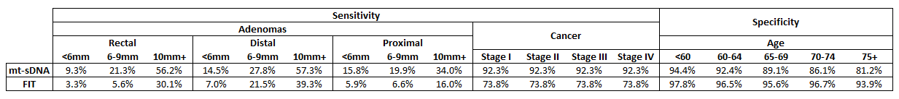

# Comparative Effectiveness of Stool-based Testing Screening strategies assuming a Spectrum of Adherence - Deep-C Sensitivity Analysis 

## Methods 

This experiment is a sensitivity analysis of the 
[spectrum of adherence rates analysis](https://github.com/CRCAIM/CRC-AIM-Public/blob/master/experiments/adherence_spectrum.md), using Deep-C sensitivity and specificity inputs for mt-sDNA and FIT. 

Screening outcomes are per 1000 individuals free of clinically diagnosed colorectal cancer at age 40.

## Inputs

## Results
 
- [Triennial mt-sDNA, annual FIT, and annual HSgFOBT](#triennial-mt-sdna--annual-fit--and-annual-hsgfobt)
  - [Screening between ages 45–75 years](#screening-between-ages-45-75-years)
  - [Screening between ages 45–80 years](#screening-between-ages-45-80-years)
  - [Screening between ages 45–85 years](#screening-between-ages-45-85-years)
  - [Screening between ages 50–75 years](#screening-between-ages-50-75-years)
  - [Screening between ages 50–80 years](#screening-between-ages-50-80-years)
  - [Screening between ages 50–85 years](#screening-between-ages-50-85-years)
  - [Screening between ages 55–75 years](#screening-between-ages-55-75-years)
  - [Screening between ages 55–80 years](#screening-between-ages-55-80-years)
  - [Screening between ages 55–85 years](#screening-between-ages-55-85-years)
- [Biennial mt-sDNA, FIT, and HSgFOBT](#biennial-mt-sdna--fit--and-hsgfobt)
  - [Screening between ages 45–75 years](#screening-between-ages-45-75-years-1)
  - [Screening between ages 45–80 years](#screening-between-ages-45-80-years-1)
  - [Screening between ages 45–85 years](#screening-between-ages-45-85-years-1)
  - [Screening between ages 50–75 years](#screening-between-ages-50-75-years-1)
  - [Screening between ages 50–80 years](#screening-between-ages-50-80-years-1)
  - [Screening between ages 50–85 years](#screening-between-ages-50-85-years-1)
  - [Screening between ages 55–75 years](#screening-between-ages-55-75-years-1)
  - [Screening between ages 55–80 years](#screening-between-ages-55-80-years-1)
  - [Screening between ages 55–85 years](#screening-between-ages-55-85-years-1)

### Triennial mt-sDNA, annual FIT, and annual HSgFOBT 

#### Screening between ages 45–75 years

| Strategies             |   Stool tests |   Follow-up COLs |   Surveillance COLs |   COLs for symptoms |   Total COLs |   Complications |   CRC cases |   CRC deaths |   LY with CRC |   LYG |   Incidence reduction |   Mortality reduction |
|:-----------------------|--------------:|-----------------:|--------------------:|--------------------:|-------------:|----------------:|------------:|-------------:|--------------:|------:|----------------------:|----------------------:|
| mt-sDNA 0% Adherence   |             0 |                0 |                   0 |                  80 |           80 |               2 |        80.3 |         36.6 |         646   |   0   |                 0     |                 0     |
| mt-sDNA 10% Adherence  |          2172 |              274 |                 537 |                  47 |          858 |               6 |        53.7 |         22.7 |         487.6 | 159.3 |                 0.332 |                 0.38  |
| mt-sDNA 20% Adherence  |          3588 |              430 |                 791 |                  33 |         1255 |               8 |        42.3 |         17   |         411.8 | 226.8 |                 0.473 |                 0.536 |
| mt-sDNA 30% Adherence  |          4585 |              532 |                 934 |                  27 |         1492 |               9 |        36.4 |         14.1 |         367.9 | 261.8 |                 0.547 |                 0.614 |
| mt-sDNA 40% Adherence  |          5332 |              603 |                1026 |                  23 |         1653 |              10 |        32.8 |         12.4 |         339.2 | 282.6 |                 0.592 |                 0.66  |
| mt-sDNA 50% Adherence  |          5913 |              656 |                1089 |                  21 |         1766 |              10 |        30.4 |         11.3 |         319.7 | 295.7 |                 0.622 |                 0.691 |
| mt-sDNA 60% Adherence  |          6370 |              699 |                1133 |                  19 |         1851 |              10 |        28.8 |         10.6 |         305.3 | 304.9 |                 0.641 |                 0.71  |
| mt-sDNA 70% Adherence  |          6748 |              734 |                1169 |                  18 |         1920 |              11 |        27.6 |         10.1 |         294.7 | 312.2 |                 0.656 |                 0.725 |
| mt-sDNA 80% Adherence  |          7063 |              759 |                1195 |                  17 |         1971 |              11 |        26.7 |          9.7 |         287.2 | 317.3 |                 0.668 |                 0.736 |
| mt-sDNA 90% Adherence  |          7314 |              782 |                1218 |                  17 |         2017 |              11 |        26.1 |          9.4 |         280.2 | 320.8 |                 0.675 |                 0.744 |
| mt-sDNA 100% Adherence |          7576 |              814 |                1240 |                  16 |         2070 |              11 |        25.2 |          9   |         273.8 | 324.7 |                 0.687 |                 0.755 |
| FIT 0% Adherence       |             0 |                0 |                   0 |                  80 |           80 |               2 |        80.3 |         36.6 |         646   |   0   |                 0     |                 0     |
| FIT 10% Adherence      |          2640 |              152 |                 348 |                  55 |          556 |               5 |        62.5 |         26.8 |         553.3 | 114.3 |                 0.221 |                 0.267 |
| FIT 20% Adherence      |          5073 |              271 |                 583 |                  41 |          895 |               6 |        51.3 |         20.9 |         488.6 | 185.3 |                 0.361 |                 0.431 |
| FIT 30% Adherence      |          7339 |              371 |                 753 |                  32 |         1155 |               8 |        43.7 |         16.9 |         440   | 232.3 |                 0.456 |                 0.538 |
| FIT 40% Adherence      |          9470 |              455 |                 882 |                  26 |         1364 |               9 |        38.3 |         14.3 |         400   | 263.4 |                 0.523 |                 0.609 |
| FIT 50% Adherence      |         11484 |              530 |                 988 |                  22 |         1540 |               9 |        34.1 |         12.4 |         365.2 | 286.2 |                 0.576 |                 0.661 |
| FIT 60% Adherence      |         13388 |              600 |                1070 |                  19 |         1689 |              10 |        30.9 |         11   |         338.3 | 303.8 |                 0.615 |                 0.7   |
| FIT 70% Adherence      |         15193 |              664 |                1140 |                  18 |         1822 |              10 |        28.5 |         10   |         316   | 315.5 |                 0.645 |                 0.727 |
| FIT 80% Adherence      |         16953 |              718 |                1199 |                  16 |         1933 |              11 |        26.5 |          9.2 |         296.6 | 325.6 |                 0.671 |                 0.75  |
| FIT 90% Adherence      |         18599 |              775 |                1249 |                  15 |         2039 |              11 |        24.7 |          8.5 |         278.3 | 333.3 |                 0.693 |                 0.768 |
| FIT 100% Adherence     |         20175 |              827 |                1293 |                  14 |         2135 |              11 |        23.4 |          8   |         264.4 | 338.6 |                 0.709 |                 0.781 |

#### Screening between ages 45–80 years

| Strategies             |   Stool tests |   Follow-up COLs |   Surveillance COLs |   COLs for symptoms |   Total COLs |   Complications |   CRC cases |   CRC deaths |   LY with CRC |   LYG |   Incidence reduction |   Mortality reduction |
|:-----------------------|--------------:|-----------------:|--------------------:|--------------------:|-------------:|----------------:|------------:|-------------:|--------------:|------:|----------------------:|----------------------:|
| mt-sDNA 0% Adherence   |             0 |                0 |                   0 |                  80 |           80 |               2 |        80.3 |         36.6 |         646   |   0   |                 0     |                 0     |
| mt-sDNA 10% Adherence  |          2401 |              325 |                 564 |                  43 |          931 |               7 |        51.7 |         21.3 |         488.2 | 168.6 |                 0.356 |                 0.418 |
| mt-sDNA 20% Adherence  |          3933 |              504 |                 825 |                  29 |         1358 |               9 |        39.9 |         15.3 |         411.9 | 238.9 |                 0.503 |                 0.582 |
| mt-sDNA 30% Adherence  |          5008 |              621 |                 971 |                  22 |         1614 |              10 |        33.8 |         12.3 |         366.6 | 274.2 |                 0.58  |                 0.664 |
| mt-sDNA 40% Adherence  |          5803 |              703 |                1061 |                  18 |         1783 |              11 |        30.1 |         10.6 |         336.2 | 295.8 |                 0.625 |                 0.71  |
| mt-sDNA 50% Adherence  |          6415 |              764 |                1123 |                  16 |         1904 |              11 |        27.9 |          9.7 |         316.7 | 307.5 |                 0.653 |                 0.736 |
| mt-sDNA 60% Adherence  |          6904 |              812 |                1170 |                  15 |         1997 |              11 |        26.3 |          9   |         303.4 | 315.8 |                 0.673 |                 0.755 |
| mt-sDNA 70% Adherence  |          7311 |              848 |                1205 |                  14 |         2067 |              12 |        25.1 |          8.4 |         293.4 | 323.6 |                 0.688 |                 0.771 |
| mt-sDNA 80% Adherence  |          7645 |              879 |                1233 |                  13 |         2125 |              12 |        24.2 |          8   |         284.7 | 328.6 |                 0.699 |                 0.781 |
| mt-sDNA 90% Adherence  |          7930 |              907 |                1253 |                  12 |         2173 |              12 |        23.5 |          7.7 |         279.2 | 332   |                 0.707 |                 0.789 |
| mt-sDNA 100% Adherence |          8126 |              925 |                1270 |                  12 |         2207 |              12 |        23.1 |          7.6 |         273.7 | 334.2 |                 0.712 |                 0.793 |
| FIT 0% Adherence       |             0 |                0 |                   0 |                  80 |           80 |               2 |        80.3 |         36.6 |         646   |   0   |                 0     |                 0     |
| FIT 10% Adherence      |          2934 |              181 |                 365 |                  52 |          597 |               5 |        61.2 |         25.6 |         559   | 123.6 |                 0.238 |                 0.301 |
| FIT 20% Adherence      |          5601 |              317 |                 610 |                  36 |          963 |               7 |        49.2 |         19.1 |         493   | 198.7 |                 0.387 |                 0.478 |
| FIT 30% Adherence      |          8078 |              430 |                 784 |                  27 |         1241 |               9 |        41.3 |         15.2 |         441.7 | 244.9 |                 0.486 |                 0.586 |
| FIT 40% Adherence      |         10393 |              526 |                 916 |                  21 |         1463 |              10 |        35.8 |         12.5 |         400.8 | 276.6 |                 0.554 |                 0.66  |
| FIT 50% Adherence      |         12549 |              612 |                1020 |                  17 |         1650 |              10 |        31.7 |         10.5 |         368.2 | 299.8 |                 0.606 |                 0.712 |
| FIT 60% Adherence      |         14607 |              691 |                1105 |                  15 |         1811 |              11 |        28.6 |          9.3 |         341.4 | 315.5 |                 0.644 |                 0.747 |
| FIT 70% Adherence      |         16583 |              761 |                1174 |                  13 |         1948 |              11 |        26   |          8.2 |         316.6 | 327.9 |                 0.676 |                 0.776 |
| FIT 80% Adherence      |         18434 |              829 |                1234 |                  12 |         2074 |              12 |        24.1 |          7.5 |         297.1 | 336.9 |                 0.7   |                 0.796 |
| FIT 90% Adherence      |         20207 |              889 |                1285 |                  11 |         2184 |              12 |        22.4 |          6.8 |         281.1 | 344.5 |                 0.721 |                 0.814 |
| FIT 100% Adherence     |         21910 |              947 |                1327 |                  10 |         2283 |              13 |        21.1 |          6.4 |         265.3 | 349.9 |                 0.738 |                 0.826 |

#### Screening between ages 45–85 years

| Strategies             |   Stool tests |   Follow-up COLs |   Surveillance COLs |   COLs for symptoms |   Total COLs |   Complications |   CRC cases |   CRC deaths |   LY with CRC |   LYG |   Incidence reduction |   Mortality reduction |
|:-----------------------|--------------:|-----------------:|--------------------:|--------------------:|-------------:|----------------:|------------:|-------------:|--------------:|------:|----------------------:|----------------------:|
| mt-sDNA 0% Adherence   |             0 |                0 |                   0 |                  80 |           80 |               2 |        80.3 |         36.6 |         646   |   0   |                 0     |                 0     |
| mt-sDNA 10% Adherence  |          2575 |              366 |                 578 |                  40 |          984 |               8 |        50.6 |         20.5 |         488.8 | 172.9 |                 0.37  |                 0.439 |
| mt-sDNA 20% Adherence  |          4194 |              563 |                 839 |                  25 |         1427 |              10 |        38.7 |         14.4 |         413.6 | 243.8 |                 0.519 |                 0.608 |
| mt-sDNA 30% Adherence  |          5315 |              688 |                 987 |                  19 |         1693 |              11 |        32.5 |         11.4 |         367   | 278.4 |                 0.595 |                 0.688 |
| mt-sDNA 40% Adherence  |          6151 |              776 |                1080 |                  15 |         1871 |              12 |        28.9 |          9.7 |         338.5 | 299.6 |                 0.64  |                 0.734 |
| mt-sDNA 50% Adherence  |          6794 |              842 |                1142 |                  13 |         1997 |              12 |        26.7 |          8.7 |         320.5 | 312.4 |                 0.667 |                 0.763 |
| mt-sDNA 60% Adherence  |          7309 |              893 |                1187 |                  11 |         2091 |              13 |        25   |          7.9 |         306   | 321.9 |                 0.688 |                 0.783 |
| mt-sDNA 70% Adherence  |          7728 |              933 |                1223 |                  10 |         2166 |              13 |        23.9 |          7.5 |         295.1 | 328   |                 0.702 |                 0.796 |
| mt-sDNA 80% Adherence  |          8072 |              966 |                1251 |                  10 |         2226 |              13 |        23   |          7.1 |         286   | 333   |                 0.713 |                 0.806 |
| mt-sDNA 90% Adherence  |          8366 |              994 |                1273 |                   9 |         2276 |              13 |        22.2 |          6.7 |         280   | 337.4 |                 0.723 |                 0.816 |
| mt-sDNA 100% Adherence |          8632 |             1027 |                1293 |                   9 |         2328 |              13 |        21.6 |          6.5 |         273.5 | 340.4 |                 0.731 |                 0.823 |
| FIT 0% Adherence       |             0 |                0 |                   0 |                  80 |           80 |               2 |        80.3 |         36.6 |         646   |   0   |                 0     |                 0     |
| FIT 10% Adherence      |          3167 |              203 |                 375 |                  49 |          627 |               6 |        60.5 |         24.9 |         561.7 | 127.7 |                 0.247 |                 0.32  |
| FIT 20% Adherence      |          6009 |              355 |                 624 |                  33 |         1012 |               8 |        48.3 |         18.2 |         496.4 | 202.5 |                 0.398 |                 0.502 |
| FIT 30% Adherence      |          8619 |              477 |                 800 |                  23 |         1300 |              10 |        40.3 |         14   |         446.9 | 251.3 |                 0.498 |                 0.618 |
| FIT 40% Adherence      |         11074 |              582 |                 935 |                  17 |         1534 |              11 |        34.6 |         11.4 |         405.1 | 282.5 |                 0.569 |                 0.69  |
| FIT 50% Adherence      |         13359 |              673 |                1040 |                  13 |         1726 |              11 |        30.5 |          9.4 |         371.9 | 305.1 |                 0.621 |                 0.742 |
| FIT 60% Adherence      |         15513 |              757 |                1123 |                  11 |         1892 |              12 |        27.4 |          8.2 |         345.2 | 321.3 |                 0.659 |                 0.777 |
| FIT 70% Adherence      |         17560 |              836 |                1195 |                   9 |         2040 |              12 |        24.8 |          7.1 |         320.6 | 333.8 |                 0.691 |                 0.805 |
| FIT 80% Adherence      |         19497 |              905 |                1253 |                   8 |         2166 |              13 |        22.9 |          6.4 |         299.8 | 342.5 |                 0.715 |                 0.824 |
| FIT 90% Adherence      |         21365 |              970 |                1303 |                   8 |         2280 |              13 |        21.3 |          5.9 |         282.7 | 349.3 |                 0.735 |                 0.84  |
| FIT 100% Adherence     |         23114 |             1032 |                1347 |                   7 |         2386 |              14 |        19.9 |          5.5 |         267.1 | 355   |                 0.752 |                 0.85  |

#### Screening between ages 50–75 years

| Strategies             |   Stool tests |   Follow-up COLs |   Surveillance COLs |   COLs for symptoms |   Total COLs |   Complications |   CRC cases |   CRC deaths |   LY with CRC |   LYG |   Incidence reduction |   Mortality reduction |
|:-----------------------|--------------:|-----------------:|--------------------:|--------------------:|-------------:|----------------:|------------:|-------------:|--------------:|------:|----------------------:|----------------------:|
| mt-sDNA 0% Adherence   |             0 |                0 |                   0 |                  80 |           80 |               2 |        80.3 |         36.6 |         646   |   0   |                 0     |                 0     |
| mt-sDNA 10% Adherence  |          1801 |              248 |                 468 |                  49 |          765 |               6 |        56.1 |         23.8 |         515.5 | 140.9 |                 0.302 |                 0.35  |
| mt-sDNA 20% Adherence  |          2968 |              387 |                 700 |                  36 |         1123 |               8 |        45.2 |         18.3 |         448.2 | 204   |                 0.437 |                 0.501 |
| mt-sDNA 30% Adherence  |          3795 |              478 |                 834 |                  29 |         1341 |               9 |        39.3 |         15.4 |         406.3 | 237.9 |                 0.511 |                 0.58  |
| mt-sDNA 40% Adherence  |          4415 |              541 |                 921 |                  25 |         1487 |              10 |        35.7 |         13.6 |         381.5 | 258.5 |                 0.556 |                 0.628 |
| mt-sDNA 50% Adherence  |          4889 |              589 |                 983 |                  23 |         1595 |              10 |        33.3 |         12.5 |         362.2 | 272.1 |                 0.585 |                 0.658 |
| mt-sDNA 60% Adherence  |          5268 |              628 |                1027 |                  21 |         1676 |              10 |        31.6 |         11.7 |         350.1 | 282.4 |                 0.606 |                 0.681 |
| mt-sDNA 70% Adherence  |          5578 |              658 |                1058 |                  20 |         1736 |              10 |        30.5 |         11.2 |         341.1 | 288.1 |                 0.621 |                 0.694 |
| mt-sDNA 80% Adherence  |          5840 |              684 |                1087 |                  19 |         1790 |              11 |        29.4 |         10.8 |         330.2 | 293.9 |                 0.634 |                 0.706 |
| mt-sDNA 90% Adherence  |          6082 |              708 |                1108 |                  18 |         1834 |              11 |        28.5 |         10.3 |         325.2 | 299.2 |                 0.645 |                 0.718 |
| mt-sDNA 100% Adherence |          6290 |              732 |                1123 |                  17 |         1872 |              11 |        27.8 |         10   |         319.6 | 303.8 |                 0.653 |                 0.728 |
| FIT 0% Adherence       |             0 |                0 |                   0 |                  80 |           80 |               2 |        80.3 |         36.6 |         646   |   0   |                 0     |                 0     |
| FIT 10% Adherence      |          2182 |              138 |                 302 |                  57 |          497 |               5 |        64.3 |         27.6 |         572.3 | 101.9 |                 0.199 |                 0.246 |
| FIT 20% Adherence      |          4183 |              243 |                 510 |                  43 |          797 |               6 |        53.9 |         22   |         518.4 | 166.1 |                 0.329 |                 0.4   |
| FIT 30% Adherence      |          6049 |              331 |                 666 |                  35 |         1032 |               7 |        46.6 |         18.2 |         475.9 | 210.7 |                 0.42  |                 0.504 |
| FIT 40% Adherence      |          7792 |              408 |                 787 |                  29 |         1223 |               8 |        41.2 |         15.5 |         440.6 | 241   |                 0.487 |                 0.576 |
| FIT 50% Adherence      |          9432 |              475 |                 883 |                  24 |         1383 |               9 |        37.1 |         13.6 |         408.2 | 262.1 |                 0.538 |                 0.628 |
| FIT 60% Adherence      |         10982 |              537 |                 963 |                  22 |         1521 |              10 |        33.9 |         12.2 |         384.7 | 280   |                 0.577 |                 0.667 |
| FIT 70% Adherence      |         12456 |              593 |                1029 |                  19 |         1641 |              10 |        31.4 |         11.1 |         362.8 | 291.6 |                 0.609 |                 0.696 |
| FIT 80% Adherence      |         13873 |              645 |                1085 |                  18 |         1748 |              10 |        29.2 |         10.2 |         343.7 | 302.2 |                 0.636 |                 0.721 |
| FIT 90% Adherence      |         15226 |              692 |                1133 |                  17 |         1842 |              11 |        27.5 |          9.6 |         326.3 | 309.1 |                 0.657 |                 0.738 |
| FIT 100% Adherence     |         16510 |              737 |                1175 |                  16 |         1927 |              11 |        26.2 |          9.1 |         314   | 315   |                 0.674 |                 0.752 |

#### Screening between ages 50–80 years

| Strategies             |   Stool tests |   Follow-up COLs |   Surveillance COLs |   COLs for symptoms |   Total COLs |   Complications |   CRC cases |   CRC deaths |   LY with CRC |   LYG |   Incidence reduction |   Mortality reduction |
|:-----------------------|--------------:|-----------------:|--------------------:|--------------------:|-------------:|----------------:|------------:|-------------:|--------------:|------:|----------------------:|----------------------:|
| mt-sDNA 0% Adherence   |             0 |                0 |                   0 |                  80 |           80 |               2 |        80.3 |         36.6 |         646   |   0   |                 0     |                 0     |
| mt-sDNA 10% Adherence  |          2021 |              297 |                 495 |                  45 |          836 |               7 |        54.1 |         22.4 |         515.9 | 150.1 |                 0.326 |                 0.389 |
| mt-sDNA 20% Adherence  |          3315 |              461 |                 735 |                  31 |         1227 |               9 |        42.7 |         16.6 |         448.7 | 215   |                 0.468 |                 0.547 |
| mt-sDNA 30% Adherence  |          4216 |              567 |                 873 |                  24 |         1463 |              10 |        36.6 |         13.6 |         406.1 | 250.2 |                 0.544 |                 0.629 |
| mt-sDNA 40% Adherence  |          4886 |              641 |                 959 |                  20 |         1620 |              10 |        33.1 |         11.8 |         380.8 | 271   |                 0.588 |                 0.678 |
| mt-sDNA 50% Adherence  |          5403 |              696 |                1020 |                  18 |         1734 |              11 |        30.6 |         10.8 |         361   | 283.9 |                 0.619 |                 0.706 |
| mt-sDNA 60% Adherence  |          5814 |              740 |                1064 |                  16 |         1820 |              11 |        29   |         10   |         348   | 292.6 |                 0.639 |                 0.727 |
| mt-sDNA 70% Adherence  |          6149 |              775 |                1097 |                  15 |         1887 |              12 |        27.7 |          9.4 |         338.1 | 301.7 |                 0.655 |                 0.744 |
| mt-sDNA 80% Adherence  |          6421 |              804 |                1123 |                  14 |         1941 |              12 |        26.8 |          9   |         328.9 | 306.1 |                 0.666 |                 0.753 |
| mt-sDNA 90% Adherence  |          6649 |              824 |                1141 |                  14 |         1979 |              12 |        26   |          8.7 |         321.6 | 309.6 |                 0.676 |                 0.762 |
| mt-sDNA 100% Adherence |          6865 |              849 |                1156 |                  13 |         2018 |              12 |        25.4 |          8.4 |         318.5 | 312.8 |                 0.683 |                 0.77  |
| FIT 0% Adherence       |             0 |                0 |                   0 |                  80 |           80 |               2 |        80.3 |         36.6 |         646   |   0   |                 0     |                 0     |
| FIT 10% Adherence      |          2467 |              164 |                 320 |                  54 |          538 |               5 |        62.9 |         26.5 |         576.3 | 109.3 |                 0.216 |                 0.277 |
| FIT 20% Adherence      |          4707 |              291 |                 542 |                  38 |          871 |               7 |        51.6 |         20.3 |         518   | 177.1 |                 0.357 |                 0.446 |
| FIT 30% Adherence      |          6773 |              394 |                 703 |                  29 |         1126 |               8 |        44   |         16.3 |         477.4 | 223.6 |                 0.452 |                 0.556 |
| FIT 40% Adherence      |          8702 |              482 |                 826 |                  23 |         1331 |              10 |        38.5 |         13.5 |         439.1 | 254.4 |                 0.521 |                 0.63  |
| FIT 50% Adherence      |         10525 |              558 |                 923 |                  19 |         1500 |              10 |        34.5 |         11.7 |         410.9 | 276.5 |                 0.571 |                 0.681 |
| FIT 60% Adherence      |         12231 |              630 |                1001 |                  16 |         1647 |              11 |        31.3 |         10.3 |         385.5 | 292.9 |                 0.61  |                 0.719 |
| FIT 70% Adherence      |         13850 |              694 |                1067 |                  14 |         1775 |              11 |        28.7 |          9.2 |         362.3 | 304.7 |                 0.642 |                 0.748 |
| FIT 80% Adherence      |         15390 |              751 |                1124 |                  13 |         1888 |              12 |        26.7 |          8.4 |         343.5 | 314.5 |                 0.667 |                 0.77  |
| FIT 90% Adherence      |         16852 |              806 |                1171 |                  12 |         1989 |              12 |        25   |          7.8 |         326.4 | 321.5 |                 0.689 |                 0.786 |
| FIT 100% Adherence     |         18243 |              859 |                1212 |                  11 |         2082 |              12 |        23.8 |          7.4 |         312.7 | 326.8 |                 0.704 |                 0.799 |

#### Screening between ages 50–85 years

| Strategies             |   Stool tests |   Follow-up COLs |   Surveillance COLs |   COLs for symptoms |   Total COLs |   Complications |   CRC cases |   CRC deaths |   LY with CRC |   LYG |   Incidence reduction |   Mortality reduction |
|:-----------------------|--------------:|-----------------:|--------------------:|--------------------:|-------------:|----------------:|------------:|-------------:|--------------:|------:|----------------------:|----------------------:|
| mt-sDNA 0% Adherence   |             0 |                0 |                   0 |                  80 |           80 |               2 |        80.3 |         36.6 |         646   |   0   |                 0     |                 0     |
| mt-sDNA 10% Adherence  |          2199 |              340 |                 511 |                  42 |          893 |               8 |        53   |         21.6 |         516.8 | 154.6 |                 0.34  |                 0.411 |
| mt-sDNA 20% Adherence  |          3569 |              520 |                 754 |                  27 |         1301 |              10 |        41.4 |         15.5 |         448.7 | 221.1 |                 0.485 |                 0.576 |
| mt-sDNA 30% Adherence  |          4528 |              637 |                 892 |                  21 |         1549 |              11 |        35.3 |         12.5 |         408   | 256.2 |                 0.56  |                 0.657 |
| mt-sDNA 40% Adherence  |          5234 |              718 |                 980 |                  17 |         1715 |              12 |        31.6 |         10.8 |         381.9 | 276.4 |                 0.606 |                 0.706 |
| mt-sDNA 50% Adherence  |          5773 |              779 |                1039 |                  15 |         1833 |              12 |        29.3 |          9.7 |         362.1 | 289.3 |                 0.635 |                 0.734 |
| mt-sDNA 60% Adherence  |          6203 |              826 |                1084 |                  13 |         1923 |              13 |        27.7 |          9   |         349.5 | 298.4 |                 0.656 |                 0.754 |
| mt-sDNA 70% Adherence  |          6559 |              863 |                1115 |                  12 |         1990 |              13 |        26.5 |          8.5 |         339.7 | 305.6 |                 0.67  |                 0.768 |
| mt-sDNA 80% Adherence  |          6852 |              892 |                1141 |                  11 |         2044 |              13 |        25.6 |          8   |         333.2 | 311.4 |                 0.681 |                 0.78  |
| mt-sDNA 90% Adherence  |          7100 |              919 |                1161 |                  11 |         2090 |              13 |        24.9 |          7.8 |         326.3 | 314.8 |                 0.689 |                 0.788 |
| mt-sDNA 100% Adherence |          7291 |              934 |                1175 |                  10 |         2119 |              13 |        24.3 |          7.6 |         319.1 | 318.4 |                 0.698 |                 0.793 |
| FIT 0% Adherence       |             0 |                0 |                   0 |                  80 |           80 |               2 |        80.3 |         36.6 |         646   |   0   |                 0     |                 0     |
| FIT 10% Adherence      |          2698 |              189 |                 332 |                  51 |          572 |               6 |        62   |         25.6 |         577.7 | 114.6 |                 0.228 |                 0.3   |
| FIT 20% Adherence      |          5101 |              328 |                 558 |                  35 |          921 |               8 |        50.6 |         19.1 |         525.5 | 185.1 |                 0.37  |                 0.479 |
| FIT 30% Adherence      |          7328 |              442 |                 722 |                  25 |         1189 |               9 |        42.8 |         15.1 |         479.4 | 228.6 |                 0.467 |                 0.586 |
| FIT 40% Adherence      |          9388 |              539 |                 846 |                  19 |         1404 |              10 |        37.3 |         12.4 |         444.2 | 260.9 |                 0.536 |                 0.661 |
| FIT 50% Adherence      |         11304 |              624 |                 943 |                  15 |         1582 |              11 |        33.2 |         10.5 |         415   | 282.9 |                 0.586 |                 0.713 |
| FIT 60% Adherence      |         13117 |              700 |                1022 |                  13 |         1735 |              12 |        30   |          9.1 |         387.7 | 298.6 |                 0.626 |                 0.75  |
| FIT 70% Adherence      |         14828 |              768 |                1088 |                  11 |         1867 |              12 |        27.5 |          8.1 |         365.2 | 310.6 |                 0.658 |                 0.778 |
| FIT 80% Adherence      |         16460 |              827 |                1143 |                  10 |         1980 |              13 |        25.6 |          7.5 |         346.2 | 319   |                 0.681 |                 0.796 |
| FIT 90% Adherence      |         17990 |              888 |                1191 |                   9 |         2088 |              13 |        23.9 |          6.9 |         328   | 326.4 |                 0.703 |                 0.813 |
| FIT 100% Adherence     |         19451 |              944 |                1231 |                   8 |         2183 |              14 |        22.6 |          6.4 |         315.5 | 331.4 |                 0.719 |                 0.825 |

#### Screening between ages 55–75 years

| Strategies             |   Stool tests |   Follow-up COLs |   Surveillance COLs |   COLs for symptoms |   Total COLs |   Complications |   CRC cases |   CRC deaths |   LY with CRC |   LYG |   Incidence reduction |   Mortality reduction |
|:-----------------------|--------------:|-----------------:|--------------------:|--------------------:|-------------:|----------------:|------------:|-------------:|--------------:|------:|----------------------:|----------------------:|
| mt-sDNA 0% Adherence   |             0 |                0 |                   0 |                  80 |           80 |               2 |        80.3 |         36.6 |         646   |   0   |                 0     |                 0     |
| mt-sDNA 10% Adherence  |          1430 |              216 |                 385 |                  52 |          653 |               6 |        59.5 |         25.5 |         546.2 | 116.3 |                 0.259 |                 0.303 |
| mt-sDNA 20% Adherence  |          2363 |              341 |                 588 |                  40 |          969 |               7 |        49.3 |         20   |         492.3 | 174.9 |                 0.386 |                 0.453 |
| mt-sDNA 30% Adherence  |          3028 |              423 |                 710 |                  33 |         1165 |               8 |        43.6 |         17.2 |         458.1 | 206.3 |                 0.457 |                 0.53  |
| mt-sDNA 40% Adherence  |          3517 |              480 |                 789 |                  29 |         1297 |               9 |        40.1 |         15.5 |         436   | 225.6 |                 0.501 |                 0.577 |
| mt-sDNA 50% Adherence  |          3900 |              523 |                 845 |                  26 |         1394 |               9 |        37.7 |         14.3 |         419.8 | 238.5 |                 0.53  |                 0.609 |
| mt-sDNA 60% Adherence  |          4203 |              556 |                 887 |                  24 |         1468 |              10 |        35.9 |         13.5 |         407.5 | 249.1 |                 0.553 |                 0.632 |
| mt-sDNA 70% Adherence  |          4456 |              584 |                 918 |                  23 |         1525 |              10 |        34.8 |         12.9 |         399.7 | 255.6 |                 0.567 |                 0.648 |
| mt-sDNA 80% Adherence  |          4663 |              604 |                 944 |                  22 |         1571 |              10 |        33.7 |         12.4 |         390.1 | 261   |                 0.581 |                 0.661 |
| mt-sDNA 90% Adherence  |          4814 |              617 |                 964 |                  22 |         1603 |              10 |        33   |         12.2 |         383.5 | 264.2 |                 0.589 |                 0.667 |
| mt-sDNA 100% Adherence |          4888 |              617 |                 976 |                  22 |         1614 |              10 |        32.8 |         12.1 |         379.2 | 265.9 |                 0.592 |                 0.668 |
| FIT 0% Adherence       |             0 |                0 |                   0 |                  80 |           80 |               2 |        80.3 |         36.6 |         646   |   0   |                 0     |                 0     |
| FIT 10% Adherence      |          1724 |              120 |                 248 |                  60 |          428 |               4 |        66.6 |         28.7 |         592.9 |  85.5 |                 0.171 |                 0.216 |
| FIT 20% Adherence      |          3300 |              214 |                 427 |                  47 |          688 |               6 |        57.3 |         23.5 |         549.9 | 140.3 |                 0.287 |                 0.357 |
| FIT 30% Adherence      |          4776 |              292 |                 563 |                  38 |          893 |               7 |        50.4 |         19.9 |         515.2 | 180.4 |                 0.372 |                 0.456 |
| FIT 40% Adherence      |          6145 |              361 |                 671 |                  32 |         1064 |               8 |        45.3 |         17.4 |         486.6 | 209.1 |                 0.436 |                 0.526 |
| FIT 50% Adherence      |          7434 |              420 |                 756 |                  28 |         1204 |               9 |        41.3 |         15.4 |         460.7 | 229.3 |                 0.485 |                 0.579 |
| FIT 60% Adherence      |          8654 |              474 |                 828 |                  25 |         1327 |               9 |        38.2 |         14   |         439.6 | 246.2 |                 0.524 |                 0.619 |
| FIT 70% Adherence      |          9828 |              523 |                 888 |                  23 |         1433 |              10 |        35.8 |         12.8 |         422   | 258.9 |                 0.554 |                 0.65  |
| FIT 80% Adherence      |         10923 |              569 |                 939 |                  21 |         1528 |              10 |        33.6 |         11.9 |         404.3 | 268.7 |                 0.582 |                 0.675 |
| FIT 90% Adherence      |         11985 |              609 |                 985 |                  20 |         1613 |              10 |        31.8 |         11.3 |         388.5 | 275.6 |                 0.604 |                 0.693 |
| FIT 100% Adherence     |         12983 |              648 |                1023 |                  19 |         1690 |              11 |        30.4 |         10.6 |         375.9 | 282.8 |                 0.622 |                 0.71  |

#### Screening between ages 55–80 years

| Strategies             |   Stool tests |   Follow-up COLs |   Surveillance COLs |   COLs for symptoms |   Total COLs |   Complications |   CRC cases |   CRC deaths |   LY with CRC |   LYG |   Incidence reduction |   Mortality reduction |
|:-----------------------|--------------:|-----------------:|--------------------:|--------------------:|-------------:|----------------:|------------:|-------------:|--------------:|------:|----------------------:|----------------------:|
| mt-sDNA 0% Adherence   |             0 |                0 |                   0 |                  80 |           80 |               2 |        80.3 |         36.6 |         646   |   0   |                 0     |                 0     |
| mt-sDNA 10% Adherence  |          1662 |              269 |                 415 |                  48 |          731 |               6 |        57.3 |         23.8 |         546.8 | 128.1 |                 0.287 |                 0.35  |
| mt-sDNA 20% Adherence  |          2721 |              418 |                 625 |                  34 |         1078 |               8 |        46.6 |         18.2 |         492.6 | 187.2 |                 0.42  |                 0.502 |
| mt-sDNA 30% Adherence  |          3458 |              514 |                 749 |                  27 |         1291 |              10 |        40.7 |         15.3 |         456   | 219.3 |                 0.493 |                 0.582 |
| mt-sDNA 40% Adherence  |          4003 |              581 |                 828 |                  24 |         1433 |              10 |        37.2 |         13.6 |         433.8 | 238.5 |                 0.537 |                 0.628 |
| mt-sDNA 50% Adherence  |          4419 |              632 |                 886 |                  21 |         1539 |              11 |        34.8 |         12.4 |         418.1 | 252.1 |                 0.567 |                 0.661 |
| mt-sDNA 60% Adherence  |          4752 |              671 |                 928 |                  19 |         1618 |              11 |        33.1 |         11.7 |         404.9 | 261.3 |                 0.588 |                 0.681 |
| mt-sDNA 70% Adherence  |          5025 |              701 |                 960 |                  18 |         1679 |              11 |        31.8 |         11   |         396.6 | 268.4 |                 0.604 |                 0.699 |
| mt-sDNA 80% Adherence  |          5252 |              727 |                 983 |                  17 |         1727 |              12 |        31   |         10.7 |         389.4 | 272.7 |                 0.615 |                 0.708 |
| mt-sDNA 90% Adherence  |          5462 |              749 |                1005 |                  16 |         1771 |              12 |        30.1 |         10.3 |         382.1 | 277.5 |                 0.625 |                 0.72  |
| mt-sDNA 100% Adherence |          5651 |              772 |                1025 |                  16 |         1813 |              12 |        29.5 |         10   |         377.7 | 280.6 |                 0.633 |                 0.727 |
| FIT 0% Adherence       |             0 |                0 |                   0 |                  80 |           80 |               2 |        80.3 |         36.6 |         646   |   0   |                 0     |                 0     |
| FIT 10% Adherence      |          2025 |              149 |                 268 |                  56 |          472 |               5 |        65.1 |         27.5 |         595.7 |  93.4 |                 0.19  |                 0.249 |
| FIT 20% Adherence      |          3849 |              263 |                 458 |                  41 |          762 |               7 |        54.9 |         21.7 |         552.7 | 153.5 |                 0.317 |                 0.407 |
| FIT 30% Adherence      |          5529 |              356 |                 599 |                  32 |          987 |               8 |        47.7 |         17.9 |         517.6 | 194.6 |                 0.406 |                 0.512 |
| FIT 40% Adherence      |          7090 |              436 |                 709 |                  26 |         1171 |               9 |        42.6 |         15.3 |         487.5 | 222.6 |                 0.47  |                 0.582 |
| FIT 50% Adherence      |          8542 |              508 |                 797 |                  22 |         1327 |              10 |        38.5 |         13.3 |         462.3 | 244.5 |                 0.52  |                 0.636 |
| FIT 60% Adherence      |          9918 |              570 |                 868 |                  19 |         1458 |              10 |        35.5 |         12   |         440.8 | 260.1 |                 0.558 |                 0.673 |
| FIT 70% Adherence      |         11216 |              626 |                 928 |                  17 |         1572 |              11 |        32.9 |         10.9 |         421.2 | 271.5 |                 0.59  |                 0.703 |
| FIT 80% Adherence      |         12449 |              678 |                 979 |                  16 |         1673 |              11 |        30.9 |         10.1 |         402.8 | 280.8 |                 0.616 |                 0.725 |
| FIT 90% Adherence      |         13607 |              728 |                1023 |                  15 |         1766 |              12 |        29.3 |          9.4 |         389.9 | 288.6 |                 0.635 |                 0.743 |
| FIT 100% Adherence     |         14728 |              771 |                1062 |                  14 |         1847 |              12 |        27.8 |          8.9 |         375.8 | 294.4 |                 0.654 |                 0.756 |

#### Screening between ages 55–85 years

| Strategies             |   Stool tests |   Follow-up COLs |   Surveillance COLs |   COLs for symptoms |   Total COLs |   Complications |   CRC cases |   CRC deaths |   LY with CRC |   LYG |   Incidence reduction |   Mortality reduction |
|:-----------------------|--------------:|-----------------:|--------------------:|--------------------:|-------------:|----------------:|------------:|-------------:|--------------:|------:|----------------------:|----------------------:|
| mt-sDNA 0% Adherence   |             0 |                0 |                   0 |                  80 |           80 |               2 |        80.3 |         36.6 |         646   |   0   |                 0     |                 0     |
| mt-sDNA 10% Adherence  |          1825 |              308 |                 427 |                  45 |          780 |               7 |        56.3 |         23   |         548.9 | 132.2 |                 0.299 |                 0.372 |
| mt-sDNA 20% Adherence  |          2975 |              477 |                 642 |                  31 |         1150 |              10 |        45.3 |         17.2 |         492.4 | 191.8 |                 0.436 |                 0.529 |
| mt-sDNA 30% Adherence  |          3766 |              581 |                 768 |                  24 |         1372 |              11 |        39.5 |         14.2 |         460.7 | 225.1 |                 0.508 |                 0.611 |
| mt-sDNA 40% Adherence  |          4351 |              654 |                 850 |                  20 |         1524 |              12 |        35.8 |         12.6 |         435.5 | 243.6 |                 0.554 |                 0.657 |
| mt-sDNA 50% Adherence  |          4796 |              711 |                 905 |                  18 |         1633 |              12 |        33.5 |         11.4 |         419.6 | 257.8 |                 0.583 |                 0.69  |
| mt-sDNA 60% Adherence  |          5155 |              753 |                 946 |                  16 |         1715 |              12 |        31.9 |         10.6 |         407.5 | 267.2 |                 0.603 |                 0.711 |
| mt-sDNA 70% Adherence  |          5441 |              788 |                 978 |                  15 |         1781 |              13 |        30.6 |         10.1 |         398.7 | 273.4 |                 0.619 |                 0.725 |
| mt-sDNA 80% Adherence  |          5681 |              815 |                1003 |                  14 |         1832 |              13 |        29.7 |          9.7 |         390.1 | 278.3 |                 0.63  |                 0.735 |
| mt-sDNA 90% Adherence  |          5880 |              834 |                1022 |                  14 |         1870 |              13 |        29.1 |          9.4 |         386.5 | 281.5 |                 0.638 |                 0.743 |
| mt-sDNA 100% Adherence |          6053 |              855 |                1044 |                  13 |         1911 |              13 |        28.3 |          9   |         379.1 | 285.6 |                 0.647 |                 0.753 |
| FIT 0% Adherence       |             0 |                0 |                   0 |                  80 |           80 |               2 |        80.3 |         36.6 |         646   |   0   |                 0     |                 0     |
| FIT 10% Adherence      |          2234 |              172 |                 275 |                  53 |          500 |               6 |        64.6 |         26.8 |         600.7 |  96.8 |                 0.196 |                 0.268 |
| FIT 20% Adherence      |          4245 |              301 |                 471 |                  38 |          810 |               8 |        53.9 |         20.7 |         557.9 | 158.8 |                 0.328 |                 0.433 |
| FIT 30% Adherence      |          6064 |              405 |                 616 |                  28 |         1049 |               9 |        46.6 |         16.8 |         521.5 | 201   |                 0.42  |                 0.542 |
| FIT 40% Adherence      |          7766 |              493 |                 727 |                  22 |         1242 |              10 |        41.3 |         14   |         492.7 | 230.7 |                 0.486 |                 0.618 |
| FIT 50% Adherence      |          9340 |              568 |                 814 |                  18 |         1400 |              11 |        37.4 |         12.2 |         467.5 | 250.7 |                 0.534 |                 0.667 |
| FIT 60% Adherence      |         10813 |              640 |                 887 |                  16 |         1542 |              12 |        34.3 |         10.8 |         445.5 | 265.4 |                 0.573 |                 0.704 |
| FIT 70% Adherence      |         12206 |              701 |                 948 |                  14 |         1663 |              12 |        31.7 |          9.7 |         424.2 | 278.4 |                 0.605 |                 0.734 |
| FIT 80% Adherence      |         13515 |              758 |                 999 |                  13 |         1770 |              13 |        29.7 |          9   |         406.9 | 287.2 |                 0.63  |                 0.754 |
| FIT 90% Adherence      |         14758 |              811 |                1043 |                  12 |         1866 |              13 |        28.1 |          8.4 |         392.5 | 293.8 |                 0.65  |                 0.771 |
| FIT 100% Adherence     |         15947 |              857 |                1082 |                  11 |         1950 |              13 |        26.6 |          8   |         377.9 | 299.1 |                 0.668 |                 0.782 |

### Biennial mt-sDNA, FIT, and HSgFOBT 

#### Screening between ages 45–75 years

| Strategies             |   Stool tests |   Follow-up COLs |   Surveillance COLs |   COLs for symptoms |   Total COLs |   Complications |   CRC cases |   CRC deaths |   LY with CRC |   LYG |   Incidence reduction |   Mortality reduction |
|:-----------------------|--------------:|-----------------:|--------------------:|--------------------:|-------------:|----------------:|------------:|-------------:|--------------:|------:|----------------------:|----------------------:|
| mt-sDNA 0% Adherence   |             0 |                0 |                   0 |                  80 |           80 |               2 |        80.3 |         36.6 |         646   |   0   |                 0     |                 0     |
| mt-sDNA 10% Adherence  |          2337 |              292 |                 560 |                  45 |          897 |               6 |        52.7 |         22.2 |         480.8 | 164.5 |                 0.345 |                 0.394 |
| mt-sDNA 20% Adherence  |          4034 |              477 |                 846 |                  31 |         1354 |               9 |        40   |         15.9 |         394.6 | 238   |                 0.502 |                 0.565 |
| mt-sDNA 30% Adherence  |          5354 |              605 |                1016 |                  24 |         1645 |              10 |        33.1 |         12.6 |         341   | 278.5 |                 0.588 |                 0.656 |
| mt-sDNA 40% Adherence  |          6398 |              703 |                1127 |                  20 |         1850 |              10 |        29.1 |         10.8 |         307.1 | 301.2 |                 0.638 |                 0.704 |
| mt-sDNA 50% Adherence  |          7270 |              777 |                1202 |                  17 |         1997 |              11 |        26.4 |          9.6 |         284.4 | 316.7 |                 0.671 |                 0.739 |
| mt-sDNA 60% Adherence  |          7989 |              840 |                1259 |                  16 |         2115 |              11 |        24.6 |          8.9 |         265.3 | 325.8 |                 0.694 |                 0.757 |
| mt-sDNA 70% Adherence  |          8607 |              892 |                1302 |                  15 |         2209 |              11 |        23.2 |          8.2 |         253.2 | 333.4 |                 0.712 |                 0.775 |
| mt-sDNA 80% Adherence  |          9131 |              938 |                1337 |                  14 |         2289 |              12 |        22.2 |          7.8 |         241.6 | 337.3 |                 0.724 |                 0.786 |
| mt-sDNA 90% Adherence  |          9593 |              978 |                1365 |                  13 |         2357 |              12 |        21.3 |          7.5 |         233.2 | 342.2 |                 0.735 |                 0.795 |
| mt-sDNA 100% Adherence |         10080 |             1029 |                1393 |                  12 |         2434 |              12 |        20.3 |          7.1 |         226.2 | 346.5 |                 0.747 |                 0.807 |
| FIT 0% Adherence       |             0 |                0 |                   0 |                  80 |           80 |               2 |        80.3 |         36.6 |         646   |   0   |                 0     |                 0     |
| FIT 10% Adherence      |          2440 |              142 |                 324 |                  57 |          523 |               5 |        63.7 |         27.3 |         563.1 | 110.3 |                 0.207 |                 0.255 |
| FIT 20% Adherence      |          4339 |              240 |                 522 |                  44 |          806 |               6 |        54.1 |         22.1 |         509.5 | 171.2 |                 0.326 |                 0.397 |
| FIT 30% Adherence      |          5886 |              309 |                 657 |                  36 |         1003 |               7 |        47.9 |         18.8 |         471.3 | 211.3 |                 0.404 |                 0.486 |
| FIT 40% Adherence      |          7158 |              365 |                 751 |                  31 |         1147 |               8 |        43.7 |         16.8 |         442.5 | 236.9 |                 0.456 |                 0.542 |
| FIT 50% Adherence      |          8246 |              406 |                 823 |                  28 |         1257 |               8 |        40.7 |         15.2 |         421.5 | 254.8 |                 0.493 |                 0.584 |
| FIT 60% Adherence      |          9167 |              444 |                 876 |                  26 |         1345 |               9 |        38.5 |         14.2 |         405.6 | 268.4 |                 0.521 |                 0.613 |
| FIT 70% Adherence      |          9969 |              473 |                 920 |                  24 |         1417 |               9 |        36.7 |         13.3 |         390.1 | 278.1 |                 0.544 |                 0.636 |
| FIT 80% Adherence      |         10666 |              500 |                 958 |                  22 |         1480 |               9 |        35.2 |         12.7 |         380.2 | 286.6 |                 0.561 |                 0.654 |
| FIT 90% Adherence      |         11285 |              524 |                 987 |                  21 |         1532 |               9 |        34   |         12.2 |         369.3 | 292.1 |                 0.577 |                 0.668 |
| FIT 100% Adherence     |         11949 |              556 |                1019 |                  20 |         1594 |              10 |        32.8 |         11.4 |         363   | 300.7 |                 0.592 |                 0.688 |

#### Screening between ages 45–80 years

| Strategies             |   Stool tests |   Follow-up COLs |   Surveillance COLs |   COLs for symptoms |   Total COLs |   Complications |   CRC cases |   CRC deaths |   LY with CRC |   LYG |   Incidence reduction |   Mortality reduction |
|:-----------------------|--------------:|-----------------:|--------------------:|--------------------:|-------------:|----------------:|------------:|-------------:|--------------:|------:|----------------------:|----------------------:|
| mt-sDNA 0% Adherence   |             0 |                0 |                   0 |                  80 |           80 |               2 |        80.3 |         36.6 |         646   |   0   |                 0     |                 0     |
| mt-sDNA 10% Adherence  |          2580 |              347 |                 590 |                  41 |          979 |               7 |        50.5 |         20.7 |         480.4 | 175.1 |                 0.372 |                 0.434 |
| mt-sDNA 20% Adherence  |          4421 |              555 |                 885 |                  26 |         1465 |              10 |        37.3 |         14.1 |         391.7 | 251   |                 0.536 |                 0.614 |
| mt-sDNA 30% Adherence  |          5829 |              702 |                1055 |                  19 |         1776 |              11 |        30.5 |         10.9 |         339.4 | 290.7 |                 0.62  |                 0.703 |
| mt-sDNA 40% Adherence  |          6943 |              815 |                1165 |                  15 |         1996 |              12 |        26.5 |          9.1 |         306.1 | 312.9 |                 0.67  |                 0.752 |
| mt-sDNA 50% Adherence  |          7851 |              902 |                1241 |                  13 |         2155 |              12 |        23.9 |          8   |         281.3 | 325.9 |                 0.703 |                 0.781 |
| mt-sDNA 60% Adherence  |          8618 |              971 |                1297 |                  12 |         2279 |              12 |        22   |          7.2 |         263.7 | 336.7 |                 0.726 |                 0.803 |
| mt-sDNA 70% Adherence  |          9266 |             1027 |                1338 |                  11 |         2377 |              13 |        20.8 |          6.7 |         251.7 | 343.5 |                 0.742 |                 0.816 |
| mt-sDNA 80% Adherence  |          9820 |             1078 |                1372 |                  10 |         2460 |              13 |        19.7 |          6.3 |         239.8 | 347.9 |                 0.754 |                 0.827 |
| mt-sDNA 90% Adherence  |         10302 |             1117 |                1399 |                  10 |         2526 |              13 |        19   |          6.1 |         230.8 | 351.6 |                 0.763 |                 0.834 |
| mt-sDNA 100% Adherence |         10665 |             1144 |                1418 |                  10 |         2572 |              13 |        18.6 |          5.9 |         224.8 | 354   |                 0.769 |                 0.838 |
| FIT 0% Adherence       |             0 |                0 |                   0 |                  80 |           80 |               2 |        80.3 |         36.6 |         646   |   0   |                 0     |                 0     |
| FIT 10% Adherence      |          2716 |              168 |                 345 |                  53 |          566 |               5 |        62.2 |         26.1 |         563.9 | 117.7 |                 0.226 |                 0.286 |
| FIT 20% Adherence      |          4807 |              279 |                 553 |                  39 |          871 |               7 |        51.9 |         20.4 |         510.7 | 183.3 |                 0.354 |                 0.442 |
| FIT 30% Adherence      |          6494 |              360 |                 690 |                  31 |         1080 |               8 |        45.6 |         17.1 |         472.6 | 222.6 |                 0.432 |                 0.533 |
| FIT 40% Adherence      |          7884 |              425 |                 787 |                  26 |         1237 |               9 |        41.2 |         14.9 |         444.6 | 250.2 |                 0.487 |                 0.594 |
| FIT 50% Adherence      |          9053 |              474 |                 857 |                  22 |         1354 |               9 |        38.3 |         13.3 |         423.7 | 267.2 |                 0.523 |                 0.637 |
| FIT 60% Adherence      |         10051 |              516 |                 914 |                  20 |         1450 |              10 |        35.8 |         12.2 |         405.9 | 282.1 |                 0.554 |                 0.668 |
| FIT 70% Adherence      |         10913 |              550 |                 959 |                  18 |         1527 |              10 |        34   |         11.3 |         391.6 | 293   |                 0.577 |                 0.691 |
| FIT 80% Adherence      |         11671 |              580 |                 995 |                  17 |         1591 |              10 |        32.7 |         10.7 |         381.6 | 299.4 |                 0.593 |                 0.708 |
| FIT 90% Adherence      |         12336 |              604 |                1024 |                  16 |         1643 |              10 |        31.5 |         10.2 |         372.8 | 306.7 |                 0.607 |                 0.722 |
| FIT 100% Adherence     |         12828 |              622 |                1047 |                  16 |         1685 |              11 |        30.8 |          9.9 |         365.7 | 311.3 |                 0.616 |                 0.73  |

#### Screening between ages 45–85 years

| Strategies             |   Stool tests |   Follow-up COLs |   Surveillance COLs |   COLs for symptoms |   Total COLs |   Complications |   CRC cases |   CRC deaths |   LY with CRC |   LYG |   Incidence reduction |   Mortality reduction |
|:-----------------------|--------------:|-----------------:|--------------------:|--------------------:|-------------:|----------------:|------------:|-------------:|--------------:|------:|----------------------:|----------------------:|
| mt-sDNA 0% Adherence   |             0 |                0 |                   0 |                  80 |           80 |               2 |        80.3 |         36.6 |         646   |   0   |                 0     |                 0     |
| mt-sDNA 10% Adherence  |          2757 |              387 |                 605 |                  38 |         1031 |               8 |        49.3 |         19.8 |         482.2 | 179.9 |                 0.386 |                 0.459 |
| mt-sDNA 20% Adherence  |          4697 |              619 |                 901 |                  23 |         1543 |              11 |        36.2 |         13.2 |         394.5 | 255.6 |                 0.55  |                 0.639 |
| mt-sDNA 30% Adherence  |          6177 |              778 |                1072 |                  16 |         1866 |              12 |        29.3 |         10   |         342.1 | 294.7 |                 0.635 |                 0.727 |
| mt-sDNA 40% Adherence  |          7347 |              893 |                1181 |                  12 |         2087 |              13 |        25.2 |          8.2 |         306.9 | 317.7 |                 0.686 |                 0.777 |
| mt-sDNA 50% Adherence  |          8294 |              985 |                1258 |                  10 |         2253 |              13 |        22.7 |          7.1 |         283   | 332   |                 0.717 |                 0.807 |
| mt-sDNA 60% Adherence  |          9077 |             1063 |                1316 |                   9 |         2387 |              14 |        20.8 |          6.3 |         265.3 | 341.3 |                 0.741 |                 0.828 |
| mt-sDNA 70% Adherence  |          9749 |             1125 |                1356 |                   8 |         2489 |              14 |        19.5 |          5.9 |         251.7 | 347.6 |                 0.757 |                 0.84  |
| mt-sDNA 80% Adherence  |         10315 |             1177 |                1392 |                   7 |         2576 |              14 |        18.6 |          5.5 |         242.3 | 352.5 |                 0.769 |                 0.85  |
| mt-sDNA 90% Adherence  |         10816 |             1222 |                1419 |                   7 |         2649 |              14 |        17.8 |          5.2 |         232.3 | 356.5 |                 0.779 |                 0.858 |
| mt-sDNA 100% Adherence |         11300 |             1269 |                1442 |                   6 |         2717 |              15 |        17.1 |          4.9 |         226.3 | 359.8 |                 0.787 |                 0.867 |
| FIT 0% Adherence       |             0 |                0 |                   0 |                  80 |           80 |               2 |        80.3 |         36.6 |         646   |   0   |                 0     |                 0     |
| FIT 10% Adherence      |          2915 |              189 |                 353 |                  50 |          593 |               6 |        61.5 |         25.4 |         568.5 | 123.4 |                 0.234 |                 0.307 |
| FIT 20% Adherence      |          5153 |              315 |                 565 |                  35 |          915 |               8 |        51.1 |         19.6 |         514.9 | 187.9 |                 0.364 |                 0.466 |
| FIT 30% Adherence      |          6951 |              402 |                 703 |                  27 |         1132 |               9 |        44.6 |         15.9 |         478.5 | 229.8 |                 0.445 |                 0.565 |
| FIT 40% Adherence      |          8423 |              468 |                 800 |                  22 |         1290 |               9 |        40.3 |         13.7 |         451.1 | 256   |                 0.499 |                 0.627 |
| FIT 50% Adherence      |          9660 |              523 |                 873 |                  18 |         1414 |              10 |        37.3 |         12.2 |         430.7 | 275.1 |                 0.536 |                 0.668 |
| FIT 60% Adherence      |         10712 |              570 |                 930 |                  16 |         1515 |              11 |        34.9 |         11   |         413.1 | 288.5 |                 0.566 |                 0.699 |
| FIT 70% Adherence      |         11624 |              608 |                 974 |                  14 |         1596 |              11 |        33.1 |         10.2 |         400.1 | 298.9 |                 0.588 |                 0.721 |
| FIT 80% Adherence      |         12417 |              639 |                1012 |                  13 |         1664 |              11 |        31.6 |          9.5 |         387.7 | 307.2 |                 0.607 |                 0.74  |
| FIT 90% Adherence      |         13122 |              666 |                1043 |                  12 |         1721 |              11 |        30.3 |          9   |         377.5 | 313.3 |                 0.622 |                 0.754 |
| FIT 100% Adherence     |         13798 |              698 |                1070 |                  11 |         1778 |              12 |        29.5 |          8.5 |         371.5 | 319.4 |                 0.633 |                 0.768 |

#### Screening between ages 50–75 years

| Strategies             |   Stool tests |   Follow-up COLs |   Surveillance COLs |   COLs for symptoms |   Total COLs |   Complications |   CRC cases |   CRC deaths |   LY with CRC |   LYG |   Incidence reduction |   Mortality reduction |
|:-----------------------|--------------:|-----------------:|--------------------:|--------------------:|-------------:|----------------:|------------:|-------------:|--------------:|------:|----------------------:|----------------------:|
| mt-sDNA 0% Adherence   |             0 |                0 |                   0 |                  80 |           80 |               2 |        80.3 |         36.6 |         646   |   0   |                 0     |                 0     |
| mt-sDNA 10% Adherence  |          1924 |              262 |                 491 |                  48 |          801 |               6 |        55.1 |         23.3 |         508.7 | 146.1 |                 0.314 |                 0.364 |
| mt-sDNA 20% Adherence  |          3324 |              426 |                 754 |                  33 |         1214 |               8 |        42.8 |         17.1 |         431.2 | 216.6 |                 0.467 |                 0.533 |
| mt-sDNA 30% Adherence  |          4406 |              544 |                 912 |                  26 |         1482 |               9 |        36.1 |         13.9 |         384.2 | 253.3 |                 0.55  |                 0.62  |
| mt-sDNA 40% Adherence  |          5267 |              631 |                1015 |                  22 |         1667 |              10 |        32.1 |         12   |         353.9 | 276.5 |                 0.601 |                 0.672 |
| mt-sDNA 50% Adherence  |          5980 |              700 |                1090 |                  19 |         1809 |              11 |        29.2 |         10.7 |         330.2 | 292.3 |                 0.636 |                 0.708 |
| mt-sDNA 60% Adherence  |          6574 |              754 |                1145 |                  18 |         1916 |              11 |        27.2 |          9.9 |         311.3 | 302.1 |                 0.662 |                 0.73  |
| mt-sDNA 70% Adherence  |          7067 |              801 |                1187 |                  16 |         2005 |              11 |        25.8 |          9.3 |         299.1 | 309.1 |                 0.678 |                 0.746 |
| mt-sDNA 80% Adherence  |          7499 |              840 |                1219 |                  16 |         2074 |              11 |        24.8 |          8.8 |         290.6 | 315.3 |                 0.691 |                 0.759 |
| mt-sDNA 90% Adherence  |          7864 |              870 |                1247 |                  15 |         2132 |              12 |        23.9 |          8.5 |         281.7 | 319.3 |                 0.702 |                 0.768 |
| mt-sDNA 100% Adherence |          8116 |              881 |                1264 |                  15 |         2160 |              12 |        23.5 |          8.4 |         273.4 | 320.8 |                 0.708 |                 0.77  |
| FIT 0% Adherence       |             0 |                0 |                   0 |                  80 |           80 |               2 |        80.3 |         36.6 |         646   |   0   |                 0     |                 0     |
| FIT 10% Adherence      |          2008 |              128 |                 283 |                  58 |          470 |               4 |        65.2 |         28.1 |         578.2 |  97   |                 0.188 |                 0.234 |
| FIT 20% Adherence      |          3577 |              215 |                 462 |                  46 |          723 |               6 |        56.3 |         23.2 |         532.6 | 153.1 |                 0.299 |                 0.367 |
| FIT 30% Adherence      |          4852 |              280 |                 583 |                  39 |          902 |               7 |        50.5 |         20.1 |         501.2 | 189.4 |                 0.372 |                 0.452 |
| FIT 40% Adherence      |          5899 |              329 |                 671 |                  34 |         1034 |               7 |        46.3 |         17.9 |         475.5 | 214.2 |                 0.424 |                 0.512 |
| FIT 50% Adherence      |          6794 |              369 |                 737 |                  30 |         1136 |               8 |        43.5 |         16.4 |         458   | 232   |                 0.458 |                 0.551 |
| FIT 60% Adherence      |          7556 |              401 |                 788 |                  28 |         1216 |               8 |        41.2 |         15.3 |         443.7 | 245.6 |                 0.487 |                 0.583 |
| FIT 70% Adherence      |          8216 |              428 |                 829 |                  26 |         1282 |               9 |        39.4 |         14.5 |         430.3 | 255.4 |                 0.509 |                 0.604 |
| FIT 80% Adherence      |          8783 |              452 |                 863 |                  24 |         1340 |               9 |        38.1 |         13.8 |         419.4 | 263   |                 0.526 |                 0.622 |
| FIT 90% Adherence      |          9285 |              470 |                 890 |                  23 |         1383 |               9 |        36.8 |         13.2 |         411.2 | 270.8 |                 0.541 |                 0.638 |
| FIT 100% Adherence     |          9620 |              476 |                 910 |                  23 |         1409 |               9 |        36.1 |         13   |         403.8 | 273.2 |                 0.55  |                 0.644 |

#### Screening between ages 50–80 years

| Strategies             |   Stool tests |   Follow-up COLs |   Surveillance COLs |   COLs for symptoms |   Total COLs |   Complications |   CRC cases |   CRC deaths |   LY with CRC |   LYG |   Incidence reduction |   Mortality reduction |
|:-----------------------|--------------:|-----------------:|--------------------:|--------------------:|-------------:|----------------:|------------:|-------------:|--------------:|------:|----------------------:|----------------------:|
| mt-sDNA 0% Adherence   |             0 |                0 |                   0 |                  80 |           80 |               2 |        80.3 |         36.6 |         646   |   0   |                 0     |                 0     |
| mt-sDNA 10% Adherence  |          2159 |              317 |                 519 |                  44 |          880 |               7 |        53   |         21.8 |         509.4 | 155.9 |                 0.341 |                 0.403 |
| mt-sDNA 20% Adherence  |          3713 |              508 |                 788 |                  29 |         1324 |               9 |        40.4 |         15.5 |         431.6 | 226.5 |                 0.497 |                 0.578 |
| mt-sDNA 30% Adherence  |          4888 |              642 |                 949 |                  21 |         1612 |              10 |        33.4 |         12.1 |         383.8 | 266.2 |                 0.584 |                 0.669 |
| mt-sDNA 40% Adherence  |          5820 |              741 |                1052 |                  17 |         1810 |              11 |        29.3 |         10.3 |         350.7 | 288.1 |                 0.635 |                 0.719 |
| mt-sDNA 50% Adherence  |          6581 |              818 |                1126 |                  15 |         1958 |              12 |        26.6 |          9.1 |         328   | 302.5 |                 0.668 |                 0.751 |
| mt-sDNA 60% Adherence  |          7211 |              881 |                1180 |                  13 |         2073 |              12 |        24.7 |          8.3 |         309.4 | 311.8 |                 0.693 |                 0.773 |
| mt-sDNA 70% Adherence  |          7739 |              935 |                1221 |                  12 |         2168 |              12 |        23.3 |          7.7 |         297.1 | 319.4 |                 0.709 |                 0.789 |
| mt-sDNA 80% Adherence  |          8189 |              979 |                1255 |                  12 |         2245 |              13 |        22.3 |          7.3 |         286.9 | 324.9 |                 0.723 |                 0.801 |
| mt-sDNA 90% Adherence  |          8594 |             1016 |                1281 |                  11 |         2309 |              13 |        21.5 |          7   |         278.6 | 328.7 |                 0.733 |                 0.81  |
| mt-sDNA 100% Adherence |          9005 |             1058 |                1305 |                  10 |         2374 |              13 |        20.7 |          6.7 |         270.7 | 332.4 |                 0.742 |                 0.817 |
| FIT 0% Adherence       |             0 |                0 |                   0 |                  80 |           80 |               2 |        80.3 |         36.6 |         646   |   0   |                 0     |                 0     |
| FIT 10% Adherence      |          2271 |              155 |                 302 |                  55 |          512 |               5 |        63.8 |         26.9 |         579.9 | 105.1 |                 0.206 |                 0.266 |
| FIT 20% Adherence      |          4046 |              256 |                 487 |                  41 |          784 |               7 |        54.3 |         21.5 |         537.2 | 165   |                 0.324 |                 0.414 |
| FIT 30% Adherence      |          5463 |              331 |                 614 |                  33 |          979 |               8 |        48.1 |         18.3 |         502   | 201.6 |                 0.401 |                 0.501 |
| FIT 40% Adherence      |          6628 |              389 |                 704 |                  28 |         1120 |               9 |        43.9 |         16   |         479.2 | 228   |                 0.453 |                 0.563 |
| FIT 50% Adherence      |          7611 |              435 |                 770 |                  24 |         1229 |               9 |        41   |         14.5 |         462.4 | 245.9 |                 0.49  |                 0.605 |
| FIT 60% Adherence      |          8452 |              471 |                 824 |                  22 |         1317 |               9 |        38.5 |         13.3 |         444.4 | 259.2 |                 0.521 |                 0.638 |
| FIT 70% Adherence      |          9173 |              504 |                 864 |                  20 |         1388 |              10 |        36.9 |         12.5 |         434.1 | 269   |                 0.54  |                 0.658 |
| FIT 80% Adherence      |          9796 |              532 |                 900 |                  19 |         1451 |              10 |        35.4 |         11.8 |         422.2 | 277.4 |                 0.56  |                 0.678 |
| FIT 90% Adherence      |         10364 |              554 |                 927 |                  18 |         1499 |              10 |        34.3 |         11.3 |         415   | 283.9 |                 0.573 |                 0.692 |
| FIT 100% Adherence     |         10958 |              579 |                 954 |                  16 |         1549 |              10 |        33.1 |         10.7 |         407.1 | 290.1 |                 0.588 |                 0.708 |

#### Screening between ages 50–85 years

| Strategies             |   Stool tests |   Follow-up COLs |   Surveillance COLs |   COLs for symptoms |   Total COLs |   Complications |   CRC cases |   CRC deaths |   LY with CRC |   LYG |   Incidence reduction |   Mortality reduction |
|:-----------------------|--------------:|-----------------:|--------------------:|--------------------:|-------------:|----------------:|------------:|-------------:|--------------:|------:|----------------------:|----------------------:|
| mt-sDNA 0% Adherence   |             0 |                0 |                   0 |                  80 |           80 |               2 |        80.3 |         36.6 |         646   |   0   |                 0     |                 0     |
| mt-sDNA 10% Adherence  |          2345 |              359 |                 534 |                  41 |          934 |               8 |        51.8 |         21   |         509.6 | 160.4 |                 0.356 |                 0.427 |
| mt-sDNA 20% Adherence  |          3989 |              570 |                 806 |                  25 |         1401 |              10 |        38.9 |         14.3 |         432.9 | 234.1 |                 0.515 |                 0.608 |
| mt-sDNA 30% Adherence  |          5240 |              716 |                 965 |                  18 |         1699 |              12 |        32.2 |         11.1 |         385.9 | 271.8 |                 0.599 |                 0.696 |
| mt-sDNA 40% Adherence  |          6218 |              823 |                1072 |                  14 |         1909 |              13 |        28   |          9.2 |         352.6 | 294.1 |                 0.651 |                 0.748 |
| mt-sDNA 50% Adherence  |          7008 |              908 |                1144 |                  12 |         2064 |              13 |        25.6 |          8.2 |         331   | 307.1 |                 0.681 |                 0.776 |
| mt-sDNA 60% Adherence  |          7667 |              976 |                1198 |                  10 |         2184 |              13 |        23.6 |          7.5 |         312.7 | 316   |                 0.706 |                 0.796 |
| mt-sDNA 70% Adherence  |          8224 |             1031 |                1240 |                  10 |         2281 |              14 |        22.2 |          6.8 |         299.1 | 324.4 |                 0.723 |                 0.813 |
| mt-sDNA 80% Adherence  |          8698 |             1077 |                1273 |                   9 |         2360 |              14 |        21.1 |          6.5 |         287.8 | 329.5 |                 0.737 |                 0.823 |
| mt-sDNA 90% Adherence  |          9103 |             1118 |                1300 |                   8 |         2427 |              14 |        20.4 |          6.2 |         281.5 | 333.6 |                 0.746 |                 0.832 |
| mt-sDNA 100% Adherence |          9434 |             1142 |                1320 |                   8 |         2470 |              14 |        19.8 |          6.1 |         272   | 335.3 |                 0.754 |                 0.834 |
| FIT 0% Adherence       |             0 |                0 |                   0 |                  80 |           80 |               2 |        80.3 |         36.6 |         646   |   0   |                 0     |                 0     |
| FIT 10% Adherence      |          2484 |              176 |                 312 |                  52 |          541 |               6 |        63.1 |         26.1 |         584.2 | 109.3 |                 0.214 |                 0.286 |
| FIT 20% Adherence      |          4388 |              290 |                 503 |                  37 |          831 |               7 |        53.4 |         20.5 |         542.8 | 170.8 |                 0.335 |                 0.44  |
| FIT 30% Adherence      |          5916 |              372 |                 630 |                  29 |         1031 |               8 |        47.2 |         17   |         510.4 | 208.8 |                 0.413 |                 0.535 |
| FIT 40% Adherence      |          7171 |              435 |                 720 |                  24 |         1178 |               9 |        42.9 |         14.8 |         485.7 | 234.6 |                 0.466 |                 0.595 |
| FIT 50% Adherence      |          8219 |              484 |                 788 |                  20 |         1292 |              10 |        39.8 |         13.2 |         468.3 | 252.9 |                 0.504 |                 0.639 |
| FIT 60% Adherence      |          9115 |              525 |                 840 |                  18 |         1383 |              10 |        37.5 |         12   |         453   | 267   |                 0.533 |                 0.671 |
| FIT 70% Adherence      |          9885 |              561 |                 882 |                  16 |         1459 |              11 |        35.7 |         11.2 |         438.6 | 277.1 |                 0.556 |                 0.695 |
| FIT 80% Adherence      |         10556 |              589 |                 917 |                  15 |         1521 |              11 |        34.3 |         10.6 |         429.2 | 284.7 |                 0.573 |                 0.711 |
| FIT 90% Adherence      |         11146 |              615 |                 947 |                  14 |         1575 |              11 |        33.1 |         10.1 |         419.8 | 290.5 |                 0.588 |                 0.725 |
| FIT 100% Adherence     |         11609 |              630 |                 970 |                  13 |         1612 |              11 |        32.2 |          9.7 |         411.2 | 295.8 |                 0.6   |                 0.735 |

#### Screening between ages 55–75 years

| Strategies             |   Stool tests |   Follow-up COLs |   Surveillance COLs |   COLs for symptoms |   Total COLs |   Complications |   CRC cases |   CRC deaths |   LY with CRC |   LYG |   Incidence reduction |   Mortality reduction |
|:-----------------------|--------------:|-----------------:|--------------------:|--------------------:|-------------:|----------------:|------------:|-------------:|--------------:|------:|----------------------:|----------------------:|
| mt-sDNA 0% Adherence   |             0 |                0 |                   0 |                  80 |           80 |               2 |        80.3 |         36.6 |         646   |   0   |                 0     |                 0     |
| mt-sDNA 10% Adherence  |          1523 |              228 |                 401 |                  52 |          680 |               6 |        58.8 |         25.1 |         543.5 | 121   |                 0.267 |                 0.315 |
| mt-sDNA 20% Adherence  |          2637 |              374 |                 629 |                  37 |         1040 |               8 |        47.4 |         19.2 |         479.8 | 182.3 |                 0.41  |                 0.476 |
| mt-sDNA 30% Adherence  |          3500 |              478 |                 772 |                  30 |         1280 |               9 |        40.8 |         15.9 |         439.7 | 220.5 |                 0.493 |                 0.566 |
| mt-sDNA 40% Adherence  |          4186 |              556 |                 868 |                  26 |         1450 |              10 |        36.7 |         14   |         412.7 | 241.3 |                 0.543 |                 0.618 |
| mt-sDNA 50% Adherence  |          4746 |              617 |                 937 |                  23 |         1577 |              10 |        33.9 |         12.6 |         392.4 | 257   |                 0.579 |                 0.655 |
| mt-sDNA 60% Adherence  |          5207 |              667 |                 989 |                  21 |         1677 |              11 |        31.8 |         11.7 |         376.5 | 267.2 |                 0.605 |                 0.681 |
| mt-sDNA 70% Adherence  |          5604 |              706 |                1031 |                  19 |         1757 |              11 |        30.2 |         11   |         363.7 | 275.2 |                 0.624 |                 0.7   |
| mt-sDNA 80% Adherence  |          5947 |              739 |                1064 |                  19 |         1821 |              11 |        29.1 |         10.5 |         354.5 | 281.3 |                 0.638 |                 0.713 |
| mt-sDNA 90% Adherence  |          6254 |              771 |                1090 |                  18 |         1879 |              11 |        28.1 |         10.1 |         344.9 | 286.4 |                 0.651 |                 0.724 |
| mt-sDNA 100% Adherence |          6588 |              811 |                1118 |                  17 |         1947 |              12 |        27   |          9.6 |         338.2 | 291   |                 0.664 |                 0.738 |
| FIT 0% Adherence       |             0 |                0 |                   0 |                  80 |           80 |               2 |        80.3 |         36.6 |         646   |   0   |                 0     |                 0     |
| FIT 10% Adherence      |          1587 |              111 |                 230 |                  61 |          403 |               4 |        67.6 |         29.3 |         596.6 |  79.8 |                 0.159 |                 0.201 |
| FIT 20% Adherence      |          2831 |              187 |                 380 |                  49 |          617 |               6 |        59.6 |         24.7 |         564   | 128.5 |                 0.257 |                 0.325 |
| FIT 30% Adherence      |          3853 |              247 |                 489 |                  42 |          778 |               7 |        54.2 |         21.8 |         537.6 | 161.6 |                 0.326 |                 0.405 |
| FIT 40% Adherence      |          4689 |              291 |                 566 |                  37 |          893 |               7 |        50.3 |         19.6 |         519.5 | 185.7 |                 0.373 |                 0.464 |
| FIT 50% Adherence      |          5394 |              325 |                 627 |                  34 |          986 |               8 |        47.4 |         18.2 |         503   | 201.2 |                 0.41  |                 0.504 |
| FIT 60% Adherence      |          5997 |              354 |                 674 |                  31 |         1059 |               8 |        45.3 |         17   |         490.3 | 214.8 |                 0.436 |                 0.535 |
| FIT 70% Adherence      |          6524 |              377 |                 710 |                  29 |         1116 |               8 |        43.5 |         16.2 |         479.4 | 224.6 |                 0.459 |                 0.558 |
| FIT 80% Adherence      |          6980 |              399 |                 742 |                  28 |         1168 |               9 |        42.2 |         15.5 |         470.5 | 232   |                 0.475 |                 0.576 |
| FIT 90% Adherence      |          7394 |              418 |                 769 |                  26 |         1214 |               9 |        40.8 |         14.9 |         461.6 | 238.2 |                 0.492 |                 0.593 |
| FIT 100% Adherence     |          7862 |              445 |                 795 |                  25 |         1265 |               9 |        39.7 |         14.3 |         457.6 | 245.1 |                 0.506 |                 0.61  |

#### Screening between ages 55–80 years

| Strategies             |   Stool tests |   Follow-up COLs |   Surveillance COLs |   COLs for symptoms |   Total COLs |   Complications |   CRC cases |   CRC deaths |   LY with CRC |   LYG |   Incidence reduction |   Mortality reduction |
|:-----------------------|--------------:|-----------------:|--------------------:|--------------------:|-------------:|----------------:|------------:|-------------:|--------------:|------:|----------------------:|----------------------:|
| mt-sDNA 0% Adherence   |             0 |                0 |                   0 |                  80 |           80 |               2 |        80.3 |         36.6 |         646   |   0   |                 0     |                 0     |
| mt-sDNA 10% Adherence  |          1762 |              282 |                 432 |                  47 |          762 |               7 |        56.3 |         23.4 |         541.1 | 131.7 |                 0.299 |                 0.36  |
| mt-sDNA 20% Adherence  |          3031 |              459 |                 668 |                  32 |         1159 |               9 |        44.6 |         17.3 |         479.8 | 196.1 |                 0.445 |                 0.528 |
| mt-sDNA 30% Adherence  |          3986 |              579 |                 813 |                  25 |         1417 |              10 |        37.9 |         14.1 |         436.9 | 231.7 |                 0.528 |                 0.616 |
| mt-sDNA 40% Adherence  |          4735 |              670 |                 912 |                  20 |         1602 |              11 |        33.7 |         12   |         408.9 | 254.9 |                 0.581 |                 0.672 |
| mt-sDNA 50% Adherence  |          5348 |              739 |                 980 |                  18 |         1738 |              12 |        30.9 |         10.8 |         388   | 269.3 |                 0.615 |                 0.705 |
| mt-sDNA 60% Adherence  |          5850 |              795 |                1031 |                  16 |         1842 |              12 |        29   |          9.9 |         373.7 | 279.7 |                 0.639 |                 0.729 |
| mt-sDNA 70% Adherence  |          6278 |              841 |                1072 |                  15 |         1928 |              12 |        27.5 |          9.3 |         360.5 | 286.1 |                 0.657 |                 0.745 |
| mt-sDNA 80% Adherence  |          6650 |              878 |                1101 |                  14 |         1993 |              13 |        26.4 |          8.8 |         351.2 | 292.2 |                 0.671 |                 0.759 |
| mt-sDNA 90% Adherence  |          6956 |              910 |                1127 |                  14 |         2051 |              13 |        25.6 |          8.6 |         341.9 | 296   |                 0.682 |                 0.766 |
| mt-sDNA 100% Adherence |          7177 |              928 |                1147 |                  13 |         2089 |              13 |        25.1 |          8.4 |         336.6 | 298.8 |                 0.688 |                 0.772 |
| FIT 0% Adherence       |             0 |                0 |                   0 |                  80 |           80 |               2 |        80.3 |         36.6 |         646   |   0   |                 0     |                 0     |
| FIT 10% Adherence      |          1853 |              138 |                 251 |                  57 |          447 |               5 |        66   |         28   |         600   |  89.1 |                 0.178 |                 0.237 |
| FIT 20% Adherence      |          3307 |              231 |                 411 |                  44 |          686 |               6 |        57.3 |         23   |         566   | 141.1 |                 0.286 |                 0.372 |
| FIT 30% Adherence      |          4464 |              298 |                 521 |                  36 |          856 |               7 |        51.7 |         19.8 |         542.2 | 175.8 |                 0.356 |                 0.459 |
| FIT 40% Adherence      |          5414 |              352 |                 600 |                  31 |          983 |               8 |        47.8 |         17.6 |         523.6 | 199.4 |                 0.405 |                 0.519 |
| FIT 50% Adherence      |          6218 |              394 |                 662 |                  27 |         1083 |               9 |        44.8 |         16.1 |         506   | 215.8 |                 0.442 |                 0.56  |
| FIT 60% Adherence      |          6899 |              427 |                 708 |                  25 |         1161 |               9 |        42.6 |         15   |         493.7 | 228.8 |                 0.47  |                 0.591 |
| FIT 70% Adherence      |          7491 |              456 |                 747 |                  23 |         1227 |              10 |        40.8 |         14.1 |         484.2 | 239.2 |                 0.491 |                 0.616 |
| FIT 80% Adherence      |          8006 |              479 |                 778 |                  22 |         1279 |              10 |        39.5 |         13.4 |         473.7 | 247.3 |                 0.509 |                 0.634 |
| FIT 90% Adherence      |          8447 |              501 |                 805 |                  21 |         1326 |              10 |        38.3 |         12.9 |         466.4 | 252.2 |                 0.523 |                 0.649 |
| FIT 100% Adherence     |          8752 |              515 |                 827 |                  20 |         1362 |              10 |        37.5 |         12.5 |         459   | 257.9 |                 0.533 |                 0.659 |

#### Screening between ages 55–85 years

| Strategies             |   Stool tests |   Follow-up COLs |   Surveillance COLs |   COLs for symptoms |   Total COLs |   Complications |   CRC cases |   CRC deaths |   LY with CRC |   LYG |   Incidence reduction |   Mortality reduction |
|:-----------------------|--------------:|-----------------:|--------------------:|--------------------:|-------------:|----------------:|------------:|-------------:|--------------:|------:|----------------------:|----------------------:|
| mt-sDNA 0% Adherence   |             0 |                0 |                   0 |                  80 |           80 |               2 |        80.3 |         36.6 |         646   |   0   |                 0     |                 0     |
| mt-sDNA 10% Adherence  |          1949 |              327 |                 448 |                  44 |          819 |               8 |        55.2 |         22.5 |         543   | 136.7 |                 0.313 |                 0.387 |
| mt-sDNA 20% Adherence  |          3318 |              521 |                 688 |                  29 |         1238 |              10 |        43.2 |         16.1 |         481.6 | 202.9 |                 0.463 |                 0.56  |
| mt-sDNA 30% Adherence  |          4339 |              655 |                 834 |                  21 |         1510 |              12 |        36.4 |         12.9 |         439.1 | 238.7 |                 0.546 |                 0.647 |
| mt-sDNA 40% Adherence  |          5141 |              753 |                 930 |                  17 |         1700 |              12 |        32.4 |         11.1 |         410.8 | 259.6 |                 0.596 |                 0.697 |
| mt-sDNA 50% Adherence  |          5783 |              828 |                1000 |                  15 |         1843 |              13 |        29.7 |          9.8 |         390.9 | 274.5 |                 0.631 |                 0.732 |
| mt-sDNA 60% Adherence  |          6316 |              889 |                1053 |                  13 |         1955 |              13 |        27.7 |          8.9 |         373.5 | 285.3 |                 0.655 |                 0.756 |
| mt-sDNA 70% Adherence  |          6767 |              938 |                1090 |                  12 |         2041 |              14 |        26.3 |          8.5 |         360.5 | 290.9 |                 0.673 |                 0.769 |
| mt-sDNA 80% Adherence  |          7151 |              981 |                1121 |                  11 |         2113 |              14 |        25.2 |          8   |         351.7 | 296.2 |                 0.686 |                 0.782 |
| mt-sDNA 90% Adherence  |          7483 |             1017 |                1147 |                  11 |         2176 |              14 |        24.4 |          7.7 |         343.1 | 300.6 |                 0.697 |                 0.79  |
| mt-sDNA 100% Adherence |          7814 |             1055 |                1170 |                  10 |         2236 |              14 |        23.5 |          7.3 |         335.4 | 305.2 |                 0.708 |                 0.802 |
| FIT 0% Adherence       |             0 |                0 |                   0 |                  80 |           80 |               2 |        80.3 |         36.6 |         646   |   0   |                 0     |                 0     |
| FIT 10% Adherence      |          2065 |              162 |                 261 |                  54 |          477 |               5 |        65.4 |         27.2 |         603.6 |  93.3 |                 0.186 |                 0.256 |
| FIT 20% Adherence      |          3656 |              266 |                 425 |                  40 |          731 |               7 |        56.4 |         21.9 |         570.8 | 146.9 |                 0.298 |                 0.401 |
| FIT 30% Adherence      |          4920 |              343 |                 537 |                  32 |          912 |               8 |        50.6 |         18.6 |         546.6 | 181.7 |                 0.37  |                 0.491 |
| FIT 40% Adherence      |          5959 |              401 |                 619 |                  27 |         1046 |               9 |        46.6 |         16.4 |         527.6 | 206.5 |                 0.419 |                 0.552 |
| FIT 50% Adherence      |          6826 |              447 |                 682 |                  23 |         1152 |              10 |        43.5 |         14.8 |         510.2 | 223.4 |                 0.458 |                 0.595 |
| FIT 60% Adherence      |          7568 |              483 |                 729 |                  21 |         1233 |              10 |        41.3 |         13.6 |         498.2 | 236.4 |                 0.486 |                 0.627 |
| FIT 70% Adherence      |          8201 |              515 |                 767 |                  19 |         1301 |              10 |        39.6 |         12.8 |         488.1 | 246.3 |                 0.507 |                 0.651 |
| FIT 80% Adherence      |          8754 |              542 |                 799 |                  17 |         1358 |              11 |        38.2 |         12.1 |         480.5 | 253.8 |                 0.524 |                 0.67  |
| FIT 90% Adherence      |          9243 |              566 |                 826 |                  16 |         1408 |              11 |        37.1 |         11.6 |         472.8 | 260.5 |                 0.539 |                 0.684 |
| FIT 100% Adherence     |          9729 |              592 |                 851 |                  15 |         1458 |              11 |        36   |         11   |         465.8 | 266.3 |                 0.552 |                 0.699 |
