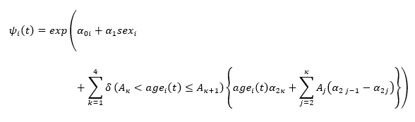
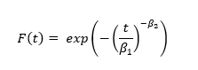
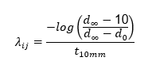
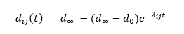
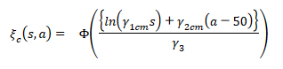
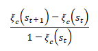
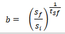
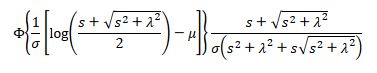
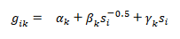
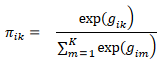

# CRC-AIM Public Repository

## Background

This is a public repository of information related to the Colorectal Cancer and Adenoma Incidence and Mortality (CRC-AIM) microsimulation model. CRC-AIM is a robust CRC natural history model that provides an accessible platform for collaborative simulation studies. This repository was created in the spirit of scientific engagement and transparency, and we will update it periodically as various components of CRC-AIM are added or improved.

We are currently finalizing a detailed manuscript that describes the natural history component of this model. We will provide a link to that manuscript and its supplemental material upon publication.

## Collaborate

We are excited to collaborate with researchers and members the modeling community to address outstanding questions related to colorectal cancer screening. If you are interested in working with us, please email us at collaborate@crcaim.com.

## List of Abstracts/Publications

This is a comprehensive list of all the abstracts and publications that featured CRC-AIM, along with the corresponding versions of the model and parameters used by them.

* Natural History: [abstract, SMDM]() NHistory v1.0

* Natural History: [manuscript in preparation]()

## Contents

### Natural History

#### Adenoma Generation and Location

Instantaneous risk function of growing an adenoma

_Parameters_

* t - time in years
* α0 - baseline log risk parameter
* α0i - random baseline risk parameter assigned to individual i, ~ N(α0, σα)
* α1 - sex parameter
* α2 - age group parameter, four parameters total, one for each age grouping
  * k = 1: ages 20-49
  * k = 2: ages 50-59
  * k = 3: ages 60-69
  * k = 4: ages 70+

#### Adenoma Growth

CDF of of time to 10 mm adenoma size.

_Parameters_

* β1 - scale parameter
* β2 - location parameter

These parameters vary based on adenoma location (colon or rectum).

Time to 10 mm can be used to calculate a growth rate: λij for the jth adenoma in the ith individual:

_Parameters_

* d - diameter of adenoma at given time (0: initiation, infinity: max)
* t_10mm - time for adenoma to grow to 10 mm as sampled from CDF above

The growth rate can be rewritten to evaluate the size of the adenoma at a given time t:

#### Transition from Adenoma to Preclinical CRC
[formulas | parameters]: [description]

_Parameters_

* γ1
* γ2
  * c or r: colon or rectum
  * m or f: male or female
* γ3
* s - adenoma size in mm
* a - age of adenoma initiation in years

#### Transition to Clinically Detectable CRC
[formulas | parameters]: [description]

_Parameters_

* ξc - transition probability
* s_t+1 - size at time t+1
* s_t - size at time t

#### CRC Growth
[formulas | parameters]: [description]

_Parameters_

* sf - size final
* si - size initial
* tsf - time to final size

#### CRC Size at Clinical Detection
[formulas | parameters]: [description]

_Parameters_

* s - CRC Size in mm
* σ - scale parameter
* λ - shape parameter

#### CRC Stage Upon Detection
[formulas | parameters]: [description]

Multinomial Logistic Regression Model

Categorical Probability

