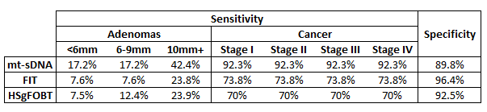

# Comparative Effectiveness of Stool-based Testing Screening strategies assuming a Spectrum of Adherence 

## Methods 

The purpose of this experiment is to evaluate the comparative effectiveness of stool-based testing screening strategies assuming a spectrum of adherence rates for each modality. 

Adherence was set by assuming a fixed annual likelihood to comply with each stool-based screening strategy ranging from 0% to 100%, in 10% increments. It was assumed that individuals were offered a stool-based test every year unless they were not due for screening. 

Screening outcomes are per 1000 individuals free of clinically diagnosed colorectal cancer at age 40.

## Inputs

## Results

- [Triennial mt-sDNA, annual FIT, and annual HSgFOBT](#triennial-mt-sdna-annual-fit-and-annual-hsgfobt)
  - [Screening between ages 45–75 years](#screening-between-ages-4575-years)
  - [Screening between ages 45–80 years](#screening-between-ages-4580-years)
  - [Screening between ages 45–85 years](#screening-between-ages-4585-years)
  - [Screening between ages 50–75 years](#screening-between-ages-5075-years)
  - [Screening between ages 50–80 years](#screening-between-ages-5080-years)
  - [Screening between ages 50–85 years](#screening-between-ages-5085-years)
  - [Screening between ages 55–75 years](#screening-between-ages-5575-years)
  - [Screening between ages 55–80 years](#screening-between-ages-5580-years)
  - [Screening between ages 55–85 years](#screening-between-ages-5585-years)

- [Biennial mt-sDNA, FIT, and HSgFOBT](#biennial-mt-sdna-fit-and-hsgfobt)
  - [Screening between ages 45–75 years](#screening-between-ages-4575-years-1)
  - [Screening between ages 45–80 years](#screening-between-ages-4580-years-1)
  - [Screening between ages 45–85 years](#screening-between-ages-4585-years-1)
  - [Screening between ages 50–75 years](#screening-between-ages-5075-years-1)
  - [Screening between ages 50–80 years](#screening-between-ages-5080-years-1)
  - [Screening between ages 50–85 years](#screening-between-ages-5085-years-1)
  - [Screening between ages 55–75 years](#screening-between-ages-5575-years-1)
  - [Screening between ages 55–80 years](#screening-between-ages-5580-years-1)
  - [Screening between ages 55–85 years](#screening-between-ages-5585-years-1)

### Triennial mt-sDNA, annual FIT, and annual HSgFOBT 

#### Screening between ages 45–75 years

| Strategies             |   Stool tests |   Follow-up COLs |   Surveillance COLs |   COLs for symptoms |   Total COLs |   Complications |   CRC cases |   CRC deaths |   LY with CRC |   LYG |   Incidence reduction |   Mortality reduction |
|:-----------------------|--------------:|-----------------:|--------------------:|--------------------:|-------------:|----------------:|------------:|-------------:|--------------:|------:|----------------------:|----------------------:|
| No screening           |             0 |                0 |                   0 |                  80 |           80 |               2 |        80.3 |         36.6 |         646   |   0   |                 0     |                 0     |
| mt-sDNA 0% Adherence   |             0 |                0 |                   0 |                  80 |           80 |               2 |        80.3 |         36.6 |         646   |   0   |                 0     |                 0     |
| mt-sDNA 10% Adherence  |          2155 |              309 |                 523 |                  48 |          880 |               6 |        55   |         23.3 |         499.9 | 151.1 |                 0.315 |                 0.363 |
| mt-sDNA 20% Adherence  |          3522 |              491 |                 781 |                  34 |         1306 |               8 |        43.6 |         17.5 |         426.7 | 220.4 |                 0.458 |                 0.522 |
| mt-sDNA 30% Adherence  |          4472 |              609 |                 929 |                  27 |         1565 |               9 |        37.4 |         14.6 |         381.5 | 255.7 |                 0.534 |                 0.603 |
| mt-sDNA 40% Adherence  |          5171 |              696 |                1022 |                  24 |         1742 |              10 |        33.9 |         12.8 |         355.2 | 277.5 |                 0.578 |                 0.651 |
| mt-sDNA 50% Adherence  |          5711 |              759 |                1089 |                  21 |         1869 |              10 |        31.4 |         11.7 |         334.6 | 291.1 |                 0.609 |                 0.681 |
| mt-sDNA 60% Adherence  |          6138 |              809 |                1138 |                  19 |         1967 |              10 |        29.7 |         10.9 |         318.8 | 301.3 |                 0.631 |                 0.703 |
| mt-sDNA 70% Adherence  |          6485 |              851 |                1174 |                  18 |         2043 |              10 |        28.4 |         10.3 |         308.8 | 309   |                 0.646 |                 0.719 |
| mt-sDNA 80% Adherence  |          6771 |              883 |                1202 |                  17 |         2103 |              11 |        27.5 |          9.9 |         298.9 | 312.7 |                 0.658 |                 0.729 |
| mt-sDNA 90% Adherence  |          6995 |              911 |                1224 |                  17 |         2151 |              11 |        26.8 |          9.6 |         292.6 | 317   |                 0.667 |                 0.738 |
| mt-sDNA 100% Adherence |          7213 |              935 |                1245 |                  16 |         2196 |              11 |        26.1 |          9.3 |         287.4 | 320.9 |                 0.675 |                 0.746 |
| FIT 0% Adherence       |             0 |                0 |                   0 |                  80 |           80 |               2 |        80.3 |         36.6 |         646   |   0   |                 0     |                 0     |
| FIT 10% Adherence      |          2637 |              162 |                 331 |                  56 |          550 |               5 |        63.7 |         27.3 |         565.1 | 110.2 |                 0.207 |                 0.255 |
| FIT 20% Adherence      |          5035 |              297 |                 574 |                  42 |          913 |               6 |        52.3 |         21.2 |         501.6 | 180.4 |                 0.348 |                 0.42  |
| FIT 30% Adherence      |          7239 |              408 |                 757 |                  32 |         1198 |               8 |        44.2 |         17.1 |         448.1 | 229.9 |                 0.45  |                 0.533 |
| FIT 40% Adherence      |          9293 |              507 |                 900 |                  26 |         1433 |               9 |        38.2 |         14.3 |         402.9 | 262.7 |                 0.524 |                 0.609 |
| FIT 50% Adherence      |         11191 |              595 |                1011 |                  22 |         1628 |               9 |        33.9 |         12.3 |         368.4 | 286.5 |                 0.578 |                 0.664 |
| FIT 60% Adherence      |         12978 |              675 |                1101 |                  19 |         1795 |              10 |        30.5 |         10.8 |         338.9 | 304.3 |                 0.62  |                 0.705 |
| FIT 70% Adherence      |         14663 |              747 |                1177 |                  17 |         1941 |              10 |        27.9 |          9.7 |         314.6 | 317.6 |                 0.653 |                 0.735 |
| FIT 80% Adherence      |         16249 |              814 |                1238 |                  16 |         2067 |              11 |        25.8 |          8.9 |         293.6 | 327.6 |                 0.679 |                 0.758 |
| FIT 90% Adherence      |         17751 |              877 |                1292 |                  14 |         2183 |              11 |        24.1 |          8.2 |         274.5 | 334.7 |                 0.7   |                 0.775 |
| FIT 100% Adherence     |         19182 |              935 |                1336 |                  14 |         2285 |              12 |        22.8 |          7.7 |         261.3 | 340.7 |                 0.717 |                 0.789 |
| HSgFOBT 0% Adherence   |             0 |                0 |                   0 |                  80 |           80 |               2 |        80.3 |         36.6 |         646   |   0   |                 0     |                 0     |
| HSgFOBT 10% Adherence  |          2575 |              244 |                 355 |                  56 |          654 |               5 |        62.4 |         26.8 |         553.2 | 114.7 |                 0.223 |                 0.268 |
| HSgFOBT 20% Adherence  |          4808 |              445 |                 608 |                  41 |         1093 |               7 |        50.3 |         20.5 |         480.2 | 186.6 |                 0.373 |                 0.44  |
| HSgFOBT 30% Adherence  |          6772 |              609 |                 794 |                  31 |         1434 |               8 |        42.1 |         16.4 |         423.2 | 235.3 |                 0.476 |                 0.552 |
| HSgFOBT 40% Adherence  |          8520 |              756 |                 934 |                  25 |         1715 |               9 |        36.1 |         13.6 |         378.8 | 270.1 |                 0.551 |                 0.629 |
| HSgFOBT 50% Adherence  |         10086 |              881 |                1043 |                  21 |         1944 |              10 |        31.8 |         11.7 |         344.2 | 293   |                 0.604 |                 0.682 |
| HSgFOBT 60% Adherence  |         11505 |              993 |                1128 |                  18 |         2139 |              10 |        28.6 |         10.2 |         312.7 | 309.3 |                 0.644 |                 0.72  |
| HSgFOBT 70% Adherence  |         12782 |             1098 |                1197 |                  16 |         2311 |              11 |        26.2 |          9.3 |         290.3 | 321.2 |                 0.674 |                 0.747 |
| HSgFOBT 80% Adherence  |         13965 |             1187 |                1254 |                  15 |         2457 |              11 |        24.2 |          8.5 |         271.1 | 330.9 |                 0.699 |                 0.769 |
| HSgFOBT 90% Adherence  |         15041 |             1272 |                1303 |                  14 |         2589 |              12 |        22.6 |          7.8 |         253.5 | 338.5 |                 0.719 |                 0.786 |
| HSgFOBT 100% Adherence |         16023 |             1350 |                1344 |                  13 |         2707 |              12 |        21.3 |          7.4 |         239.1 | 343.6 |                 0.734 |                 0.798 |

#### Screening between ages 45–80 years

| Strategies             |   Stool tests |   Follow-up COLs |   Surveillance COLs |   COLs for symptoms |   Total COLs |   Complications |   CRC cases |   CRC deaths |   LY with CRC |   LYG |   Incidence reduction |   Mortality reduction |
|:-----------------------|--------------:|-----------------:|--------------------:|--------------------:|-------------:|----------------:|------------:|-------------:|--------------:|------:|----------------------:|----------------------:|
| No screening           |             0 |                0 |                   0 |                  80 |           80 |               2 |        80.3 |         36.6 |         646   |   0   |                 0     |                 0     |
| mt-sDNA 0% Adherence   |             0 |                0 |                   0 |                  80 |           80 |               2 |        80.3 |         36.6 |         646   |   0   |                 0     |                 0     |
| mt-sDNA 10% Adherence  |          2380 |              346 |                 547 |                  44 |          936 |               7 |        53.2 |         22   |         501.7 | 160.9 |                 0.337 |                 0.4   |
| mt-sDNA 20% Adherence  |          3880 |              546 |                 810 |                  30 |         1386 |               9 |        41.3 |         16   |         426.4 | 229.7 |                 0.486 |                 0.563 |
| mt-sDNA 30% Adherence  |          4916 |              674 |                 963 |                  23 |         1659 |              10 |        35.1 |         12.9 |         382   | 267.7 |                 0.563 |                 0.648 |
| mt-sDNA 40% Adherence  |          5679 |              766 |                1057 |                  19 |         1843 |              11 |        31.3 |         11.1 |         352.3 | 288.9 |                 0.61  |                 0.698 |
| mt-sDNA 50% Adherence  |          6259 |              836 |                1124 |                  16 |         1977 |              11 |        28.9 |         10   |         334   | 302.4 |                 0.64  |                 0.727 |
| mt-sDNA 60% Adherence  |          6719 |              889 |                1174 |                  15 |         2078 |              11 |        27.1 |          9.2 |         317.1 | 312.4 |                 0.663 |                 0.749 |
| mt-sDNA 70% Adherence  |          7090 |              932 |                1209 |                  14 |         2156 |              12 |        25.9 |          8.7 |         306.7 | 319.7 |                 0.678 |                 0.764 |
| mt-sDNA 80% Adherence  |          7404 |              966 |                1238 |                  13 |         2217 |              12 |        25   |          8.3 |         297.5 | 324.1 |                 0.689 |                 0.774 |
| mt-sDNA 90% Adherence  |          7669 |              998 |                1262 |                  12 |         2272 |              12 |        24.1 |          7.9 |         288.5 | 328.5 |                 0.7   |                 0.783 |
| mt-sDNA 100% Adherence |          7856 |             1021 |                1280 |                  12 |         2313 |              12 |        23.8 |          7.7 |         285.2 | 331.5 |                 0.704 |                 0.789 |
| FIT 0% Adherence       |             0 |                0 |                   0 |                  80 |           80 |               2 |        80.3 |         36.6 |         646   |   0   |                 0     |                 0     |
| FIT 10% Adherence      |          2928 |              186 |                 351 |                  53 |          590 |               5 |        62.2 |         26   |         567.6 | 118.6 |                 0.225 |                 0.289 |
| FIT 20% Adherence      |          5572 |              337 |                 602 |                  37 |          976 |               7 |        50.2 |         19.6 |         502.4 | 191.3 |                 0.375 |                 0.465 |
| FIT 30% Adherence      |          7982 |              459 |                 791 |                  27 |         1277 |               9 |        41.7 |         15.2 |         447.6 | 242.8 |                 0.481 |                 0.585 |
| FIT 40% Adherence      |         10223 |              566 |                 932 |                  21 |         1519 |              10 |        35.9 |         12.4 |         407.8 | 275.3 |                 0.553 |                 0.661 |
| FIT 50% Adherence      |         12291 |              662 |                1046 |                  17 |         1725 |              11 |        31.3 |         10.4 |         370.6 | 299.8 |                 0.61  |                 0.715 |
| FIT 60% Adherence      |         14241 |              744 |                1137 |                  14 |         1895 |              11 |        28   |          9   |         339.1 | 315.9 |                 0.651 |                 0.754 |
| FIT 70% Adherence      |         16061 |              821 |                1212 |                  12 |         2045 |              11 |        25.3 |          8   |         312.9 | 328.7 |                 0.684 |                 0.782 |
| FIT 80% Adherence      |         17790 |              893 |                1274 |                  11 |         2178 |              12 |        23.3 |          7.2 |         292.9 | 338.3 |                 0.709 |                 0.803 |
| FIT 90% Adherence      |         19434 |              959 |                1326 |                  10 |         2295 |              12 |        21.7 |          6.6 |         275.1 | 345.7 |                 0.729 |                 0.819 |
| FIT 100% Adherence     |         20958 |             1025 |                1370 |                   9 |         2405 |              13 |        20.3 |          6.1 |         259.3 | 351.1 |                 0.748 |                 0.833 |
| HSgFOBT 0% Adherence   |             0 |                0 |                   0 |                  80 |           80 |               2 |        80.3 |         36.6 |         646   |   0   |                 0     |                 0     |
| HSgFOBT 10% Adherence  |          2857 |              272 |                 374 |                  52 |          698 |               6 |        61   |         25.7 |         555   | 121.2 |                 0.241 |                 0.299 |
| HSgFOBT 20% Adherence  |          5321 |              495 |                 636 |                  36 |         1166 |               8 |        48.2 |         18.8 |         483.4 | 198.7 |                 0.399 |                 0.486 |
| HSgFOBT 30% Adherence  |          7460 |              677 |                 827 |                  26 |         1530 |               9 |        39.6 |         14.6 |         426.8 | 248.3 |                 0.507 |                 0.602 |
| HSgFOBT 40% Adherence  |          9376 |              834 |                 965 |                  20 |         1820 |              10 |        33.6 |         11.8 |         378.1 | 280.5 |                 0.581 |                 0.676 |
| HSgFOBT 50% Adherence  |         11061 |              973 |                1075 |                  16 |         2065 |              11 |        29.4 |          9.9 |         344.7 | 304.3 |                 0.634 |                 0.729 |
| HSgFOBT 60% Adherence  |         12609 |             1091 |                1160 |                  14 |         2265 |              12 |        26.1 |          8.6 |         314.3 | 320.6 |                 0.675 |                 0.766 |
| HSgFOBT 70% Adherence  |         13993 |             1199 |                1231 |                  12 |         2442 |              12 |        23.7 |          7.6 |         290.9 | 332.4 |                 0.705 |                 0.792 |
| HSgFOBT 80% Adherence  |         15263 |             1298 |                1289 |                  11 |         2598 |              13 |        21.7 |          6.9 |         268.7 | 341.1 |                 0.729 |                 0.812 |
| HSgFOBT 90% Adherence  |         16437 |             1388 |                1335 |                  10 |         2733 |              13 |        20.3 |          6.4 |         252.6 | 348   |                 0.748 |                 0.826 |
| HSgFOBT 100% Adherence |         17489 |             1473 |                1377 |                   9 |         2859 |              13 |        18.9 |          5.9 |         236   | 352.9 |                 0.764 |                 0.839 |

#### Screening between ages 45–85 years

| Strategies             |   Stool tests |   Follow-up COLs |   Surveillance COLs |   COLs for symptoms |   Total COLs |   Complications |   CRC cases |   CRC deaths |   LY with CRC |   LYG |   Incidence reduction |   Mortality reduction |
|:-----------------------|--------------:|-----------------:|--------------------:|--------------------:|-------------:|----------------:|------------:|-------------:|--------------:|------:|----------------------:|----------------------:|
| No screening           |             0 |                0 |                   0 |                  80 |           80 |               2 |        80.3 |         36.6 |         646   |   0   |                 0     |                 0     |
| mt-sDNA 0% Adherence   |             0 |                0 |                   0 |                  80 |           80 |               2 |        80.3 |         36.6 |         646   |   0   |                 0     |                 0     |
| mt-sDNA 10% Adherence  |          2561 |              381 |                 564 |                  41 |          985 |               8 |        51.9 |         21   |         502.1 | 167.3 |                 0.354 |                 0.427 |
| mt-sDNA 20% Adherence  |          4149 |              590 |                 832 |                  26 |         1448 |              10 |        40   |         14.8 |         428.3 | 237.7 |                 0.502 |                 0.596 |
| mt-sDNA 30% Adherence  |          5246 |              728 |                 983 |                  19 |         1730 |              11 |        33.9 |         11.8 |         385.1 | 273   |                 0.579 |                 0.677 |
| mt-sDNA 40% Adherence  |          6046 |              823 |                1079 |                  15 |         1917 |              12 |        30.2 |         10.1 |         356.2 | 295   |                 0.624 |                 0.725 |
| mt-sDNA 50% Adherence  |          6664 |              894 |                1145 |                  13 |         2052 |              12 |        27.7 |          9   |         334.6 | 307.6 |                 0.656 |                 0.754 |
| mt-sDNA 60% Adherence  |          7149 |              951 |                1193 |                  12 |         2155 |              13 |        26   |          8.2 |         320.7 | 317.7 |                 0.677 |                 0.775 |
| mt-sDNA 70% Adherence  |          7549 |              995 |                1229 |                  11 |         2235 |              13 |        24.7 |          7.7 |         308   | 324.9 |                 0.693 |                 0.791 |
| mt-sDNA 80% Adherence  |          7874 |             1035 |                1256 |                  10 |         2301 |              13 |        23.9 |          7.3 |         301.8 | 329.1 |                 0.703 |                 0.8   |
| mt-sDNA 90% Adherence  |          8146 |             1068 |                1281 |                   9 |         2359 |              13 |        23   |          6.9 |         292.5 | 333.4 |                 0.714 |                 0.81  |
| mt-sDNA 100% Adherence |          8406 |             1097 |                1301 |                   9 |         2407 |              13 |        22.4 |          6.7 |         286.9 | 336.4 |                 0.722 |                 0.817 |
| FIT 0% Adherence       |             0 |                0 |                   0 |                  80 |           80 |               2 |        80.3 |         36.6 |         646   |   0   |                 0     |                 0     |
| FIT 10% Adherence      |          3156 |              207 |                 364 |                  50 |          621 |               6 |        61.4 |         25.2 |         569.8 | 123.4 |                 0.236 |                 0.313 |
| FIT 20% Adherence      |          5974 |              367 |                 621 |                  33 |         1021 |               8 |        49.1 |         18.3 |         507.6 | 200.6 |                 0.389 |                 0.5   |
| FIT 30% Adherence      |          8544 |              500 |                 811 |                  23 |         1334 |              10 |        40.6 |         14.1 |         452.9 | 248.3 |                 0.495 |                 0.615 |
| FIT 40% Adherence      |         10921 |              610 |                 954 |                  17 |         1581 |              11 |        34.7 |         11.3 |         410.3 | 281.2 |                 0.568 |                 0.691 |
| FIT 50% Adherence      |         13115 |              710 |                1067 |                  13 |         1790 |              12 |        30.2 |          9.4 |         373.7 | 305   |                 0.624 |                 0.744 |
| FIT 60% Adherence      |         15186 |              797 |                1158 |                  11 |         1966 |              12 |        26.9 |          8   |         343.5 | 321.7 |                 0.665 |                 0.782 |
| FIT 70% Adherence      |         17113 |              881 |                1233 |                   9 |         2123 |              13 |        24.2 |          6.9 |         316.2 | 335.1 |                 0.699 |                 0.811 |
| FIT 80% Adherence      |         18919 |              961 |                1295 |                   8 |         2264 |              13 |        22.2 |          6.2 |         295.3 | 343.8 |                 0.724 |                 0.83  |
| FIT 90% Adherence      |         20637 |             1033 |                1347 |                   7 |         2387 |              14 |        20.5 |          5.7 |         276.2 | 350.6 |                 0.745 |                 0.844 |
| FIT 100% Adherence     |         22308 |             1094 |                1391 |                   7 |         2492 |              14 |        19.2 |          5.3 |         261   | 355.5 |                 0.761 |                 0.856 |
| HSgFOBT 0% Adherence   |             0 |                0 |                   0 |                  80 |           80 |               2 |        80.3 |         36.6 |         646   |   0   |                 0     |                 0     |
| HSgFOBT 10% Adherence  |          3080 |              299 |                 387 |                  49 |          735 |               6 |        60.1 |         24.8 |         557.8 | 127   |                 0.252 |                 0.323 |
| HSgFOBT 20% Adherence  |          5703 |              533 |                 655 |                  32 |         1220 |               9 |        47   |         17.8 |         485.7 | 205   |                 0.415 |                 0.515 |
| HSgFOBT 30% Adherence  |          7986 |              730 |                 847 |                  22 |         1599 |              10 |        38.4 |         13.5 |         430   | 255.1 |                 0.522 |                 0.633 |
| HSgFOBT 40% Adherence  |         10007 |              893 |                 987 |                  17 |         1896 |              12 |        32.4 |         10.7 |         382.9 | 288.3 |                 0.597 |                 0.708 |
| HSgFOBT 50% Adherence  |         11806 |             1036 |                1098 |                  13 |         2147 |              12 |        28   |          8.9 |         344.6 | 309.9 |                 0.651 |                 0.757 |
| HSgFOBT 60% Adherence  |         13428 |             1164 |                1183 |                  11 |         2357 |              13 |        24.9 |          7.6 |         316.7 | 326.2 |                 0.69  |                 0.794 |
| HSgFOBT 70% Adherence  |         14899 |             1279 |                1252 |                   9 |         2540 |              13 |        22.4 |          6.7 |         290   | 337.4 |                 0.721 |                 0.818 |
| HSgFOBT 80% Adherence  |         16246 |             1386 |                1308 |                   8 |         2701 |              14 |        20.6 |          6   |         270.8 | 345.5 |                 0.744 |                 0.836 |
| HSgFOBT 90% Adherence  |         17455 |             1483 |                1357 |                   7 |         2846 |              14 |        19   |          5.5 |         253.2 | 352.7 |                 0.763 |                 0.851 |
| HSgFOBT 100% Adherence |         18590 |             1568 |                1397 |                   7 |         2972 |              15 |        17.8 |          5   |         238.1 | 357.8 |                 0.779 |                 0.862 |

#### Screening between ages 50–75 years

| Strategies             |   Stool tests |   Follow-up COLs |   Surveillance COLs |   COLs for symptoms |   Total COLs |   Complications |   CRC cases |   CRC deaths |   LY with CRC |   LYG |   Incidence reduction |   Mortality reduction |
|:-----------------------|--------------:|-----------------:|--------------------:|--------------------:|-------------:|----------------:|------------:|-------------:|--------------:|------:|----------------------:|----------------------:|
| No screening           |             0 |                0 |                   0 |                  80 |           80 |               2 |        80.3 |         36.6 |         646   |   0   |                 0     |                 0     |
| mt-sDNA 0% Adherence   |             0 |                0 |                   0 |                  80 |           80 |               2 |        80.3 |         36.6 |         646   |   0   |                 0     |                 0     |
| mt-sDNA 10% Adherence  |          1782 |              268 |                 452 |                  50 |          770 |               6 |        57.6 |         24.6 |         526.9 | 133.1 |                 0.283 |                 0.33  |
| mt-sDNA 20% Adherence  |          2925 |              424 |                 684 |                  37 |         1145 |               8 |        46.8 |         18.9 |         464   | 196   |                 0.417 |                 0.483 |
| mt-sDNA 30% Adherence  |          3717 |              527 |                 825 |                  30 |         1382 |               9 |        40.6 |         15.9 |         422   | 231.1 |                 0.494 |                 0.565 |
| mt-sDNA 40% Adherence  |          4304 |              601 |                 915 |                  26 |         1541 |               9 |        36.9 |         14   |         397   | 253.8 |                 0.541 |                 0.617 |
| mt-sDNA 50% Adherence  |          4751 |              657 |                 978 |                  23 |         1659 |              10 |        34.4 |         12.8 |         378.5 | 268.1 |                 0.572 |                 0.65  |
| mt-sDNA 60% Adherence  |          5107 |              701 |                1024 |                  21 |         1747 |              10 |        32.6 |         12   |         364   | 278.3 |                 0.594 |                 0.672 |
| mt-sDNA 70% Adherence  |          5397 |              734 |                1059 |                  20 |         1813 |              10 |        31.3 |         11.4 |         353.4 | 285.1 |                 0.611 |                 0.688 |
| mt-sDNA 80% Adherence  |          5641 |              763 |                1085 |                  19 |         1867 |              10 |        30.4 |         11   |         346.9 | 290.2 |                 0.622 |                 0.7   |
| mt-sDNA 90% Adherence  |          5864 |              789 |                1108 |                  18 |         1916 |              10 |        29.4 |         10.6 |         339.5 | 295.3 |                 0.634 |                 0.712 |
| mt-sDNA 100% Adherence |          6076 |              814 |                1126 |                  18 |         1957 |              11 |        28.6 |         10.2 |         333   | 300   |                 0.644 |                 0.722 |
| FIT 0% Adherence       |             0 |                0 |                   0 |                  80 |           80 |               2 |        80.3 |         36.6 |         646   |   0   |                 0     |                 0     |
| FIT 10% Adherence      |          2174 |              142 |                 285 |                  58 |          486 |               5 |        65.5 |         28.1 |         582.6 |  96.3 |                 0.185 |                 0.232 |
| FIT 20% Adherence      |          4162 |              258 |                 500 |                  44 |          802 |               6 |        55.1 |         22.4 |         530.7 | 160.2 |                 0.315 |                 0.388 |
| FIT 30% Adherence      |          5980 |              356 |                 666 |                  35 |         1057 |               7 |        47.2 |         18.4 |         483.8 | 206.5 |                 0.413 |                 0.498 |
| FIT 40% Adherence      |          7672 |              441 |                 799 |                  28 |         1269 |               8 |        41.3 |         15.5 |         444.4 | 239.4 |                 0.486 |                 0.576 |
| FIT 50% Adherence      |          9246 |              518 |                 903 |                  24 |         1444 |               9 |        36.9 |         13.5 |         411.5 | 263   |                 0.541 |                 0.631 |
| FIT 60% Adherence      |         10727 |              585 |                 987 |                  21 |         1594 |              10 |        33.6 |         12   |         384.9 | 279.5 |                 0.582 |                 0.672 |
| FIT 70% Adherence      |         12120 |              648 |                1060 |                  19 |         1726 |              10 |        30.8 |         10.9 |         360.5 | 293   |                 0.616 |                 0.703 |
| FIT 80% Adherence      |         13432 |              705 |                1120 |                  17 |         1842 |              11 |        28.7 |          9.9 |         342.8 | 304.4 |                 0.643 |                 0.729 |
| FIT 90% Adherence      |         14673 |              759 |                1170 |                  16 |         1945 |              11 |        26.9 |          9.3 |         323.7 | 310.9 |                 0.665 |                 0.746 |
| FIT 100% Adherence     |         15856 |              808 |                1214 |                  15 |         2037 |              11 |        25.4 |          8.7 |         308.9 | 318.1 |                 0.684 |                 0.763 |
| HSgFOBT 0% Adherence   |             0 |                0 |                   0 |                  80 |           80 |               2 |        80.3 |         36.6 |         646   |   0   |                 0     |                 0     |
| HSgFOBT 10% Adherence  |          2127 |              208 |                 306 |                  58 |          572 |               5 |        64.4 |         27.7 |         572.4 |  99.8 |                 0.199 |                 0.244 |
| HSgFOBT 20% Adherence  |          3981 |              379 |                 532 |                  43 |          954 |               7 |        53.1 |         21.7 |         511.5 | 166.3 |                 0.338 |                 0.406 |
| HSgFOBT 30% Adherence  |          5612 |              520 |                 701 |                  34 |         1255 |               8 |        45.3 |         17.8 |         463.8 | 211.9 |                 0.437 |                 0.515 |
| HSgFOBT 40% Adherence  |          7074 |              642 |                 833 |                  28 |         1503 |               9 |        39.3 |         14.9 |         422   | 244.2 |                 0.511 |                 0.593 |
| HSgFOBT 50% Adherence  |          8373 |              752 |                 934 |                  23 |         1709 |              10 |        34.9 |         12.9 |         390   | 268   |                 0.565 |                 0.649 |
| HSgFOBT 60% Adherence  |          9558 |              846 |                1016 |                  20 |         1883 |              10 |        31.7 |         11.5 |         361.5 | 284.9 |                 0.606 |                 0.687 |
| HSgFOBT 70% Adherence  |         10631 |              933 |                1084 |                  18 |         2034 |              11 |        29.1 |         10.4 |         338.2 | 296.6 |                 0.637 |                 0.716 |
| HSgFOBT 80% Adherence  |         11609 |             1011 |                1139 |                  17 |         2167 |              11 |        27.1 |          9.5 |         321.6 | 307.3 |                 0.663 |                 0.74  |
| HSgFOBT 90% Adherence  |         12505 |             1081 |                1188 |                  16 |         2285 |              12 |        25.4 |          8.9 |         302.8 | 314.2 |                 0.684 |                 0.757 |
| HSgFOBT 100% Adherence |         13337 |             1146 |                1227 |                  15 |         2388 |              12 |        24   |          8.4 |         288.4 | 320.6 |                 0.701 |                 0.77  |

#### Screening between ages 50–80 years

| Strategies             |   Stool tests |   Follow-up COLs |   Surveillance COLs |   COLs for symptoms |   Total COLs |   Complications |   CRC cases |   CRC deaths |   LY with CRC |   LYG |   Incidence reduction |   Mortality reduction |
|:-----------------------|--------------:|-----------------:|--------------------:|--------------------:|-------------:|----------------:|------------:|-------------:|--------------:|------:|----------------------:|----------------------:|
| No screening           |             0 |                0 |                   0 |                  80 |           80 |               2 |        80.3 |         36.6 |         646   |   0   |                 0     |                 0     |
| mt-sDNA 0% Adherence   |             0 |                0 |                   0 |                  80 |           80 |               2 |        80.3 |         36.6 |         646   |   0   |                 0     |                 0     |
| mt-sDNA 10% Adherence  |          2014 |              304 |                 480 |                  46 |          830 |               7 |        55.4 |         23.1 |         525.5 | 142.5 |                 0.31  |                 0.37  |
| mt-sDNA 20% Adherence  |          3280 |              479 |                 722 |                  32 |         1233 |               9 |        44.1 |         17.1 |         462.4 | 208.5 |                 0.451 |                 0.533 |
| mt-sDNA 30% Adherence  |          4159 |              594 |                 862 |                  25 |         1481 |              10 |        38   |         14.1 |         422.5 | 244   |                 0.527 |                 0.616 |
| mt-sDNA 40% Adherence  |          4813 |              672 |                 951 |                  21 |         1644 |              10 |        34.3 |         12.2 |         397   | 266.1 |                 0.573 |                 0.665 |
| mt-sDNA 50% Adherence  |          5305 |              733 |                1015 |                  18 |         1767 |              11 |        31.7 |         11.1 |         377.1 | 279.2 |                 0.605 |                 0.697 |
| mt-sDNA 60% Adherence  |          5693 |              779 |                1062 |                  17 |         1858 |              11 |        29.9 |         10.2 |         363.5 | 289.9 |                 0.627 |                 0.721 |
| mt-sDNA 70% Adherence  |          6010 |              816 |                1097 |                  15 |         1929 |              11 |        28.7 |          9.7 |         352.8 | 296.9 |                 0.642 |                 0.734 |
| mt-sDNA 80% Adherence  |          6272 |              847 |                1124 |                  15 |         1985 |              12 |        27.7 |          9.3 |         344.1 | 301.2 |                 0.655 |                 0.745 |
| mt-sDNA 90% Adherence  |          6481 |              872 |                1144 |                  14 |         2030 |              12 |        27   |          9   |         337.9 | 306   |                 0.664 |                 0.756 |
| mt-sDNA 100% Adherence |          6676 |              896 |                1159 |                  13 |         2068 |              12 |        26.4 |          8.7 |         332.1 | 309.5 |                 0.672 |                 0.762 |
| FIT 0% Adherence       |             0 |                0 |                   0 |                  80 |           80 |               2 |        80.3 |         36.6 |         646   |   0   |                 0     |                 0     |
| FIT 10% Adherence      |          2469 |              167 |                 307 |                  55 |          528 |               5 |        64   |         26.9 |         584.3 | 104.2 |                 0.203 |                 0.264 |
| FIT 20% Adherence      |          4693 |              298 |                 532 |                  39 |          869 |               7 |        52.6 |         20.6 |         530.7 | 173   |                 0.345 |                 0.436 |
| FIT 30% Adherence      |          6725 |              410 |                 703 |                  29 |         1142 |               9 |        44.6 |         16.4 |         484.1 | 219.6 |                 0.445 |                 0.551 |
| FIT 40% Adherence      |          8622 |              501 |                 834 |                  23 |         1358 |              10 |        38.8 |         13.5 |         449.2 | 253.2 |                 0.517 |                 0.63  |
| FIT 50% Adherence      |         10369 |              583 |                 940 |                  19 |         1543 |              10 |        34.3 |         11.6 |         413.8 | 275.4 |                 0.572 |                 0.682 |
| FIT 60% Adherence      |         11995 |              657 |                1026 |                  16 |         1699 |              11 |        31   |         10.2 |         385.1 | 292.4 |                 0.615 |                 0.722 |
| FIT 70% Adherence      |         13533 |              724 |                1095 |                  14 |         1833 |              11 |        28.4 |          9.1 |         363.3 | 304.6 |                 0.647 |                 0.752 |
| FIT 80% Adherence      |         14985 |              787 |                1155 |                  13 |         1954 |              12 |        26.1 |          8.2 |         341.3 | 315.5 |                 0.675 |                 0.776 |
| FIT 90% Adherence      |         16355 |              844 |                1205 |                  12 |         2060 |              12 |        24.4 |          7.6 |         324.5 | 322.4 |                 0.696 |                 0.792 |
| FIT 100% Adherence     |         17642 |              898 |                1250 |                  11 |         2159 |              13 |        23   |          7.1 |         309.9 | 328.2 |                 0.714 |                 0.806 |
| HSgFOBT 0% Adherence   |             0 |                0 |                   0 |                  80 |           80 |               2 |        80.3 |         36.6 |         646   |   0   |                 0     |                 0     |
| HSgFOBT 10% Adherence  |          2412 |              239 |                 328 |                  54 |          621 |               5 |        62.7 |         26.5 |         573.8 | 108.5 |                 0.219 |                 0.277 |
| HSgFOBT 20% Adherence  |          4481 |              430 |                 562 |                  38 |         1030 |               8 |        50.9 |         20   |         513.8 | 177.9 |                 0.367 |                 0.453 |
| HSgFOBT 30% Adherence  |          6303 |              590 |                 736 |                  29 |         1355 |               9 |        42.6 |         15.9 |         464.2 | 223.7 |                 0.469 |                 0.565 |
| HSgFOBT 40% Adherence  |          7927 |              724 |                 868 |                  22 |         1614 |              10 |        36.7 |         13.1 |         423.6 | 256.8 |                 0.543 |                 0.643 |
| HSgFOBT 50% Adherence  |          9369 |              841 |                 971 |                  18 |         1831 |              11 |        32.3 |         11.1 |         388.2 | 279.5 |                 0.598 |                 0.698 |
| HSgFOBT 60% Adherence  |         10662 |              943 |                1054 |                  16 |         2013 |              11 |        29   |          9.7 |         360.5 | 296.6 |                 0.639 |                 0.736 |
| HSgFOBT 70% Adherence  |         11843 |             1037 |                1120 |                  14 |         2170 |              12 |        26.5 |          8.7 |         338.4 | 308.8 |                 0.67  |                 0.762 |
| HSgFOBT 80% Adherence  |         12928 |             1121 |                1175 |                  12 |         2308 |              13 |        24.4 |          7.9 |         316.8 | 317.8 |                 0.696 |                 0.785 |
| HSgFOBT 90% Adherence  |         13897 |             1201 |                1221 |                  12 |         2433 |              13 |        22.9 |          7.3 |         300.6 | 324.4 |                 0.715 |                 0.8   |
| HSgFOBT 100% Adherence |         14792 |             1272 |                1261 |                  11 |         2544 |              13 |        21.6 |          6.9 |         286.7 | 330   |                 0.731 |                 0.812 |

#### Screening between ages 50–85 years

| Strategies             |   Stool tests |   Follow-up COLs |   Surveillance COLs |   COLs for symptoms |   Total COLs |   Complications |   CRC cases |   CRC deaths |   LY with CRC |   LYG |   Incidence reduction |   Mortality reduction |
|:-----------------------|--------------:|-----------------:|--------------------:|--------------------:|-------------:|----------------:|------------:|-------------:|--------------:|------:|----------------------:|----------------------:|
| No screening           |             0 |                0 |                   0 |                  80 |           80 |               2 |        80.3 |         36.6 |         646   |   0   |                 0     |                 0     |
| mt-sDNA 0% Adherence   |             0 |                0 |                   0 |                  80 |           80 |               2 |        80.3 |         36.6 |         646   |   0   |                 0     |                 0     |
| mt-sDNA 10% Adherence  |          2193 |              337 |                 494 |                  43 |          875 |               8 |        54.5 |         22.2 |         530.5 | 148.2 |                 0.322 |                 0.394 |
| mt-sDNA 20% Adherence  |          3556 |              523 |                 741 |                  28 |         1292 |              10 |        42.9 |         16.1 |         464   | 214.5 |                 0.466 |                 0.561 |
| mt-sDNA 30% Adherence  |          4496 |              642 |                 881 |                  21 |         1544 |              11 |        36.6 |         12.9 |         424.5 | 250.7 |                 0.545 |                 0.647 |
| mt-sDNA 40% Adherence  |          5188 |              727 |                 972 |                  17 |         1716 |              12 |        32.9 |         11.2 |         397.1 | 271.7 |                 0.59  |                 0.695 |
| mt-sDNA 50% Adherence  |          5714 |              793 |                1033 |                  15 |         1841 |              12 |        30.5 |         10.1 |         379.1 | 284.3 |                 0.62  |                 0.724 |
| mt-sDNA 60% Adherence  |          6130 |              841 |                1081 |                  13 |         1936 |              13 |        28.7 |          9.3 |         365   | 294.1 |                 0.642 |                 0.746 |
| mt-sDNA 70% Adherence  |          6467 |              883 |                1116 |                  12 |         2012 |              13 |        27.4 |          8.8 |         352.8 | 301.1 |                 0.659 |                 0.76  |
| mt-sDNA 80% Adherence  |          6748 |              915 |                1143 |                  11 |         2070 |              13 |        26.4 |          8.3 |         345.1 | 307.6 |                 0.671 |                 0.774 |
| mt-sDNA 90% Adherence  |          6988 |              943 |                1165 |                  11 |         2119 |              13 |        25.7 |          8   |         339.6 | 311.5 |                 0.68  |                 0.781 |
| mt-sDNA 100% Adherence |          7170 |              962 |                1178 |                  11 |         2151 |              13 |        25.2 |          7.8 |         332.8 | 314.1 |                 0.687 |                 0.787 |
| FIT 0% Adherence       |             0 |                0 |                   0 |                  80 |           80 |               2 |        80.3 |         36.6 |         646   |   0   |                 0     |                 0     |
| FIT 10% Adherence      |          2696 |              186 |                 316 |                  52 |          554 |               6 |        63.2 |         26.1 |         587.4 | 109.4 |                 0.213 |                 0.287 |
| FIT 20% Adherence      |          5098 |              329 |                 548 |                  35 |          912 |               8 |        51.5 |         19.5 |         534.4 | 180.2 |                 0.358 |                 0.469 |
| FIT 30% Adherence      |          7301 |              446 |                 722 |                  25 |         1193 |              10 |        43.3 |         15.2 |         489.5 | 227.8 |                 0.46  |                 0.584 |
| FIT 40% Adherence      |          9311 |              547 |                 855 |                  19 |         1422 |              11 |        37.4 |         12.4 |         451.4 | 259.4 |                 0.534 |                 0.662 |
| FIT 50% Adherence      |         11186 |              634 |                 962 |                  15 |         1611 |              11 |        33   |         10.4 |         415.9 | 282.8 |                 0.589 |                 0.717 |
| FIT 60% Adherence      |         12943 |              711 |                1048 |                  13 |         1772 |              12 |        29.6 |          9   |         387.8 | 299.3 |                 0.631 |                 0.754 |
| FIT 70% Adherence      |         14589 |              783 |                1118 |                  11 |         1912 |              13 |        27.1 |          8   |         365.9 | 312   |                 0.663 |                 0.782 |
| FIT 80% Adherence      |         16133 |              850 |                1178 |                  10 |         2038 |              13 |        24.8 |          7.3 |         342   | 320.3 |                 0.691 |                 0.801 |
| FIT 90% Adherence      |         17615 |              909 |                1227 |                   9 |         2145 |              13 |        23.2 |          6.6 |         326.1 | 328.1 |                 0.711 |                 0.819 |
| FIT 100% Adherence     |         18994 |              967 |                1270 |                   8 |         2246 |              14 |        21.9 |          6.2 |         310.5 | 332.9 |                 0.727 |                 0.83  |
| HSgFOBT 0% Adherence   |             0 |                0 |                   0 |                  80 |           80 |               2 |        80.3 |         36.6 |         646   |   0   |                 0     |                 0     |
| HSgFOBT 10% Adherence  |          2633 |              265 |                 338 |                  51 |          653 |               6 |        62.1 |         25.7 |         577.1 | 113   |                 0.227 |                 0.297 |
| HSgFOBT 20% Adherence  |          4872 |              471 |                 580 |                  35 |         1086 |               9 |        49.7 |         19   |         516.9 | 183.8 |                 0.381 |                 0.481 |
| HSgFOBT 30% Adherence  |          6834 |              641 |                 758 |                  24 |         1423 |              10 |        41.2 |         14.7 |         466.3 | 231.9 |                 0.488 |                 0.6   |
| HSgFOBT 40% Adherence  |          8559 |              784 |                 889 |                  19 |         1692 |              11 |        35.4 |         12   |         425.6 | 263.1 |                 0.56  |                 0.673 |
| HSgFOBT 50% Adherence  |         10089 |              910 |                 993 |                  15 |         1918 |              12 |        30.9 |         10   |         389.9 | 285.7 |                 0.615 |                 0.726 |
| HSgFOBT 60% Adherence  |         11481 |             1021 |                1074 |                  12 |         2108 |              13 |        27.7 |          8.7 |         362.9 | 302   |                 0.655 |                 0.764 |
| HSgFOBT 70% Adherence  |         12756 |             1118 |                1141 |                  11 |         2270 |              13 |        25.2 |          7.7 |         338.6 | 313.9 |                 0.686 |                 0.79  |
| HSgFOBT 80% Adherence  |         13895 |             1208 |                1198 |                  10 |         2415 |              14 |        23.2 |          7   |         319   | 323.2 |                 0.711 |                 0.809 |
| HSgFOBT 90% Adherence  |         14954 |             1289 |                1242 |                   9 |         2540 |              14 |        21.7 |          6.4 |         302.3 | 329.6 |                 0.73  |                 0.825 |
| HSgFOBT 100% Adherence |         15906 |             1366 |                1281 |                   8 |         2656 |              14 |        20.4 |          6   |         288   | 334.7 |                 0.746 |                 0.835 |

#### Screening between ages 55–75 years

| Strategies             |   Stool tests |   Follow-up COLs |   Surveillance COLs |   COLs for symptoms |   Total COLs |   Complications |   CRC cases |   CRC deaths |   LY with CRC |   LYG |   Incidence reduction |   Mortality reduction |
|:-----------------------|--------------:|-----------------:|--------------------:|--------------------:|-------------:|----------------:|------------:|-------------:|--------------:|------:|----------------------:|----------------------:|
| No screening           |             0 |                0 |                   0 |                  80 |           80 |               2 |        80.3 |         36.6 |         646   |   0   |                 0     |                 0     |
| mt-sDNA 0% Adherence   |             0 |                0 |                   0 |                  80 |           80 |               2 |        80.3 |         36.6 |         646   |   0   |                 0     |                 0     |
| mt-sDNA 10% Adherence  |          1421 |              221 |                 368 |                  54 |          642 |               6 |        61   |         26.1 |         558.7 | 110.5 |                 0.24  |                 0.288 |
| mt-sDNA 20% Adherence  |          2343 |              353 |                 572 |                  41 |          966 |               7 |        50.8 |         20.7 |         505.2 | 167.7 |                 0.367 |                 0.435 |
| mt-sDNA 30% Adherence  |          2990 |              442 |                 696 |                  34 |         1172 |               8 |        45.1 |         17.8 |         472.9 | 199.9 |                 0.439 |                 0.515 |
| mt-sDNA 40% Adherence  |          3464 |              503 |                 778 |                  29 |         1310 |               9 |        41.5 |         15.9 |         450.9 | 220.4 |                 0.484 |                 0.564 |
| mt-sDNA 50% Adherence  |          3827 |              551 |                 836 |                  27 |         1414 |              10 |        38.9 |         14.8 |         434.8 | 233.7 |                 0.516 |                 0.596 |
| mt-sDNA 60% Adherence  |          4120 |              587 |                 879 |                  25 |         1490 |              10 |        37.1 |         13.9 |         421.8 | 243.9 |                 0.538 |                 0.621 |
| mt-sDNA 70% Adherence  |          4359 |              618 |                 914 |                  23 |         1555 |              10 |        35.6 |         13.2 |         411.2 | 251.3 |                 0.557 |                 0.639 |
| mt-sDNA 80% Adherence  |          4558 |              640 |                 940 |                  22 |         1602 |              10 |        34.6 |         12.7 |         403.2 | 257.6 |                 0.569 |                 0.653 |
| mt-sDNA 90% Adherence  |          4702 |              657 |                 960 |                  22 |         1639 |              10 |        33.9 |         12.4 |         397.3 | 261.1 |                 0.579 |                 0.661 |
| mt-sDNA 100% Adherence |          4765 |              666 |                 976 |                  22 |         1664 |              10 |        33.5 |         12.4 |         390.9 | 262.6 |                 0.582 |                 0.663 |
| FIT 0% Adherence       |             0 |                0 |                   0 |                  80 |           80 |               2 |        80.3 |         36.6 |         646   |   0   |                 0     |                 0     |
| FIT 10% Adherence      |          1724 |              118 |                 231 |                  61 |          410 |               4 |        67.8 |         29.3 |         601.6 |  80.1 |                 0.156 |                 0.201 |
| FIT 20% Adherence      |          3302 |              217 |                 413 |                  48 |          678 |               6 |        58.3 |         24   |         560.1 | 135.7 |                 0.274 |                 0.344 |
| FIT 30% Adherence      |          4761 |              301 |                 556 |                  39 |          895 |               7 |        51.3 |         20.2 |         524.8 | 176.6 |                 0.362 |                 0.448 |
| FIT 40% Adherence      |          6116 |              373 |                 673 |                  32 |         1078 |               8 |        45.7 |         17.5 |         492.7 | 206.5 |                 0.431 |                 0.523 |
| FIT 50% Adherence      |          7370 |              438 |                 766 |                  28 |         1232 |               9 |        41.4 |         15.4 |         466.5 | 229.6 |                 0.484 |                 0.581 |
| FIT 60% Adherence      |          8550 |              497 |                 844 |                  24 |         1366 |               9 |        38   |         13.8 |         442.2 | 246.9 |                 0.527 |                 0.623 |
| FIT 70% Adherence      |          9670 |              549 |                 909 |                  22 |         1480 |              10 |        35.4 |         12.7 |         422.2 | 259   |                 0.56  |                 0.654 |
| FIT 80% Adherence      |         10724 |              597 |                 965 |                  20 |         1582 |              10 |        33   |         11.7 |         403.2 | 269.8 |                 0.589 |                 0.681 |
| FIT 90% Adherence      |         11727 |              641 |                1012 |                  19 |         1672 |              11 |        31.3 |         10.9 |         388.5 | 277.8 |                 0.61  |                 0.701 |
| FIT 100% Adherence     |         12668 |              682 |                1054 |                  18 |         1754 |              11 |        29.7 |         10.4 |         373.5 | 283.9 |                 0.63  |                 0.716 |
| HSgFOBT 0% Adherence   |             0 |                0 |                   0 |                  80 |           80 |               2 |        80.3 |         36.6 |         646   |   0   |                 0     |                 0     |
| HSgFOBT 10% Adherence  |          1687 |              169 |                 247 |                  60 |          476 |               5 |        66.8 |         28.9 |         593.5 |  82.3 |                 0.168 |                 0.21  |
| HSgFOBT 20% Adherence  |          3172 |              309 |                 437 |                  47 |          793 |               6 |        57   |         23.6 |         548   | 139.2 |                 0.29  |                 0.355 |
| HSgFOBT 30% Adherence  |          4491 |              431 |                 586 |                  38 |         1054 |               7 |        49.5 |         19.7 |         508.8 | 181.5 |                 0.384 |                 0.463 |
| HSgFOBT 40% Adherence  |          5665 |              533 |                 704 |                  31 |         1268 |               9 |        43.8 |         16.8 |         474.6 | 211.7 |                 0.454 |                 0.54  |
| HSgFOBT 50% Adherence  |          6713 |              623 |                 796 |                  27 |         1446 |               9 |        39.6 |         14.9 |         446   | 233   |                 0.508 |                 0.594 |
| HSgFOBT 60% Adherence  |          7676 |              702 |                 873 |                  24 |         1599 |              10 |        36.1 |         13.3 |         421   | 250.4 |                 0.551 |                 0.638 |
| HSgFOBT 70% Adherence  |          8542 |              774 |                 937 |                  21 |         1733 |              11 |        33.5 |         12.1 |         401.6 | 264.5 |                 0.583 |                 0.67  |
| HSgFOBT 80% Adherence  |          9348 |              837 |                 990 |                  20 |         1847 |              11 |        31.4 |         11.2 |         382.2 | 273.1 |                 0.609 |                 0.694 |
| HSgFOBT 90% Adherence  |         10085 |              897 |                1034 |                  18 |         1949 |              11 |        29.6 |         10.5 |         367.1 | 281.3 |                 0.631 |                 0.712 |
| HSgFOBT 100% Adherence |         10755 |              951 |                1073 |                  18 |         2042 |              12 |        28.2 |         10   |         353.6 | 286.7 |                 0.648 |                 0.727 |

#### Screening between ages 55–80 years

| Strategies             |   Stool tests |   Follow-up COLs |   Surveillance COLs |   COLs for symptoms |   Total COLs |   Complications |   CRC cases |   CRC deaths |   LY with CRC |   LYG |   Incidence reduction |   Mortality reduction |
|:-----------------------|--------------:|-----------------:|--------------------:|--------------------:|-------------:|----------------:|------------:|-------------:|--------------:|------:|----------------------:|----------------------:|
| No screening           |             0 |                0 |                   0 |                  80 |           80 |               2 |        80.3 |         36.6 |         646   |   0   |                 0     |                 0     |
| mt-sDNA 0% Adherence   |             0 |                0 |                   0 |                  80 |           80 |               2 |        80.3 |         36.6 |         646   |   0   |                 0     |                 0     |
| mt-sDNA 10% Adherence  |          1649 |              260 |                 397 |                  49 |          707 |               6 |        58.8 |         24.5 |         558.4 | 122   |                 0.268 |                 0.33  |
| mt-sDNA 20% Adherence  |          2704 |              409 |                 609 |                  35 |         1053 |               8 |        48.2 |         18.9 |         505.3 | 178.7 |                 0.4   |                 0.483 |
| mt-sDNA 30% Adherence  |          3431 |              509 |                 736 |                  28 |         1273 |               9 |        42.2 |         15.9 |         471.5 | 213   |                 0.474 |                 0.567 |
| mt-sDNA 40% Adherence  |          3967 |              578 |                 818 |                  24 |         1419 |              10 |        38.5 |         14   |         448.7 | 233.1 |                 0.52  |                 0.617 |
| mt-sDNA 50% Adherence  |          4378 |              631 |                 875 |                  21 |         1527 |              11 |        36.1 |         12.8 |         434.2 | 246.7 |                 0.551 |                 0.65  |
| mt-sDNA 60% Adherence  |          4707 |              671 |                 917 |                  20 |         1608 |              11 |        34.3 |         12   |         420.6 | 256.6 |                 0.572 |                 0.671 |
| mt-sDNA 70% Adherence  |          4968 |              703 |                 953 |                  18 |         1674 |              11 |        32.9 |         11.4 |         410   | 264   |                 0.591 |                 0.688 |
| mt-sDNA 80% Adherence  |          5186 |              730 |                 979 |                  18 |         1727 |              11 |        31.9 |         10.9 |         403.4 | 269.2 |                 0.602 |                 0.702 |
| mt-sDNA 90% Adherence  |          5386 |              755 |                1002 |                  17 |         1774 |              12 |        31   |         10.5 |         395.5 | 274.4 |                 0.614 |                 0.714 |
| mt-sDNA 100% Adherence |          5574 |              777 |                1024 |                  16 |         1817 |              12 |        30.3 |         10.2 |         390.3 | 277.8 |                 0.623 |                 0.722 |
| FIT 0% Adherence       |             0 |                0 |                   0 |                  80 |           80 |               2 |        80.3 |         36.6 |         646   |   0   |                 0     |                 0     |
| FIT 10% Adherence      |          2008 |              142 |                 251 |                  57 |          451 |               5 |        66.4 |         28   |         604.7 |  88.6 |                 0.174 |                 0.235 |
| FIT 20% Adherence      |          3846 |              256 |                 444 |                  42 |          742 |               7 |        56.1 |         22.1 |         564.2 | 149.1 |                 0.301 |                 0.396 |
| FIT 30% Adherence      |          5510 |              351 |                 593 |                  33 |          976 |               8 |        48.5 |         18.1 |         527.7 | 191.8 |                 0.396 |                 0.506 |
| FIT 40% Adherence      |          7053 |              432 |                 710 |                  26 |         1168 |               9 |        43   |         15.5 |         495.8 | 219.9 |                 0.464 |                 0.578 |
| FIT 50% Adherence      |          8494 |              503 |                 804 |                  22 |         1329 |              10 |        38.6 |         13.3 |         468.3 | 244.3 |                 0.519 |                 0.637 |
| FIT 60% Adherence      |          9841 |              569 |                 883 |                  19 |         1470 |              11 |        35.3 |         11.8 |         443.6 | 260.4 |                 0.561 |                 0.678 |
| FIT 70% Adherence      |         11099 |              626 |                 948 |                  17 |         1591 |              11 |        32.7 |         10.8 |         423.8 | 272   |                 0.592 |                 0.706 |
| FIT 80% Adherence      |         12282 |              680 |                1004 |                  16 |         1699 |              11 |        30.5 |          9.9 |         402.6 | 281.7 |                 0.62  |                 0.73  |
| FIT 90% Adherence      |         13402 |              730 |                1051 |                  14 |         1795 |              12 |        28.7 |          9.2 |         388.2 | 289.5 |                 0.642 |                 0.748 |
| FIT 100% Adherence     |         14463 |              774 |                1092 |                  14 |         1880 |              12 |        27.3 |          8.7 |         373.5 | 295.2 |                 0.661 |                 0.763 |
| HSgFOBT 0% Adherence   |             0 |                0 |                   0 |                  80 |           80 |               2 |        80.3 |         36.6 |         646   |   0   |                 0     |                 0     |
| HSgFOBT 10% Adherence  |          1965 |              200 |                 268 |                  57 |          525 |               5 |        65.3 |         27.7 |         596.2 |  91.2 |                 0.187 |                 0.245 |
| HSgFOBT 20% Adherence  |          3685 |              361 |                 468 |                  42 |          871 |               7 |        54.7 |         21.8 |         550.2 | 151.6 |                 0.319 |                 0.406 |
| HSgFOBT 30% Adherence  |          5179 |              499 |                 622 |                  32 |         1153 |               9 |        46.8 |         17.7 |         510.1 | 194.4 |                 0.417 |                 0.517 |
| HSgFOBT 40% Adherence  |          6506 |              614 |                 738 |                  26 |         1378 |              10 |        41.1 |         14.9 |         474.4 | 224.3 |                 0.489 |                 0.593 |
| HSgFOBT 50% Adherence  |          7704 |              714 |                 833 |                  21 |         1568 |              10 |        36.7 |         12.8 |         446.3 | 246.8 |                 0.543 |                 0.649 |
| HSgFOBT 60% Adherence  |          8788 |              803 |                 909 |                  19 |         1731 |              11 |        33.5 |         11.5 |         422.5 | 262.5 |                 0.582 |                 0.687 |
| HSgFOBT 70% Adherence  |          9762 |              881 |                 972 |                  17 |         1870 |              12 |        31   |         10.4 |         401.2 | 275.3 |                 0.614 |                 0.717 |
| HSgFOBT 80% Adherence  |         10653 |              952 |                1026 |                  15 |         1993 |              12 |        28.9 |          9.6 |         381.9 | 284   |                 0.641 |                 0.738 |
| HSgFOBT 90% Adherence  |         11468 |             1017 |                1070 |                  14 |         2101 |              12 |        27.1 |          8.9 |         366.8 | 291.3 |                 0.662 |                 0.756 |
| HSgFOBT 100% Adherence |         12218 |             1076 |                1110 |                  13 |         2200 |              13 |        25.7 |          8.4 |         351.1 | 297.4 |                 0.68  |                 0.771 |

#### Screening between ages 55–85 years

| Strategies             |   Stool tests |   Follow-up COLs |   Surveillance COLs |   COLs for symptoms |   Total COLs |   Complications |   CRC cases |   CRC deaths |   LY with CRC |   LYG |   Incidence reduction |   Mortality reduction |
|:-----------------------|--------------:|-----------------:|--------------------:|--------------------:|-------------:|----------------:|------------:|-------------:|--------------:|------:|----------------------:|----------------------:|
| No screening           |             0 |                0 |                   0 |                  80 |           80 |               2 |        80.3 |         36.6 |         646   |   0   |                 0     |                 0     |
| mt-sDNA 0% Adherence   |             0 |                0 |                   0 |                  80 |           80 |               2 |        80.3 |         36.6 |         646   |   0   |                 0     |                 0     |
| mt-sDNA 10% Adherence  |          1829 |              294 |                 413 |                  46 |          753 |               7 |        57.7 |         23.6 |         560.4 | 125.5 |                 0.281 |                 0.354 |
| mt-sDNA 20% Adherence  |          2975 |              456 |                 629 |                  32 |         1117 |               9 |        46.9 |         17.8 |         507.1 | 185.6 |                 0.416 |                 0.513 |
| mt-sDNA 30% Adherence  |          3768 |              562 |                 758 |                  25 |         1344 |              10 |        40.8 |         14.8 |         471.9 | 218.6 |                 0.493 |                 0.597 |
| mt-sDNA 40% Adherence  |          4347 |              637 |                 841 |                  20 |         1498 |              11 |        37.1 |         12.9 |         450.3 | 239.5 |                 0.539 |                 0.648 |
| mt-sDNA 50% Adherence  |          4792 |              691 |                 899 |                  18 |         1609 |              12 |        34.7 |         11.7 |         434.4 | 253   |                 0.568 |                 0.679 |
| mt-sDNA 60% Adherence  |          5146 |              734 |                 941 |                  16 |         1692 |              12 |        33   |         11   |         422.8 | 263   |                 0.589 |                 0.701 |
| mt-sDNA 70% Adherence  |          5429 |              770 |                 975 |                  15 |         1761 |              12 |        31.6 |         10.4 |         412.1 | 269.5 |                 0.606 |                 0.717 |
| mt-sDNA 80% Adherence  |          5665 |              797 |                1002 |                  14 |         1813 |              13 |        30.5 |          9.9 |         403.5 | 274.8 |                 0.62  |                 0.729 |
| mt-sDNA 90% Adherence  |          5855 |              820 |                1023 |                  14 |         1856 |              13 |        29.8 |          9.6 |         397.9 | 278.7 |                 0.629 |                 0.737 |
| mt-sDNA 100% Adherence |          6030 |              840 |                1044 |                  13 |         1897 |              13 |        29.2 |          9.3 |         392.7 | 282.6 |                 0.636 |                 0.746 |
| FIT 0% Adherence       |             0 |                0 |                   0 |                  80 |           80 |               2 |        80.3 |         36.6 |         646   |   0   |                 0     |                 0     |
| FIT 10% Adherence      |          2238 |              164 |                 264 |                  54 |          482 |               5 |        65.5 |         27.2 |         607.4 |  93.3 |                 0.185 |                 0.258 |
| FIT 20% Adherence      |          4243 |              291 |                 461 |                  38 |          791 |               8 |        54.8 |         21   |         567.2 | 155.7 |                 0.317 |                 0.426 |
| FIT 30% Adherence      |          6077 |              393 |                 613 |                  28 |         1034 |               9 |        47.3 |         16.9 |         533.2 | 197.9 |                 0.411 |                 0.537 |
| FIT 40% Adherence      |          7760 |              482 |                 731 |                  22 |         1235 |              10 |        41.7 |         14.1 |         499.5 | 228.1 |                 0.481 |                 0.614 |
| FIT 50% Adherence      |          9328 |              557 |                 827 |                  18 |         1402 |              11 |        37.4 |         12.2 |         473.1 | 249.9 |                 0.534 |                 0.668 |
| FIT 60% Adherence      |         10787 |              625 |                 905 |                  15 |         1546 |              12 |        34   |         10.8 |         445.8 | 265   |                 0.577 |                 0.705 |
| FIT 70% Adherence      |         12158 |              688 |                 970 |                  14 |         1671 |              12 |        31.3 |          9.7 |         423.5 | 278.1 |                 0.61  |                 0.736 |
| FIT 80% Adherence      |         13455 |              743 |                1025 |                  12 |         1780 |              13 |        29.1 |          8.8 |         404.5 | 287.8 |                 0.637 |                 0.759 |
| FIT 90% Adherence      |         14665 |              797 |                1071 |                  11 |         1880 |              13 |        27.5 |          8.3 |         389   | 294.2 |                 0.658 |                 0.774 |
| FIT 100% Adherence     |         15818 |              845 |                1115 |                  11 |         1971 |              13 |        26   |          7.8 |         373.6 | 299.6 |                 0.676 |                 0.786 |
| HSgFOBT 0% Adherence   |             0 |                0 |                   0 |                  80 |           80 |               2 |        80.3 |         36.6 |         646   |   0   |                 0     |                 0     |
| HSgFOBT 10% Adherence  |          2189 |              227 |                 280 |                  54 |          561 |               6 |        64.4 |         26.9 |         597.3 |  95.9 |                 0.198 |                 0.265 |
| HSgFOBT 20% Adherence  |          4067 |              405 |                 487 |                  38 |          929 |               8 |        53.3 |         20.6 |         552.2 | 158.4 |                 0.336 |                 0.437 |
| HSgFOBT 30% Adherence  |          5713 |              550 |                 643 |                  28 |         1221 |              10 |        45.5 |         16.5 |         513.6 | 200.7 |                 0.433 |                 0.549 |
| HSgFOBT 40% Adherence  |          7158 |              675 |                 762 |                  22 |         1459 |              11 |        39.6 |         13.6 |         477.3 | 232   |                 0.507 |                 0.628 |
| HSgFOBT 50% Adherence  |          8452 |              783 |                 856 |                  18 |         1657 |              12 |        35.5 |         11.8 |         448.7 | 252.4 |                 0.559 |                 0.678 |
| HSgFOBT 60% Adherence  |          9617 |              879 |                 933 |                  15 |         1827 |              12 |        32.1 |         10.3 |         424.7 | 268.7 |                 0.6   |                 0.718 |
| HSgFOBT 70% Adherence  |         10670 |              965 |                 995 |                  14 |         1974 |              13 |        29.6 |          9.3 |         402.4 | 280.6 |                 0.631 |                 0.745 |
| HSgFOBT 80% Adherence  |         11644 |             1038 |                1047 |                  12 |         2097 |              13 |        27.5 |          8.6 |         382.5 | 289.3 |                 0.658 |                 0.766 |
| HSgFOBT 90% Adherence  |         12528 |             1108 |                1090 |                  11 |         2209 |              14 |        25.9 |          8.1 |         367.3 | 295.7 |                 0.677 |                 0.78  |
| HSgFOBT 100% Adherence |         13326 |             1172 |                1131 |                  11 |         2314 |              14 |        24.5 |          7.6 |         352.3 | 301.2 |                 0.695 |                 0.793 |

### Biennial mt-sDNA, FIT, and HSgFOBT 

#### Screening between ages 45–75 years

| Strategies             |   Stool tests |   Follow-up COLs |   Surveillance COLs |   COLs for symptoms |   Total COLs |   Complications |   CRC cases |   CRC deaths |   LY with CRC |   LYG |   Incidence reduction |   Mortality reduction |
|:-----------------------|--------------:|-----------------:|--------------------:|--------------------:|-------------:|----------------:|------------:|-------------:|--------------:|------:|----------------------:|----------------------:|
| No screening           |             0 |                0 |                   0 |                  80 |           80 |               2 |        80.3 |         36.6 |         646   |   0   |                 0     |                 0     |
| mt-sDNA 0% Adherence   |             0 |                0 |                   0 |                  80 |           80 |               2 |        80.3 |         36.6 |         646   |   0   |                 0     |                 0     |
| mt-sDNA 10% Adherence  |          2296 |              331 |                 546 |                  47 |          924 |               6 |        54   |         22.8 |         493.9 | 157.2 |                 0.328 |                 0.376 |
| mt-sDNA 20% Adherence  |          3933 |              544 |                 841 |                  32 |         1416 |               8 |        41.1 |         16.3 |         407.8 | 233.6 |                 0.489 |                 0.554 |
| mt-sDNA 30% Adherence  |          5162 |              693 |                1013 |                  24 |         1731 |              10 |        34.2 |         13.1 |         354.7 | 272.7 |                 0.575 |                 0.643 |
| mt-sDNA 40% Adherence  |          6125 |              812 |                1127 |                  20 |         1959 |              10 |        30   |         11   |         322.6 | 297.3 |                 0.626 |                 0.698 |
| mt-sDNA 50% Adherence  |          6906 |              901 |                1206 |                  18 |         2125 |              11 |        27.1 |          9.9 |         295.9 | 311.8 |                 0.662 |                 0.73  |
| mt-sDNA 60% Adherence  |          7550 |              974 |                1265 |                  16 |         2254 |              11 |        25.2 |          9   |         279.1 | 323.1 |                 0.686 |                 0.755 |
| mt-sDNA 70% Adherence  |          8092 |             1035 |                1312 |                  15 |         2362 |              11 |        23.6 |          8.3 |         264.4 | 331.2 |                 0.706 |                 0.773 |
| mt-sDNA 80% Adherence  |          8555 |             1086 |                1346 |                  14 |         2446 |              12 |        22.6 |          7.9 |         252.3 | 336   |                 0.719 |                 0.783 |
| mt-sDNA 90% Adherence  |          8960 |             1131 |                1376 |                  13 |         2520 |              12 |        21.9 |          7.6 |         244.7 | 340.4 |                 0.728 |                 0.793 |
| mt-sDNA 100% Adherence |          9382 |             1183 |                1403 |                  12 |         2599 |              12 |        20.8 |          7.2 |         236.4 | 344.3 |                 0.741 |                 0.804 |
| FIT 0% Adherence       |             0 |                0 |                   0 |                  80 |           80 |               2 |        80.3 |         36.6 |         646   |   0   |                 0     |                 0     |
| FIT 10% Adherence      |          2425 |              153 |                 310 |                  58 |          521 |               5 |        64.8 |         27.9 |         572.2 | 103   |                 0.193 |                 0.239 |
| FIT 20% Adherence      |          4316 |              260 |                 515 |                  45 |          819 |               6 |        55   |         22.5 |         519.1 | 166.1 |                 0.315 |                 0.385 |
| FIT 30% Adherence      |          5825 |              340 |                 653 |                  37 |         1030 |               7 |        48.7 |         19.2 |         481.3 | 205.7 |                 0.394 |                 0.475 |
| FIT 40% Adherence      |          7073 |              404 |                 754 |                  32 |         1190 |               8 |        44.3 |         17   |         452.3 | 232.9 |                 0.448 |                 0.537 |
| FIT 50% Adherence      |          8116 |              455 |                 831 |                  28 |         1314 |               8 |        41.1 |         15.4 |         429.2 | 251.6 |                 0.488 |                 0.579 |
| FIT 60% Adherence      |          9011 |              496 |                 892 |                  25 |         1413 |               9 |        38.6 |         14.2 |         412.6 | 266.7 |                 0.519 |                 0.613 |
| FIT 70% Adherence      |          9780 |              532 |                 940 |                  24 |         1496 |               9 |        36.7 |         13.2 |         397.5 | 278.1 |                 0.543 |                 0.64  |
| FIT 80% Adherence      |         10442 |              565 |                 979 |                  22 |         1566 |               9 |        35.2 |         12.6 |         384   | 285.8 |                 0.562 |                 0.655 |
| FIT 90% Adherence      |         11035 |              590 |                1012 |                  21 |         1623 |              10 |        33.8 |         11.9 |         374.7 | 293.9 |                 0.579 |                 0.674 |
| FIT 100% Adherence     |         11670 |              620 |                1046 |                  19 |         1686 |              10 |        32.5 |         11.3 |         365.3 | 300.2 |                 0.595 |                 0.691 |
| HSgFOBT 0% Adherence   |             0 |                0 |                   0 |                  80 |           80 |               2 |        80.3 |         36.6 |         646   |   0   |                 0     |                 0     |
| HSgFOBT 10% Adherence  |          2377 |              229 |                 332 |                  57 |          618 |               5 |        63.6 |         27.4 |         560.4 | 107.6 |                 0.208 |                 0.251 |
| HSgFOBT 20% Adherence  |          4169 |              389 |                 544 |                  44 |          977 |               6 |        53.3 |         21.9 |         501   | 171.9 |                 0.336 |                 0.403 |
| HSgFOBT 30% Adherence  |          5560 |              509 |                 689 |                  36 |         1233 |               8 |        46.7 |         18.6 |         459.6 | 211.4 |                 0.419 |                 0.493 |
| HSgFOBT 40% Adherence  |          6678 |              607 |                 790 |                  31 |         1427 |               8 |        42.2 |         16.3 |         430.1 | 239.5 |                 0.475 |                 0.556 |
| HSgFOBT 50% Adherence  |          7594 |              683 |                 867 |                  27 |         1577 |               9 |        38.9 |         14.7 |         405.5 | 258.4 |                 0.515 |                 0.599 |
| HSgFOBT 60% Adherence  |          8361 |              746 |                 930 |                  25 |         1700 |               9 |        36.3 |         13.5 |         383.8 | 272.7 |                 0.548 |                 0.631 |
| HSgFOBT 70% Adherence  |          9022 |              799 |                 974 |                  23 |         1795 |               9 |        34.5 |         12.6 |         371.5 | 283   |                 0.57  |                 0.656 |
| HSgFOBT 80% Adherence  |          9581 |              845 |                1014 |                  21 |         1880 |              10 |        32.9 |         12   |         355.5 | 291.4 |                 0.59  |                 0.673 |
| HSgFOBT 90% Adherence  |         10081 |              883 |                1045 |                  20 |         1948 |              10 |        31.7 |         11.3 |         347.2 | 298.9 |                 0.605 |                 0.69  |
| HSgFOBT 100% Adherence |         10608 |              927 |                1079 |                  19 |         2025 |              10 |        30.3 |         10.7 |         336.2 | 305.8 |                 0.622 |                 0.708 |

#### Screening between ages 45–80 years

| Strategies             |   Stool tests |   Follow-up COLs |   Surveillance COLs |   COLs for symptoms |   Total COLs |   Complications |   CRC cases |   CRC deaths |   LY with CRC |   LYG |   Incidence reduction |   Mortality reduction |
|:-----------------------|--------------:|-----------------:|--------------------:|--------------------:|-------------:|----------------:|------------:|-------------:|--------------:|------:|----------------------:|----------------------:|
| No screening           |             0 |                0 |                   0 |                  80 |           80 |               2 |        80.3 |         36.6 |         646   |   0   |                 0     |                 0     |
| mt-sDNA 0% Adherence   |             0 |                0 |                   0 |                  80 |           80 |               2 |        80.3 |         36.6 |         646   |   0   |                 0     |                 0     |
| mt-sDNA 10% Adherence  |          2541 |              370 |                 574 |                  42 |          987 |               7 |        51.8 |         21.3 |         492.3 | 167.2 |                 0.355 |                 0.417 |
| mt-sDNA 20% Adherence  |          4326 |              602 |                 873 |                  27 |         1502 |               9 |        38.7 |         14.8 |         407.4 | 242.9 |                 0.518 |                 0.597 |
| mt-sDNA 30% Adherence  |          5664 |              768 |                1048 |                  20 |         1835 |              11 |        31.7 |         11.4 |         355.1 | 283.8 |                 0.605 |                 0.69  |
| mt-sDNA 40% Adherence  |          6712 |              890 |                1165 |                  16 |         2071 |              11 |        27.5 |          9.5 |         319   | 308.1 |                 0.658 |                 0.742 |
| mt-sDNA 50% Adherence  |          7549 |              991 |                1244 |                  13 |         2249 |              12 |        24.7 |          8.2 |         294.8 | 324.2 |                 0.693 |                 0.776 |
| mt-sDNA 60% Adherence  |          8244 |             1070 |                1302 |                  12 |         2384 |              12 |        22.7 |          7.4 |         276.6 | 333.9 |                 0.717 |                 0.799 |
| mt-sDNA 70% Adherence  |          8826 |             1137 |                1348 |                  11 |         2495 |              13 |        21.3 |          6.9 |         260.6 | 339.8 |                 0.735 |                 0.812 |
| mt-sDNA 80% Adherence  |          9323 |             1189 |                1383 |                  10 |         2583 |              13 |        20.3 |          6.5 |         251.1 | 346   |                 0.748 |                 0.824 |
| mt-sDNA 90% Adherence  |          9739 |             1239 |                1411 |                  10 |         2659 |              13 |        19.5 |          6.2 |         242.4 | 348.8 |                 0.757 |                 0.832 |
| mt-sDNA 100% Adherence |         10046 |             1271 |                1432 |                   9 |         2712 |              13 |        18.8 |          5.9 |         233.5 | 352.8 |                 0.766 |                 0.838 |
| FIT 0% Adherence       |             0 |                0 |                   0 |                  80 |           80 |               2 |        80.3 |         36.6 |         646   |   0   |                 0     |                 0     |
| FIT 10% Adherence      |          2692 |              175 |                 329 |                  54 |          558 |               5 |        63.3 |         26.6 |         574.1 | 112.4 |                 0.211 |                 0.273 |
| FIT 20% Adherence      |          4770 |              293 |                 539 |                  40 |          873 |               7 |        53.1 |         20.9 |         523.3 | 176.9 |                 0.339 |                 0.428 |
| FIT 30% Adherence      |          6440 |              383 |                 682 |                  31 |         1096 |               8 |        46.6 |         17.4 |         485.5 | 217.3 |                 0.42  |                 0.524 |
| FIT 40% Adherence      |          7798 |              450 |                 788 |                  26 |         1264 |               9 |        42   |         15.1 |         456.5 | 245.6 |                 0.478 |                 0.588 |
| FIT 50% Adherence      |          8936 |              507 |                 867 |                  22 |         1396 |               9 |        38.5 |         13.4 |         431.4 | 265.9 |                 0.52  |                 0.633 |
| FIT 60% Adherence      |          9900 |              554 |                 927 |                  20 |         1502 |              10 |        36.1 |         12.2 |         414.6 | 280.2 |                 0.55  |                 0.666 |
| FIT 70% Adherence      |         10739 |              593 |                 975 |                  18 |         1586 |              10 |        34.2 |         11.3 |         400.8 | 290.8 |                 0.574 |                 0.69  |
| FIT 80% Adherence      |         11459 |              626 |                1015 |                  17 |         1658 |              10 |        32.7 |         10.7 |         386.6 | 298.8 |                 0.593 |                 0.708 |
| FIT 90% Adherence      |         12090 |              655 |                1048 |                  16 |         1718 |              11 |        31.4 |         10.1 |         377.4 | 306.6 |                 0.609 |                 0.725 |
| FIT 100% Adherence     |         12562 |              672 |                1076 |                  15 |         1763 |              11 |        30.5 |          9.8 |         366.8 | 310.9 |                 0.62  |                 0.733 |
| HSgFOBT 0% Adherence   |             0 |                0 |                   0 |                  80 |           80 |               2 |        80.3 |         36.6 |         646   |   0   |                 0     |                 0     |
| HSgFOBT 10% Adherence  |          2639 |              257 |                 352 |                  53 |          662 |               5 |        62   |         26.2 |         561.3 | 115.6 |                 0.228 |                 0.284 |
| HSgFOBT 20% Adherence  |          4602 |              436 |                 572 |                  39 |         1047 |               7 |        51.2 |         20.3 |         502.9 | 182.9 |                 0.363 |                 0.445 |
| HSgFOBT 30% Adherence  |          6129 |              570 |                 720 |                  31 |         1320 |               9 |        44.4 |         16.8 |         462.4 | 223.8 |                 0.447 |                 0.542 |
| HSgFOBT 40% Adherence  |          7347 |              671 |                 826 |                  25 |         1523 |               9 |        39.7 |         14.4 |         430.6 | 251.6 |                 0.505 |                 0.606 |
| HSgFOBT 50% Adherence  |          8347 |              757 |                 904 |                  22 |         1682 |              10 |        36.2 |         12.8 |         404.1 | 271.6 |                 0.549 |                 0.651 |
| HSgFOBT 60% Adherence  |          9183 |              824 |                 962 |                  19 |         1806 |              10 |        33.9 |         11.6 |         387.1 | 285.4 |                 0.578 |                 0.682 |
| HSgFOBT 70% Adherence  |          9895 |              882 |                1010 |                  18 |         1909 |              11 |        31.9 |         10.8 |         370.8 | 295.4 |                 0.603 |                 0.705 |
| HSgFOBT 80% Adherence  |         10501 |              931 |                1048 |                  16 |         1995 |              11 |        30.4 |         10.1 |         357.9 | 305   |                 0.622 |                 0.724 |
| HSgFOBT 90% Adherence  |         11021 |              974 |                1080 |                  15 |         2069 |              11 |        29.3 |          9.6 |         346.8 | 310.6 |                 0.636 |                 0.738 |
| HSgFOBT 100% Adherence |         11407 |              999 |                1106 |                  15 |         2120 |              11 |        28.4 |          9.2 |         339.3 | 315.4 |                 0.646 |                 0.748 |

#### Screening between ages 45–85 years

| Strategies             |   Stool tests |   Follow-up COLs |   Surveillance COLs |   COLs for symptoms |   Total COLs |   Complications |   CRC cases |   CRC deaths |   LY with CRC |   LYG |   Incidence reduction |   Mortality reduction |
|:-----------------------|--------------:|-----------------:|--------------------:|--------------------:|-------------:|----------------:|------------:|-------------:|--------------:|------:|----------------------:|----------------------:|
| No screening           |             0 |                0 |                   0 |                  80 |           80 |               2 |        80.3 |         36.6 |         646   |   0   |                 0     |                 0     |
| mt-sDNA 0% Adherence   |             0 |                0 |                   0 |                  80 |           80 |               2 |        80.3 |         36.6 |         646   |   0   |                 0     |                 0     |
| mt-sDNA 10% Adherence  |          2729 |              402 |                 589 |                  40 |         1030 |               8 |        50.9 |         20.4 |         496.3 | 173.2 |                 0.366 |                 0.442 |
| mt-sDNA 20% Adherence  |          4634 |              648 |                 888 |                  24 |         1560 |              10 |        37.7 |         13.8 |         411.5 | 248.4 |                 0.531 |                 0.623 |
| mt-sDNA 30% Adherence  |          6052 |              823 |                1069 |                  16 |         1908 |              12 |        30.5 |         10.4 |         358.2 | 289.8 |                 0.62  |                 0.717 |
| mt-sDNA 40% Adherence  |          7162 |              953 |                1183 |                  13 |         2148 |              12 |        26.3 |          8.5 |         321.3 | 312.7 |                 0.673 |                 0.768 |
| mt-sDNA 50% Adherence  |          8048 |             1055 |                1264 |                  10 |         2329 |              13 |        23.4 |          7.3 |         295   | 327.7 |                 0.709 |                 0.8   |
| mt-sDNA 60% Adherence  |          8776 |             1140 |                1321 |                   9 |         2470 |              13 |        21.6 |          6.6 |         279.3 | 337.7 |                 0.73  |                 0.821 |
| mt-sDNA 70% Adherence  |          9392 |             1207 |                1368 |                   8 |         2583 |              14 |        20.2 |          6   |         263   | 344.7 |                 0.748 |                 0.835 |
| mt-sDNA 80% Adherence  |          9909 |             1268 |                1403 |                   7 |         2678 |              14 |        19.2 |          5.6 |         251.9 | 350.7 |                 0.761 |                 0.847 |
| mt-sDNA 90% Adherence  |         10369 |             1317 |                1429 |                   7 |         2753 |              14 |        18.3 |          5.3 |         243.8 | 354.2 |                 0.772 |                 0.856 |
| mt-sDNA 100% Adherence |         10806 |             1369 |                1456 |                   6 |         2831 |              14 |        17.6 |          5   |         235.3 | 357.5 |                 0.781 |                 0.863 |
| FIT 0% Adherence       |             0 |                0 |                   0 |                  80 |           80 |               2 |        80.3 |         36.6 |         646   |   0   |                 0     |                 0     |
| FIT 10% Adherence      |          2903 |              191 |                 340 |                  51 |          583 |               5 |        62.6 |         25.9 |         576.8 | 116.4 |                 0.221 |                 0.293 |
| FIT 20% Adherence      |          5127 |              322 |                 554 |                  36 |          912 |               7 |        52.1 |         19.9 |         528   | 183.8 |                 0.351 |                 0.457 |
| FIT 30% Adherence      |          6903 |              417 |                 699 |                  28 |         1144 |               9 |        45.6 |         16.3 |         491.5 | 223.4 |                 0.432 |                 0.554 |
| FIT 40% Adherence      |          8356 |              490 |                 804 |                  22 |         1317 |               9 |        40.9 |         13.9 |         461.5 | 252.3 |                 0.491 |                 0.62  |
| FIT 50% Adherence      |          9560 |              549 |                 883 |                  18 |         1450 |              10 |        37.5 |         12.2 |         439.1 | 273.5 |                 0.533 |                 0.667 |
| FIT 60% Adherence      |         10589 |              597 |                 945 |                  16 |         1558 |              10 |        34.9 |         11   |         419.8 | 286.4 |                 0.566 |                 0.699 |
| FIT 70% Adherence      |         11472 |              638 |                 995 |                  14 |         1647 |              11 |        33.1 |         10.2 |         404.7 | 297.6 |                 0.588 |                 0.722 |
| FIT 80% Adherence      |         12233 |              675 |                1035 |                  13 |         1722 |              11 |        31.5 |          9.5 |         391.8 | 305.2 |                 0.608 |                 0.74  |
| FIT 90% Adherence      |         12909 |              706 |                1069 |                  12 |         1787 |              11 |        30.2 |          8.9 |         379   | 312.2 |                 0.625 |                 0.756 |
| FIT 100% Adherence     |         13582 |              733 |                1100 |                  11 |         1844 |              12 |        29.1 |          8.3 |         370.9 | 319.2 |                 0.638 |                 0.772 |
| HSgFOBT 0% Adherence   |             0 |                0 |                   0 |                  80 |           80 |               2 |        80.3 |         36.6 |         646   |   0   |                 0     |                 0     |
| HSgFOBT 10% Adherence  |          2844 |              279 |                 362 |                  51 |          691 |               6 |        61.3 |         25.4 |         565.4 | 120.9 |                 0.237 |                 0.305 |
| HSgFOBT 20% Adherence  |          4946 |              471 |                 586 |                  36 |         1092 |               8 |        50.4 |         19.5 |         508.2 | 186.3 |                 0.373 |                 0.468 |
| HSgFOBT 30% Adherence  |          6574 |              614 |                 736 |                  27 |         1377 |               9 |        43.3 |         15.7 |         465.6 | 228.9 |                 0.461 |                 0.572 |
| HSgFOBT 40% Adherence  |          7869 |              724 |                 841 |                  21 |         1587 |              10 |        38.6 |         13.4 |         434.6 | 257.5 |                 0.52  |                 0.635 |
| HSgFOBT 50% Adherence  |          8929 |              810 |                 921 |                  18 |         1748 |              11 |        35.1 |         11.6 |         410   | 277.8 |                 0.563 |                 0.683 |
| HSgFOBT 60% Adherence  |          9811 |              883 |                 982 |                  16 |         1881 |              11 |        32.6 |         10.5 |         390.1 | 291.5 |                 0.594 |                 0.713 |
| HSgFOBT 70% Adherence  |         10569 |              941 |                1029 |                  14 |         1984 |              12 |        30.7 |          9.7 |         374.2 | 301.9 |                 0.618 |                 0.736 |
| HSgFOBT 80% Adherence  |         11209 |              994 |                1068 |                  13 |         2075 |              12 |        29.2 |          9   |         362.4 | 309.8 |                 0.636 |                 0.754 |
| HSgFOBT 90% Adherence  |         11767 |             1041 |                1101 |                  12 |         2153 |              12 |        28   |          8.5 |         351.2 | 316.5 |                 0.652 |                 0.768 |
| HSgFOBT 100% Adherence |         12317 |             1084 |                1130 |                  11 |         2225 |              13 |        26.8 |          7.9 |         340.4 | 322.4 |                 0.666 |                 0.783 |

#### Screening between ages 50–75 years

| Strategies             |   Stool tests |   Follow-up COLs |   Surveillance COLs |   COLs for symptoms |   Total COLs |   Complications |   CRC cases |   CRC deaths |   LY with CRC |   LYG |   Incidence reduction |   Mortality reduction |
|:-----------------------|--------------:|-----------------:|--------------------:|--------------------:|-------------:|----------------:|------------:|-------------:|--------------:|------:|----------------------:|----------------------:|
| No screening           |             0 |                0 |                   0 |                  80 |           80 |               2 |        80.3 |         36.6 |         646   |   0   |                 0     |                 0     |
| mt-sDNA 0% Adherence   |             0 |                0 |                   0 |                  80 |           80 |               2 |        80.3 |         36.6 |         646   |   0   |                 0     |                 0     |
| mt-sDNA 10% Adherence  |          1903 |              283 |                 477 |                  49 |          808 |               6 |        56.4 |         23.9 |         521   | 139.4 |                 0.297 |                 0.347 |
| mt-sDNA 20% Adherence  |          3261 |              465 |                 739 |                  34 |         1239 |               8 |        44.4 |         17.7 |         448.9 | 209.4 |                 0.447 |                 0.516 |
| mt-sDNA 30% Adherence  |          4291 |              596 |                 903 |                  27 |         1525 |              10 |        37.3 |         14.3 |         399.4 | 248.9 |                 0.536 |                 0.61  |
| mt-sDNA 40% Adherence  |          5092 |              696 |                1011 |                  22 |         1730 |              10 |        33.1 |         12.4 |         368.1 | 272.2 |                 0.588 |                 0.662 |
| mt-sDNA 50% Adherence  |          5749 |              771 |                1088 |                  20 |         1878 |              11 |        30.1 |         11   |         344.4 | 287.6 |                 0.625 |                 0.699 |
| mt-sDNA 60% Adherence  |          6283 |              836 |                1145 |                  18 |         2000 |              11 |        28.1 |         10.1 |         325   | 298.2 |                 0.65  |                 0.723 |
| mt-sDNA 70% Adherence  |          6725 |              889 |                1190 |                  17 |         2096 |              11 |        26.6 |          9.5 |         313.3 | 307.2 |                 0.669 |                 0.741 |
| mt-sDNA 80% Adherence  |          7106 |              933 |                1225 |                  16 |         2173 |              12 |        25.4 |          9   |         301.8 | 312.9 |                 0.684 |                 0.755 |
| mt-sDNA 90% Adherence  |          7431 |              968 |                1253 |                  15 |         2236 |              12 |        24.5 |          8.6 |         292.5 | 316.7 |                 0.695 |                 0.764 |
| mt-sDNA 100% Adherence |          7634 |              990 |                1272 |                  15 |         2277 |              12 |        24   |          8.5 |         285.7 | 319.3 |                 0.701 |                 0.767 |
| FIT 0% Adherence       |             0 |                0 |                   0 |                  80 |           80 |               2 |        80.3 |         36.6 |         646   |   0   |                 0     |                 0     |
| FIT 10% Adherence      |          2003 |              133 |                 268 |                  59 |          461 |               4 |        66.4 |         28.6 |         587.8 |  91.3 |                 0.174 |                 0.22  |
| FIT 20% Adherence      |          3564 |              226 |                 447 |                  47 |          720 |               6 |        57.5 |         23.7 |         543.7 | 146.7 |                 0.285 |                 0.354 |
| FIT 30% Adherence      |          4820 |              297 |                 574 |                  39 |          911 |               7 |        51.4 |         20.4 |         511.6 | 184.3 |                 0.359 |                 0.442 |
| FIT 40% Adherence      |          5856 |              352 |                 670 |                  34 |         1056 |               8 |        47.1 |         18.2 |         486.5 | 210.9 |                 0.414 |                 0.504 |
| FIT 50% Adherence      |          6728 |              395 |                 739 |                  30 |         1164 |               8 |        44   |         16.6 |         467.8 | 229.3 |                 0.453 |                 0.547 |
| FIT 60% Adherence      |          7465 |              433 |                 795 |                  28 |         1256 |               9 |        41.5 |         15.4 |         451.1 | 243   |                 0.483 |                 0.58  |
| FIT 70% Adherence      |          8097 |              464 |                 842 |                  26 |         1331 |               9 |        39.6 |         14.4 |         437.4 | 255.2 |                 0.507 |                 0.606 |
| FIT 80% Adherence      |          8648 |              491 |                 879 |                  24 |         1394 |               9 |        38   |         13.7 |         425.6 | 263.2 |                 0.527 |                 0.625 |
| FIT 90% Adherence      |          9129 |              515 |                 909 |                  23 |         1446 |               9 |        36.8 |         13.1 |         416.7 | 270.8 |                 0.542 |                 0.641 |
| FIT 100% Adherence     |          9447 |              526 |                 931 |                  23 |         1480 |               9 |        36   |         12.9 |         407.2 | 273.5 |                 0.552 |                 0.647 |
| HSgFOBT 0% Adherence   |             0 |                0 |                   0 |                  80 |           80 |               2 |        80.3 |         36.6 |         646   |   0   |                 0     |                 0     |
| HSgFOBT 10% Adherence  |          1968 |              193 |                 287 |                  59 |          539 |               5 |        65.3 |         28.2 |         578.1 |  93.9 |                 0.187 |                 0.229 |
| HSgFOBT 20% Adherence  |          3449 |              331 |                 474 |                  46 |          852 |               6 |        55.8 |         23.1 |         528.4 | 151.5 |                 0.305 |                 0.369 |
| HSgFOBT 30% Adherence  |          4610 |              436 |                 607 |                  38 |         1081 |               7 |        49.5 |         19.8 |         492.7 | 190.1 |                 0.384 |                 0.46  |
| HSgFOBT 40% Adherence  |          5543 |              518 |                 703 |                  33 |         1253 |               8 |        45   |         17.5 |         465.3 | 216.4 |                 0.439 |                 0.522 |
| HSgFOBT 50% Adherence  |          6316 |              581 |                 774 |                  29 |         1384 |               9 |        41.9 |         15.9 |         445.2 | 234.6 |                 0.478 |                 0.564 |
| HSgFOBT 60% Adherence  |          6957 |              637 |                 829 |                  27 |         1493 |               9 |        39.4 |         14.8 |         427.7 | 248.5 |                 0.509 |                 0.597 |
| HSgFOBT 70% Adherence  |          7501 |              682 |                 876 |                  25 |         1582 |              10 |        37.4 |         13.8 |         412.4 | 260   |                 0.535 |                 0.624 |
| HSgFOBT 80% Adherence  |          7968 |              720 |                 913 |                  23 |         1657 |              10 |        35.9 |         13.1 |         399.2 | 267.2 |                 0.554 |                 0.642 |
| HSgFOBT 90% Adherence  |          8371 |              753 |                 943 |                  22 |         1718 |              10 |        34.7 |         12.6 |         390.7 | 274.2 |                 0.568 |                 0.657 |
| HSgFOBT 100% Adherence |          8627 |              773 |                 964 |                  22 |         1758 |              10 |        34   |         12.3 |         385.5 | 278.5 |                 0.576 |                 0.664 |

#### Screening between ages 50–80 years

| Strategies             |   Stool tests |   Follow-up COLs |   Surveillance COLs |   COLs for symptoms |   Total COLs |   Complications |   CRC cases |   CRC deaths |   LY with CRC |   LYG |   Incidence reduction |   Mortality reduction |
|:-----------------------|--------------:|-----------------:|--------------------:|--------------------:|-------------:|----------------:|------------:|-------------:|--------------:|------:|----------------------:|----------------------:|
| No screening           |             0 |                0 |                   0 |                  80 |           80 |               2 |        80.3 |         36.6 |         646   |   0   |                 0     |                 0     |
| mt-sDNA 0% Adherence   |             0 |                0 |                   0 |                  80 |           80 |               2 |        80.3 |         36.6 |         646   |   0   |                 0     |                 0     |
| mt-sDNA 10% Adherence  |          2144 |              325 |                 502 |                  45 |          872 |               7 |        54.4 |         22.5 |         521   | 148.7 |                 0.322 |                 0.386 |
| mt-sDNA 20% Adherence  |          3656 |              527 |                 774 |                  29 |         1331 |               9 |        41.8 |         16   |         447.5 | 220.8 |                 0.479 |                 0.563 |
| mt-sDNA 30% Adherence  |          4791 |              670 |                 940 |                  22 |         1631 |              11 |        34.8 |         12.6 |         398.4 | 259.9 |                 0.567 |                 0.656 |
| mt-sDNA 40% Adherence  |          5683 |              778 |                1048 |                  18 |         1844 |              11 |        30.5 |         10.7 |         365.6 | 282.7 |                 0.621 |                 0.709 |
| mt-sDNA 50% Adherence  |          6400 |              861 |                1124 |                  15 |         2000 |              12 |        27.7 |          9.4 |         343.1 | 298.8 |                 0.655 |                 0.744 |
| mt-sDNA 60% Adherence  |          6991 |              928 |                1182 |                  13 |         2124 |              12 |        25.6 |          8.5 |         324.4 | 309.7 |                 0.682 |                 0.768 |
| mt-sDNA 70% Adherence  |          7479 |              987 |                1225 |                  12 |         2224 |              13 |        24.1 |          7.9 |         310   | 317.3 |                 0.7   |                 0.784 |
| mt-sDNA 80% Adherence  |          7901 |             1032 |                1261 |                  12 |         2305 |              13 |        23   |          7.5 |         299.4 | 323   |                 0.714 |                 0.796 |
| mt-sDNA 90% Adherence  |          8259 |             1077 |                1288 |                  11 |         2376 |              13 |        22.1 |          7.1 |         290.4 | 326.7 |                 0.725 |                 0.805 |
| mt-sDNA 100% Adherence |          8644 |             1120 |                1312 |                  10 |         2442 |              13 |        21.2 |          6.8 |         283   | 330.1 |                 0.736 |                 0.815 |
| FIT 0% Adherence       |             0 |                0 |                   0 |                  80 |           80 |               2 |        80.3 |         36.6 |         646   |   0   |                 0     |                 0     |
| FIT 10% Adherence      |          2268 |              155 |                 286 |                  56 |          497 |               5 |        65   |         27.5 |         590.3 |  99.2 |                 0.19  |                 0.249 |
| FIT 20% Adherence      |          4020 |              264 |                 476 |                  42 |          781 |               7 |        55.5 |         22   |         548   | 159.6 |                 0.309 |                 0.4   |
| FIT 30% Adherence      |          5423 |              342 |                 605 |                  34 |          981 |               8 |        49.1 |         18.5 |         514.9 | 198.2 |                 0.389 |                 0.494 |
| FIT 40% Adherence      |          6581 |              402 |                 702 |                  28 |         1132 |               8 |        44.6 |         16.2 |         489.9 | 225   |                 0.445 |                 0.559 |
| FIT 50% Adherence      |          7544 |              451 |                 775 |                  24 |         1251 |               9 |        41.3 |         14.6 |         469.1 | 243.3 |                 0.486 |                 0.602 |
| FIT 60% Adherence      |          8367 |              490 |                 831 |                  22 |         1343 |               9 |        39   |         13.4 |         453.6 | 257.2 |                 0.515 |                 0.633 |
| FIT 70% Adherence      |          9069 |              525 |                 878 |                  20 |         1423 |              10 |        36.9 |         12.4 |         439.2 | 269.1 |                 0.54  |                 0.661 |
| FIT 80% Adherence      |          9681 |              553 |                 914 |                  19 |         1486 |              10 |        35.5 |         11.8 |         428.9 | 276.2 |                 0.558 |                 0.678 |
| FIT 90% Adherence      |         10222 |              579 |                 946 |                  17 |         1542 |              10 |        34.2 |         11.1 |         420   | 284.1 |                 0.575 |                 0.696 |
| FIT 100% Adherence     |         10790 |              607 |                 975 |                  16 |         1598 |              11 |        32.9 |         10.6 |         409.8 | 289.3 |                 0.591 |                 0.711 |
| HSgFOBT 0% Adherence   |             0 |                0 |                   0 |                  80 |           80 |               2 |        80.3 |         36.6 |         646   |   0   |                 0     |                 0     |
| HSgFOBT 10% Adherence  |          2226 |              223 |                 304 |                  55 |          583 |               5 |        64   |         27   |         580.9 | 102.9 |                 0.203 |                 0.262 |
| HSgFOBT 20% Adherence  |          3890 |              378 |                 504 |                  41 |          923 |               7 |        53.8 |         21.4 |         531.5 | 163.8 |                 0.33  |                 0.415 |
| HSgFOBT 30% Adherence  |          5182 |              494 |                 638 |                  33 |         1165 |               8 |        47.2 |         17.9 |         495.9 | 203.1 |                 0.413 |                 0.51  |
| HSgFOBT 40% Adherence  |          6225 |              585 |                 735 |                  28 |         1347 |               9 |        42.6 |         15.7 |         468   | 228.5 |                 0.469 |                 0.572 |
| HSgFOBT 50% Adherence  |          7075 |              655 |                 808 |                  24 |         1487 |              10 |        39.4 |         14.1 |         447.5 | 247   |                 0.509 |                 0.616 |
| HSgFOBT 60% Adherence  |          7786 |              714 |                 865 |                  21 |         1601 |              10 |        36.8 |         12.8 |         430.4 | 261.9 |                 0.542 |                 0.651 |
| HSgFOBT 70% Adherence  |          8383 |              765 |                 912 |                  20 |         1697 |              11 |        35   |         12   |         415.3 | 272.1 |                 0.565 |                 0.673 |
| HSgFOBT 80% Adherence  |          8903 |              806 |                 947 |                  18 |         1772 |              11 |        33.4 |         11.3 |         404.8 | 280.3 |                 0.584 |                 0.692 |
| HSgFOBT 90% Adherence  |          9350 |              845 |                 980 |                  17 |         1842 |              11 |        32.1 |         10.7 |         392.8 | 287.3 |                 0.601 |                 0.708 |
| HSgFOBT 100% Adherence |          9831 |              882 |                1007 |                  16 |         1905 |              11 |        30.8 |         10.1 |         382.2 | 293.5 |                 0.617 |                 0.723 |

#### Screening between ages 50–85 years

| Strategies             |   Stool tests |   Follow-up COLs |   Surveillance COLs |   COLs for symptoms |   Total COLs |   Complications |   CRC cases |   CRC deaths |   LY with CRC |   LYG |   Incidence reduction |   Mortality reduction |
|:-----------------------|--------------:|-----------------:|--------------------:|--------------------:|-------------:|----------------:|------------:|-------------:|--------------:|------:|----------------------:|----------------------:|
| No screening           |             0 |                0 |                   0 |                  80 |           80 |               2 |        80.3 |         36.6 |         646   |   0   |                 0     |                 0     |
| mt-sDNA 0% Adherence   |             0 |                0 |                   0 |                  80 |           80 |               2 |        80.3 |         36.6 |         646   |   0   |                 0     |                 0     |
| mt-sDNA 10% Adherence  |          2340 |              359 |                 521 |                  42 |          922 |               8 |        53.2 |         21.6 |         522.5 | 154.5 |                 0.337 |                 0.411 |
| mt-sDNA 20% Adherence  |          3963 |              576 |                 795 |                  26 |         1397 |              10 |        40.3 |         14.9 |         448.3 | 226.9 |                 0.498 |                 0.592 |
| mt-sDNA 30% Adherence  |          5176 |              728 |                 961 |                  18 |         1708 |              11 |        33.3 |         11.5 |         399.8 | 266.2 |                 0.585 |                 0.685 |
| mt-sDNA 40% Adherence  |          6132 |              840 |                1069 |                  14 |         1923 |              12 |        29.2 |          9.6 |         367.3 | 288.6 |                 0.636 |                 0.737 |
| mt-sDNA 50% Adherence  |          6883 |              932 |                1147 |                  12 |         2092 |              13 |        26.3 |          8.4 |         343.5 | 304.8 |                 0.673 |                 0.771 |
| mt-sDNA 60% Adherence  |          7505 |             1003 |                1204 |                  11 |         2217 |              13 |        24.3 |          7.5 |         326   | 314.5 |                 0.697 |                 0.794 |
| mt-sDNA 70% Adherence  |          8034 |             1063 |                1247 |                  10 |         2320 |              14 |        22.8 |          7   |         310.2 | 322.6 |                 0.716 |                 0.81  |
| mt-sDNA 80% Adherence  |          8474 |             1116 |                1281 |                   9 |         2405 |              14 |        21.8 |          6.6 |         300.4 | 327.8 |                 0.729 |                 0.821 |
| mt-sDNA 90% Adherence  |          8855 |             1158 |                1309 |                   8 |         2476 |              14 |        20.8 |          6.2 |         288.8 | 331.8 |                 0.742 |                 0.83  |
| mt-sDNA 100% Adherence |          9147 |             1187 |                1329 |                   8 |         2524 |              14 |        20.3 |          6.1 |         284.2 | 334.2 |                 0.747 |                 0.832 |
| FIT 0% Adherence       |             0 |                0 |                   0 |                  80 |           80 |               2 |        80.3 |         36.6 |         646   |   0   |                 0     |                 0     |
| FIT 10% Adherence      |          2487 |              175 |                 299 |                  53 |          528 |               5 |        64.2 |         26.6 |         594.3 | 105.5 |                 0.201 |                 0.274 |
| FIT 20% Adherence      |          4383 |              291 |                 490 |                  38 |          819 |               7 |        54.5 |         21   |         553.9 | 165.6 |                 0.321 |                 0.428 |
| FIT 30% Adherence      |          5897 |              376 |                 624 |                  29 |         1030 |               8 |        48   |         17.3 |         520.9 | 204.5 |                 0.403 |                 0.526 |
| FIT 40% Adherence      |          7144 |              440 |                 722 |                  24 |         1185 |               9 |        43.4 |         14.9 |         495.2 | 232.6 |                 0.46  |                 0.592 |
| FIT 50% Adherence      |          8175 |              493 |                 795 |                  20 |         1309 |              10 |        40.2 |         13.3 |         475.9 | 251.5 |                 0.499 |                 0.637 |
| FIT 60% Adherence      |          9048 |              537 |                 851 |                  18 |         1405 |              10 |        37.6 |         12.1 |         459.2 | 265.3 |                 0.531 |                 0.671 |
| FIT 70% Adherence      |          9802 |              572 |                 898 |                  16 |         1486 |              11 |        35.8 |         11.2 |         445.2 | 275.7 |                 0.555 |                 0.693 |
| FIT 80% Adherence      |         10454 |              605 |                 935 |                  14 |         1555 |              11 |        34.2 |         10.5 |         433   | 283.9 |                 0.574 |                 0.712 |
| FIT 90% Adherence      |         11030 |              630 |                 966 |                  13 |         1610 |              11 |        33   |         10   |         424.5 | 290.2 |                 0.589 |                 0.728 |
| FIT 100% Adherence     |         11474 |              648 |                 991 |                  13 |         1652 |              12 |        32   |          9.7 |         413.3 | 294.9 |                 0.602 |                 0.736 |
| HSgFOBT 0% Adherence   |             0 |                0 |                   0 |                  80 |           80 |               2 |        80.3 |         36.6 |         646   |   0   |                 0     |                 0     |
| HSgFOBT 10% Adherence  |          2439 |              248 |                 319 |                  53 |          620 |               6 |        63.1 |         26.2 |         583.8 | 108.3 |                 0.215 |                 0.283 |
| HSgFOBT 20% Adherence  |          4237 |              415 |                 518 |                  38 |          972 |               8 |        52.7 |         20.5 |         535.8 | 169.4 |                 0.343 |                 0.441 |
| HSgFOBT 30% Adherence  |          5627 |              540 |                 657 |                  29 |         1227 |               9 |        46   |         16.9 |         500.1 | 208.9 |                 0.427 |                 0.54  |
| HSgFOBT 40% Adherence  |          6747 |              634 |                 755 |                  24 |         1413 |              10 |        41.4 |         14.5 |         472   | 235.7 |                 0.484 |                 0.605 |
| HSgFOBT 50% Adherence  |          7654 |              713 |                 830 |                  20 |         1563 |              10 |        38   |         12.8 |         449.1 | 254.7 |                 0.528 |                 0.649 |
| HSgFOBT 60% Adherence  |          8407 |              775 |                 886 |                  17 |         1678 |              11 |        35.5 |         11.7 |         431.2 | 268.2 |                 0.558 |                 0.68  |
| HSgFOBT 70% Adherence  |          9055 |              828 |                 931 |                  16 |         1775 |              11 |        33.6 |         10.8 |         417.4 | 278.8 |                 0.582 |                 0.706 |
| HSgFOBT 80% Adherence  |          9602 |              873 |                 969 |                  14 |         1856 |              12 |        32.1 |         10.1 |         405.8 | 286.7 |                 0.601 |                 0.724 |
| HSgFOBT 90% Adherence  |         10076 |              913 |                 999 |                  13 |         1925 |              12 |        30.8 |          9.6 |         395.4 | 292.9 |                 0.617 |                 0.738 |
| HSgFOBT 100% Adherence |         10442 |              939 |                1023 |                  13 |         1975 |              12 |        29.8 |          9.3 |         386.3 | 298   |                 0.629 |                 0.746 |

#### Screening between ages 55–75 years

| Strategies             |   Stool tests |   Follow-up COLs |   Surveillance COLs |   COLs for symptoms |   Total COLs |   Complications |   CRC cases |   CRC deaths |   LY with CRC |   LYG |   Incidence reduction |   Mortality reduction |
|:-----------------------|--------------:|-----------------:|--------------------:|--------------------:|-------------:|----------------:|------------:|-------------:|--------------:|------:|----------------------:|----------------------:|
| No screening           |             0 |                0 |                   0 |                  80 |           80 |               2 |        80.3 |         36.6 |         646   |   0   |                 0     |                 0     |
| mt-sDNA 0% Adherence   |             0 |                0 |                   0 |                  80 |           80 |               2 |        80.3 |         36.6 |         646   |   0   |                 0     |                 0     |
| mt-sDNA 10% Adherence  |          1516 |              233 |                 385 |                  53 |          670 |               6 |        60   |         25.7 |         552.5 | 114.4 |                 0.253 |                 0.299 |
| mt-sDNA 20% Adherence  |          2609 |              388 |                 618 |                  38 |         1044 |               8 |        48.7 |         19.8 |         493.4 | 177.1 |                 0.394 |                 0.46  |
| mt-sDNA 30% Adherence  |          3436 |              497 |                 763 |                  31 |         1291 |               9 |        42   |         16.3 |         454.4 | 215.4 |                 0.477 |                 0.555 |
| mt-sDNA 40% Adherence  |          4088 |              581 |                 864 |                  26 |         1470 |              10 |        37.5 |         14.2 |         424.2 | 238.5 |                 0.533 |                 0.612 |
| mt-sDNA 50% Adherence  |          4616 |              648 |                 937 |                  23 |         1608 |              10 |        34.6 |         12.9 |         403.3 | 253.6 |                 0.569 |                 0.649 |
| mt-sDNA 60% Adherence  |          5051 |              699 |                 988 |                  21 |         1709 |              11 |        32.6 |         11.9 |         389.7 | 264.7 |                 0.594 |                 0.675 |
| mt-sDNA 70% Adherence  |          5418 |              744 |                1031 |                  20 |         1794 |              11 |        30.9 |         11.2 |         375.3 | 272.7 |                 0.615 |                 0.694 |
| mt-sDNA 80% Adherence  |          5730 |              781 |                1064 |                  19 |         1864 |              11 |        29.8 |         10.6 |         365.2 | 278.9 |                 0.63  |                 0.71  |
| mt-sDNA 90% Adherence  |          6014 |              814 |                1092 |                  18 |         1924 |              11 |        28.7 |         10.3 |         356.3 | 283.4 |                 0.643 |                 0.719 |
| mt-sDNA 100% Adherence |          6323 |              852 |                1121 |                  17 |         1990 |              12 |        27.7 |          9.7 |         349.8 | 289.2 |                 0.656 |                 0.735 |
| FIT 0% Adherence       |             0 |                0 |                   0 |                  80 |           80 |               2 |        80.3 |         36.6 |         646   |   0   |                 0     |                 0     |
| FIT 10% Adherence      |          1590 |              110 |                 216 |                  62 |          388 |               4 |        68.6 |         29.7 |         604.7 |  75   |                 0.146 |                 0.188 |
| FIT 20% Adherence      |          2835 |              188 |                 368 |                  50 |          607 |               5 |        60.7 |         25.2 |         573.4 | 124.8 |                 0.244 |                 0.313 |
| FIT 30% Adherence      |          3840 |              249 |                 476 |                  43 |          768 |               6 |        55.1 |         22.1 |         548.8 | 158.3 |                 0.314 |                 0.396 |
| FIT 40% Adherence      |          4669 |              297 |                 557 |                  38 |          892 |               7 |        51.3 |         20   |         529.1 | 180.6 |                 0.362 |                 0.454 |
| FIT 50% Adherence      |          5369 |              335 |                 622 |                  34 |          991 |               7 |        48.1 |         18.3 |         511.8 | 199   |                 0.401 |                 0.499 |
| FIT 60% Adherence      |          5960 |              367 |                 670 |                  31 |         1068 |               8 |        45.8 |         17.2 |         499.4 | 212.2 |                 0.43  |                 0.53  |
| FIT 70% Adherence      |          6474 |              394 |                 711 |                  29 |         1134 |               8 |        44   |         16.3 |         488.3 | 221.5 |                 0.452 |                 0.554 |
| FIT 80% Adherence      |          6928 |              415 |                 744 |                  28 |         1187 |               8 |        42.5 |         15.6 |         478.6 | 230   |                 0.471 |                 0.574 |
| FIT 90% Adherence      |          7332 |              437 |                 775 |                  26 |         1238 |               9 |        41.1 |         15   |         469.3 | 237.2 |                 0.488 |                 0.592 |
| FIT 100% Adherence     |          7784 |              462 |                 808 |                  25 |         1294 |               9 |        39.7 |         14.2 |         461.4 | 244.4 |                 0.506 |                 0.612 |
| HSgFOBT 0% Adherence   |             0 |                0 |                   0 |                  80 |           80 |               2 |        80.3 |         36.6 |         646   |   0   |                 0     |                 0     |
| HSgFOBT 10% Adherence  |          1565 |              156 |                 231 |                  61 |          449 |               4 |        67.8 |         29.4 |         597.7 |  77.3 |                 0.156 |                 0.196 |
| HSgFOBT 20% Adherence  |          2751 |              271 |                 391 |                  50 |          712 |               6 |        59.3 |         24.7 |         561.1 | 127.8 |                 0.262 |                 0.325 |
| HSgFOBT 30% Adherence  |          3685 |              357 |                 502 |                  42 |          902 |               7 |        53.7 |         21.7 |         533.5 | 160.1 |                 0.332 |                 0.408 |
| HSgFOBT 40% Adherence  |          4437 |              426 |                 588 |                  37 |         1051 |               7 |        49.5 |         19.5 |         511.7 | 184.7 |                 0.384 |                 0.468 |
| HSgFOBT 50% Adherence  |          5064 |              482 |                 654 |                  33 |         1169 |               8 |        46.2 |         17.8 |         493.2 | 203.2 |                 0.425 |                 0.514 |
| HSgFOBT 60% Adherence  |          5582 |              527 |                 704 |                  30 |         1262 |               9 |        43.9 |         16.6 |         478.9 | 215.7 |                 0.453 |                 0.546 |
| HSgFOBT 70% Adherence  |          6029 |              565 |                 745 |                  28 |         1339 |               9 |        42.1 |         15.8 |         467.9 | 226.1 |                 0.476 |                 0.57  |
| HSgFOBT 80% Adherence  |          6413 |              599 |                 779 |                  27 |         1404 |               9 |        40.4 |         15   |         455.8 | 234.4 |                 0.497 |                 0.591 |
| HSgFOBT 90% Adherence  |          6759 |              628 |                 807 |                  25 |         1461 |               9 |        39.1 |         14.3 |         448.2 | 242.3 |                 0.513 |                 0.609 |
| HSgFOBT 100% Adherence |          7148 |              661 |                 840 |                  24 |         1525 |              10 |        37.7 |         13.6 |         439.2 | 248.6 |                 0.531 |                 0.628 |

#### Screening between ages 55–80 years

| Strategies             |   Stool tests |   Follow-up COLs |   Surveillance COLs |   COLs for symptoms |   Total COLs |   Complications |   CRC cases |   CRC deaths |   LY with CRC |   LYG |   Incidence reduction |   Mortality reduction |
|:-----------------------|--------------:|-----------------:|--------------------:|--------------------:|-------------:|----------------:|------------:|-------------:|--------------:|------:|----------------------:|----------------------:|
| No screening           |             0 |                0 |                   0 |                  80 |           80 |               2 |        80.3 |         36.6 |         646   |   0   |                 0     |                 0     |
| mt-sDNA 0% Adherence   |             0 |                0 |                   0 |                  80 |           80 |               2 |        80.3 |         36.6 |         646   |   0   |                 0     |                 0     |
| mt-sDNA 10% Adherence  |          1756 |              276 |                 416 |                  48 |          741 |               7 |        57.8 |         24.1 |         552.4 | 125.2 |                 0.28  |                 0.342 |
| mt-sDNA 20% Adherence  |          3009 |              451 |                 654 |                  33 |         1139 |               9 |        46.1 |         17.9 |         493.1 | 189.9 |                 0.427 |                 0.511 |
| mt-sDNA 30% Adherence  |          3950 |              575 |                 804 |                  25 |         1404 |              10 |        39.1 |         14.4 |         452.6 | 227.5 |                 0.513 |                 0.606 |
| mt-sDNA 40% Adherence  |          4683 |              668 |                 904 |                  21 |         1593 |              11 |        34.9 |         12.4 |         423.2 | 250.2 |                 0.566 |                 0.661 |
| mt-sDNA 50% Adherence  |          5279 |              739 |                 976 |                  18 |         1733 |              11 |        32   |         11.1 |         401.7 | 265.3 |                 0.602 |                 0.697 |
| mt-sDNA 60% Adherence  |          5763 |              796 |                1029 |                  16 |         1842 |              12 |        29.9 |         10.2 |         386.8 | 276.9 |                 0.627 |                 0.722 |
| mt-sDNA 70% Adherence  |          6166 |              845 |                1071 |                  15 |         1931 |              12 |        28.3 |          9.5 |         372.6 | 283.5 |                 0.648 |                 0.74  |
| mt-sDNA 80% Adherence  |          6508 |              886 |                1105 |                  14 |         2005 |              12 |        27   |          9   |         361.4 | 290.3 |                 0.663 |                 0.754 |
| mt-sDNA 90% Adherence  |          6798 |              920 |                1131 |                  14 |         2065 |              12 |        26.3 |          8.7 |         353.4 | 293.9 |                 0.673 |                 0.763 |
| mt-sDNA 100% Adherence |          6996 |              941 |                1151 |                  14 |         2105 |              13 |        25.7 |          8.5 |         347.4 | 296.7 |                 0.679 |                 0.768 |
| FIT 0% Adherence       |             0 |                0 |                   0 |                  80 |           80 |               2 |        80.3 |         36.6 |         646   |   0   |                 0     |                 0     |
| FIT 10% Adherence      |          1852 |              133 |                 235 |                  58 |          427 |               5 |        67.1 |         28.4 |         607.7 |  84.3 |                 0.165 |                 0.224 |
| FIT 20% Adherence      |          3298 |              227 |                 396 |                  45 |          668 |               6 |        58.6 |         23.4 |         577.4 | 136.6 |                 0.271 |                 0.36  |
| FIT 30% Adherence      |          4455 |              296 |                 511 |                  37 |          844 |               7 |        52.6 |         20.1 |         551.5 | 171.4 |                 0.345 |                 0.451 |
| FIT 40% Adherence      |          5400 |              352 |                 596 |                  32 |          979 |               8 |        48.6 |         17.9 |         532.2 | 195.8 |                 0.395 |                 0.512 |
| FIT 50% Adherence      |          6198 |              394 |                 660 |                  28 |         1081 |               9 |        45.5 |         16.3 |         515.8 | 213.5 |                 0.434 |                 0.555 |
| FIT 60% Adherence      |          6870 |              428 |                 711 |                  25 |         1163 |               9 |        43   |         15.1 |         501.7 | 226.9 |                 0.464 |                 0.588 |
| FIT 70% Adherence      |          7449 |              457 |                 753 |                  23 |         1233 |               9 |        41.2 |         14.1 |         490.7 | 237.8 |                 0.488 |                 0.614 |
| FIT 80% Adherence      |          7951 |              483 |                 787 |                  22 |         1292 |              10 |        39.6 |         13.4 |         479.2 | 244.7 |                 0.507 |                 0.633 |
| FIT 90% Adherence      |          8386 |              505 |                 815 |                  20 |         1341 |              10 |        38.4 |         12.9 |         471.8 | 251.3 |                 0.522 |                 0.648 |
| FIT 100% Adherence     |          8688 |              517 |                 840 |                  20 |         1377 |              10 |        37.4 |         12.4 |         464.5 | 257.3 |                 0.535 |                 0.661 |
| HSgFOBT 0% Adherence   |             0 |                0 |                   0 |                  80 |           80 |               2 |        80.3 |         36.6 |         646   |   0   |                 0     |                 0     |
| HSgFOBT 10% Adherence  |          1821 |              188 |                 252 |                  58 |          497 |               5 |        66.1 |         28.1 |         599.6 |  87.6 |                 0.177 |                 0.232 |
| HSgFOBT 20% Adherence  |          3198 |              320 |                 419 |                  45 |          783 |               7 |        57.1 |         23.1 |         562.9 | 138.9 |                 0.289 |                 0.369 |
| HSgFOBT 30% Adherence  |          4267 |              419 |                 539 |                  36 |          995 |               8 |        51   |         19.7 |         535.1 | 174.2 |                 0.365 |                 0.462 |
| HSgFOBT 40% Adherence  |          5124 |              498 |                 625 |                  31 |         1154 |               9 |        46.7 |         17.4 |         514.2 | 199.3 |                 0.418 |                 0.526 |
| HSgFOBT 50% Adherence  |          5831 |              559 |                 692 |                  27 |         1278 |               9 |        43.5 |         15.8 |         494.7 | 217   |                 0.458 |                 0.568 |
| HSgFOBT 60% Adherence  |          6419 |              608 |                 744 |                  25 |         1377 |              10 |        41   |         14.6 |         479.7 | 230.6 |                 0.49  |                 0.602 |
| HSgFOBT 70% Adherence  |          6916 |              651 |                 785 |                  23 |         1458 |              10 |        39.2 |         13.7 |         469.3 | 239.9 |                 0.511 |                 0.626 |
| HSgFOBT 80% Adherence  |          7341 |              687 |                 820 |                  21 |         1528 |              10 |        37.6 |         13   |         456.8 | 247.8 |                 0.532 |                 0.645 |
| HSgFOBT 90% Adherence  |          7705 |              718 |                 847 |                  20 |         1585 |              10 |        36.4 |         12.4 |         449.3 | 254.9 |                 0.547 |                 0.661 |
| HSgFOBT 100% Adherence |          7957 |              736 |                 871 |                  20 |         1626 |              11 |        35.5 |         12   |         440.3 | 259.5 |                 0.559 |                 0.672 |

#### Screening between ages 55–85 years

| Strategies             |   Stool tests |   Follow-up COLs |   Surveillance COLs |   COLs for symptoms |   Total COLs |   Complications |   CRC cases |   CRC deaths |   LY with CRC |   LYG |   Incidence reduction |   Mortality reduction |
|:-----------------------|--------------:|-----------------:|--------------------:|--------------------:|-------------:|----------------:|------------:|-------------:|--------------:|------:|----------------------:|----------------------:|
| No screening           |             0 |                0 |                   0 |                  80 |           80 |               2 |        80.3 |         36.6 |         646   |   0   |                 0     |                 0     |
| mt-sDNA 0% Adherence   |             0 |                0 |                   0 |                  80 |           80 |               2 |        80.3 |         36.6 |         646   |   0   |                 0     |                 0     |
| mt-sDNA 10% Adherence  |          1954 |              310 |                 435 |                  45 |          789 |               7 |        56.6 |         23.1 |         554.3 | 131.7 |                 0.296 |                 0.37  |
| mt-sDNA 20% Adherence  |          3320 |              503 |                 675 |                  29 |         1207 |              10 |        44.7 |         16.7 |         495.3 | 195.9 |                 0.444 |                 0.543 |
| mt-sDNA 30% Adherence  |          4340 |              635 |                 824 |                  22 |         1481 |              11 |        37.8 |         13.4 |         454.9 | 232.2 |                 0.529 |                 0.634 |
| mt-sDNA 40% Adherence  |          5129 |              733 |                 926 |                  18 |         1676 |              12 |        33.5 |         11.3 |         425.9 | 256.2 |                 0.583 |                 0.69  |
| mt-sDNA 50% Adherence  |          5764 |              810 |                 997 |                  15 |         1822 |              13 |        30.7 |         10.1 |         404.1 | 270.2 |                 0.617 |                 0.724 |
| mt-sDNA 60% Adherence  |          6291 |              872 |                1051 |                  13 |         1936 |              13 |        28.6 |          9.2 |         386.9 | 281   |                 0.644 |                 0.748 |
| mt-sDNA 70% Adherence  |          6728 |              924 |                1093 |                  12 |         2029 |              13 |        27.1 |          8.6 |         374.3 | 289   |                 0.663 |                 0.764 |
| mt-sDNA 80% Adherence  |          7105 |              966 |                1126 |                  12 |         2103 |              14 |        25.9 |          8.1 |         363.2 | 294.6 |                 0.678 |                 0.778 |
| mt-sDNA 90% Adherence  |          7434 |             1002 |                1153 |                  11 |         2165 |              14 |        25   |          7.8 |         354.2 | 298.9 |                 0.689 |                 0.787 |
| mt-sDNA 100% Adherence |          7758 |             1040 |                1177 |                  10 |         2228 |              14 |        24.2 |          7.4 |         348   | 302.4 |                 0.699 |                 0.797 |
| FIT 0% Adherence       |             0 |                0 |                   0 |                  80 |           80 |               2 |        80.3 |         36.6 |         646   |   0   |                 0     |                 0     |
| FIT 10% Adherence      |          2069 |              152 |                 248 |                  55 |          454 |               5 |        66.4 |         27.7 |         611.7 |  88.9 |                 0.173 |                 0.244 |
| FIT 20% Adherence      |          3661 |              257 |                 412 |                  41 |          710 |               7 |        57.6 |         22.4 |         581.9 | 142.2 |                 0.283 |                 0.388 |
| FIT 30% Adherence      |          4929 |              334 |                 527 |                  33 |          894 |               8 |        51.7 |         18.9 |         559.9 | 178.1 |                 0.356 |                 0.483 |
| FIT 40% Adherence      |          5962 |              392 |                 613 |                  27 |         1032 |               9 |        47.4 |         16.6 |         537.9 | 203.1 |                 0.41  |                 0.546 |
| FIT 50% Adherence      |          6828 |              437 |                 680 |                  23 |         1141 |              10 |        44.2 |         15.1 |         520.6 | 219.5 |                 0.449 |                 0.588 |
| FIT 60% Adherence      |          7562 |              474 |                 732 |                  21 |         1227 |              10 |        41.8 |         13.8 |         506.5 | 233.5 |                 0.48  |                 0.622 |
| FIT 70% Adherence      |          8198 |              506 |                 772 |                  19 |         1297 |              10 |        39.9 |         12.9 |         495.7 | 243.5 |                 0.503 |                 0.647 |
| FIT 80% Adherence      |          8740 |              534 |                 809 |                  17 |         1360 |              11 |        38.3 |         12.1 |         486.5 | 253.3 |                 0.523 |                 0.668 |
| FIT 90% Adherence      |          9224 |              557 |                 838 |                  16 |         1411 |              11 |        37   |         11.6 |         474.5 | 259.4 |                 0.539 |                 0.685 |
| FIT 100% Adherence     |          9719 |              580 |                 865 |                  15 |         1460 |              11 |        35.9 |         10.9 |         469.1 | 265.7 |                 0.554 |                 0.702 |
| HSgFOBT 0% Adherence   |             0 |                0 |                   0 |                  80 |           80 |               2 |        80.3 |         36.6 |         646   |   0   |                 0     |                 0     |
| HSgFOBT 10% Adherence  |          2034 |              211 |                 264 |                  55 |          529 |               5 |        65.4 |         27.4 |         602.6 |  90.7 |                 0.186 |                 0.252 |
| HSgFOBT 20% Adherence  |          3543 |              359 |                 437 |                  41 |          837 |               7 |        56.1 |         21.9 |         567.4 | 145.6 |                 0.302 |                 0.402 |
| HSgFOBT 30% Adherence  |          4715 |              468 |                 557 |                  32 |         1057 |               9 |        49.8 |         18.5 |         539.4 | 181.4 |                 0.38  |                 0.495 |
| HSgFOBT 40% Adherence  |          5649 |              550 |                 645 |                  27 |         1222 |               9 |        45.4 |         16.2 |         516.5 | 205.6 |                 0.434 |                 0.557 |
| HSgFOBT 50% Adherence  |          6411 |              617 |                 710 |                  23 |         1351 |              10 |        42.2 |         14.5 |         499.5 | 223.5 |                 0.474 |                 0.603 |
| HSgFOBT 60% Adherence  |          7054 |              670 |                 763 |                  21 |         1454 |              11 |        39.8 |         13.4 |         484.1 | 236.8 |                 0.505 |                 0.635 |
| HSgFOBT 70% Adherence  |          7595 |              716 |                 805 |                  19 |         1540 |              11 |        37.9 |         12.5 |         471.2 | 247.2 |                 0.528 |                 0.659 |
| HSgFOBT 80% Adherence  |          8057 |              754 |                 841 |                  17 |         1613 |              12 |        36.3 |         11.8 |         460.5 | 254.8 |                 0.548 |                 0.679 |
| HSgFOBT 90% Adherence  |          8471 |              786 |                 869 |                  16 |         1671 |              12 |        35   |         11.2 |         452.8 | 261.8 |                 0.564 |                 0.693 |
| HSgFOBT 100% Adherence |          8876 |              822 |                 896 |                  15 |         1733 |              12 |        34   |         10.6 |         445.5 | 267.5 |                 0.577 |                 0.71  |